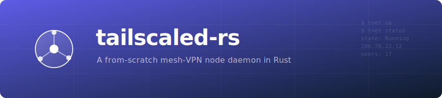
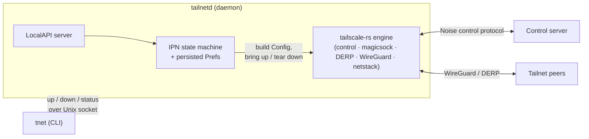

<p align="center">
  
</p>

<h1 align="center">tailscaled-rs</h1>

<p align="center">
  <a href="https://github.com/GeiserX/tailscaled-rs/actions/workflows/ci.yml"></a>
  <a href="LICENSE"></a>
  
  
</p>

An independent, from-scratch **Rust system daemon** that joins a WireGuard-based mesh
overlay network by speaking the Tailscale control protocol — the long-running, IPC-controlled
*daemon* layer (a `tailscaled`-shaped process) built on top of the embeddable
[`tailscale-rs`](https://github.com/GeiserX/tailscale-rs) engine library.

Where `tailscale-rs` is an **embeddable library** (you link it into your own program, the way
Go's `tsnet` works), `tailscaled-rs` is the **daemon**: a persistent background service with a
reconcilable state machine, persisted preferences, and a local control socket that a thin CLI
(`tnet`) talks to. That daemon layer is exactly what an embeddable library leaves out, and it is
what this project adds.

> [!WARNING]
> **Experimental. Not for production.** This is early-days software. The underlying engine
> contains unaudited cryptography and carries no stability or compatibility guarantees, and the
> daemon layer here is a young MVP. Do not rely on it for data privacy yet.

## What works today (MVP)

- **Joins a real tailnet** non-interactively with a pre-auth key, obtains a tailnet IP, and
  reaches `Running` over DERP-relayed connectivity.
- **IPN-style state machine** — `NoState → NeedsLogin → Starting → Running → Stopped`, with the
  reported state *derived* from live engine/netmap reality (never stored, so it can't drift).
- **Persisted preferences** — the node's intent (`up`/`down`, hostname, accept-routes) survives a
  restart.
- **LocalAPI over a Unix domain socket** — the daemon (`tailnetd`) serves a local control surface;
  the CLI (`tnet up` / `down` / `status`) is a thin client over it.

## Not yet (the road to a full daemon)

TUN-mode by default and per-OS routing/DNS programming, interactive (browser) login,
`netmon`-driven endpoint re-binding on network change, service installation
(systemd/launchd/Windows), MagicDNS OS integration, exit-node/subnet-router operation, Tailscale
SSH / Serve / Funnel, and Tailnet Lock enforcement. The MVP runs in **userspace-networking** mode
(no TUN, no OS routing/DNS changes) — applications reach the tailnet via the daemon rather than
the kernel. See [`docs/DESIGN.md`](docs/DESIGN.md) for the full architecture and phased plan.

## Quick start

```bash
# Build (lean default: userspace networking, no TLS-cert/SSH-server/TUN).
cargo build --release
# …or build a FULL-featured daemon (what the released binaries ship) — adds kernel-TUN mode,
# the Tailscale SSH server, and ACME cert issuance for `cert`/`serve --https`/`funnel`. Each still
# gates at runtime (TUN/SSH need root; cert/funnel need a SaaS tailnet):
#   cargo build --release --features tun,ssh,acme
# (Prebuilt release downloads are already built with all three.)

# The engine requires an explicit acknowledgement that it is experimental:
export TS_RS_EXPERIMENT=this_is_unstable_software

# Run the daemon (foreground)
./target/release/tailnetd

# In another shell: join a tailnet with a pre-auth key, then check status
./target/release/tnet up --authkey tskey-auth-XXXX --hostname my-node
./target/release/tnet status
./target/release/tnet down

# Force a fresh login (re-register from scratch, keeping your settings):
./target/release/tnet up --force-reauth

# Bring up and wait (up to 30s) for the node to reach Running — handy in scripts:
./target/release/tnet up --authkey tskey-auth-XXXX --timeout 30 && echo connected

# Serve a live HTML status page (default http://127.0.0.1:8384; opens a browser):
./target/release/tnet status --web            # add --no-browser / --listen ADDR to customize

# Adjust policy prefs on a running node — applied live, no reconnect:
./target/release/tnet set --hostname my-node --accept-routes
```

`tnet up --timeout <SECONDS>` (Go `tailscale up --timeout`) waits for the node to reach the Running
state after bringing it up, exiting non-zero on timeout — useful to gate a follow-up step on
connectivity. Omit it to return as soon as the daemon accepts the up; `0` waits forever.

`tnet up --force-reauth` (Go `tailscale up --force-reauth`) discards this node's key and registers
fresh, surfacing a new login URL — handy to re-authenticate without changing any settings. It may
briefly bring the connection down while it re-registers, so avoid running it over a remote SSH/RDP
session you could lock yourself out of.

`tnet set` (Go `tailscale set`) adjusts policy prefs on an already-running node. Changing
`--exit-node`, `--hostname`, `--accept-routes`, `--advertise-routes`, or `--advertise-exit-node`
applies **live** — in place, with no reconnect (matching Go's `set`). Only `--shields-up`, `--ssh`,
and `--advertise-tags` briefly rebuild the connection (they have no in-place engine setter). `set`
never re-authenticates and never changes whether the node is up or down.

State (node keys + prefs) lives in `$XDG_STATE_HOME/tailnetd` (override with `TAILNETD_STATE_DIR`);
the control socket is `<state-dir>/tailnetd.sock` (override with `TAILNETD_SOCKET`).

## Install as a system service

To run `tailnetd` as an always-on boot service instead of a foreground process, install it as a
system daemon (systemd on Linux, launchd on macOS):

```bash
# Build, then install the system service (one command; requires root)
cargo build --release
sudo ./target/release/tnet install

# …and to remove it later (leaves your node state in place)
sudo ./target/release/tnet uninstall
```

`sudo tnet install` does three things: it copies the running `tailnetd` binary to
`/usr/local/bin/tailnetd`, installs the service unit, and enables it to start at boot. Then check
`tnet status` (or `sudo tnet status` — as root the CLI resolves the same system state dir).

| | Linux (systemd) | macOS (launchd) |
| --- | --- | --- |
| Service unit | `/etc/systemd/system/tailnetd.service` | `/Library/LaunchDaemons/cloud.tailscaled-rs.tailnetd.plist` |
| Enable / load | `systemctl enable --now tailnetd` | `launchctl bootstrap system <plist>` |
| State dir | `/var/lib/tailnetd` | `/usr/local/var/tailnetd` |

> [!NOTE]
> The installed unit sets `TS_RS_EXPERIMENT=this_is_unstable_software` for you — **enabling the
> service is you opting in to running experimental, unaudited software on purpose** (the daemon does
> not set that opt-in for itself). Other OSes are not supported; `tnet install` there exits with a
> clear error.

> [!NOTE]
> On Linux, `tnet install` picks the systemd unit that matches how the daemon was **built**. A
> default (userspace-networking) build installs a fully-sandboxed unit (no capabilities, no
> `/dev/net/tun`). A build with the `tun` feature (`--features tun`, kernel-TUN data path) installs a
> unit relaxed *only* as much as a kernel `tun` interface needs — `CAP_NET_ADMIN`, `/dev/net/tun`, and
> the matching syscall/address-family surface — while keeping the key-protection hardening intact. The
> installed binary and its unit therefore always agree, so a TUN build is never silently broken by a
> sandbox that hides its device, and a userspace build is never needlessly granted `CAP_NET_ADMIN`.

`tnet uninstall` disables/unloads the service and removes the unit, but **deliberately leaves the
state dir** (it holds your node's key material), so a later `tnet install` resumes the same node.
To purge the node entirely, remove the state dir for your OS (above) by hand after uninstalling.

## Architecture



The daemon owns the **lifecycle and intent**; the engine owns the **cryptography and data plane**.
See [`docs/DESIGN.md`](docs/DESIGN.md) for the component graph, the state machine, and what each
layer is responsible for.

## Developing against a local engine

`tailscaled-rs` depends on a pinned revision of `tailscale-rs` (see `Cargo.toml`), and `Cargo.lock`
is committed so every build is reproducible. If you are co-developing the engine, point Cargo at a
local checkout with a **gitignored** `.cargo/config.toml`:

```toml
# .cargo/config.toml  (gitignored — never committed)
paths = ["/path/to/your/tailscale-rs"]
```

Cargo transparently substitutes the local source when its version matches the pinned one — edit the
engine, rebuild the daemon, no manifest change. To bump the pinned engine deliberately, update the
`rev` in `Cargo.toml` and run `cargo update -p tailscale-rs`.

## Relationship to Tailscale and WireGuard

This is an **independent, unofficial** project. It is **not affiliated with, endorsed by, or
sponsored by Tailscale Inc.** "Tailscale" is a trademark of Tailscale Inc.; this project uses the
name only nominatively, to describe the protocol it is compatible with. "WireGuard" is a registered
trademark of Jason A. Donenfeld; this project implements/speaks the WireGuard protocol and is not an
official WireGuard project.

The bulk of Tailscale's own client is open source (BSD-3-Clause), and this project is offered in the
same spirit: a permissively-licensed, community contribution that anyone — including upstream — is
free to use, study, and build on.

## License

[BSD-3-Clause](LICENSE). Portions derived from or interoperating with `tailscale-rs` retain the
original Tailscale Inc. copyright notice, as required.
