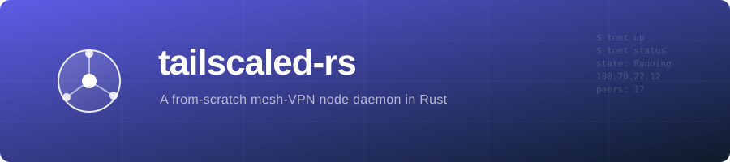
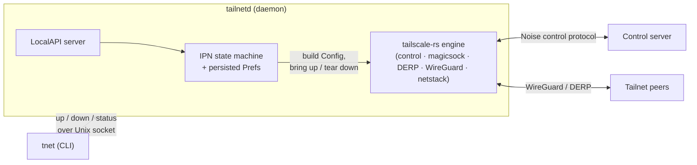

<p align="center">
  
</p>

<h1 align="center">tailscaled-rs</h1>

<p align="center">
  <a href="https://github.com/GeiserX/tailscaled-rs/actions/workflows/ci.yml"></a>
  <a href="LICENSE"></a>
  
  
</p>

An independent, from-scratch **Rust system daemon** that joins a WireGuard-based mesh
overlay network by speaking the Tailscale control protocol — the long-running, IPC-controlled
*daemon* layer (a `tailscaled`-shaped process) built on top of the embeddable
[`tailscale-rs`](https://github.com/GeiserX/tailscale-rs) engine library.

Where `tailscale-rs` is an **embeddable library** (you link it into your own program, the way
Go's `tsnet` works), `tailscaled-rs` is the **daemon**: a persistent background service with a
reconcilable state machine, persisted preferences, and a local control socket that a thin CLI
(`tnet`) talks to. That daemon layer is exactly what an embeddable library leaves out, and it is
what this project adds.

> [!WARNING]
> **Experimental. Not for production.** This is early-days software. The underlying engine
> contains unaudited cryptography and carries no stability or compatibility guarantees, and the
> daemon layer here is a young MVP. Do not rely on it for data privacy yet.

## What works today (MVP)

- **Joins a real tailnet** non-interactively with a pre-auth key, obtains a tailnet IP, and
  reaches `Running` over DERP-relayed connectivity.
- **IPN-style state machine** — `NoState → NeedsLogin → Starting → Running → Stopped`, with the
  reported state *derived* from live engine/netmap reality (never stored, so it can't drift).
- **Persisted preferences** — the node's intent (`up`/`down`, hostname, accept-routes) survives a
  restart.
- **LocalAPI over a Unix domain socket** — the daemon (`tailnetd`) serves a local control surface;
  the CLI (`tnet up` / `down` / `status`) is a thin client over it.

## Not yet (the road to a full daemon)

TUN-mode by default and per-OS routing/DNS programming, interactive (browser) login,
`netmon`-driven endpoint re-binding on network change, service installation
(systemd/launchd/Windows), MagicDNS OS integration, exit-node/subnet-router operation, Tailscale
SSH / Serve / Funnel, and Tailnet Lock enforcement. The MVP runs in **userspace-networking** mode
(no TUN, no OS routing/DNS changes) — applications reach the tailnet via the daemon rather than
the kernel. See [`docs/DESIGN.md`](docs/DESIGN.md) for the full architecture and phased plan.

## Quick start

```bash
# Build (lean default: userspace networking, no TLS-cert/SSH-server/TUN).
cargo build --release
# …or build a FULL-featured daemon (what the released binaries ship) — adds kernel-TUN mode,
# the Tailscale SSH server, and ACME cert issuance for `cert`/`serve --https`/`funnel`. Each still
# gates at runtime (TUN/SSH need root; cert/funnel need a SaaS tailnet):
#   cargo build --release --features tun,ssh,acme
# (Prebuilt release downloads are already built with all three.)

# The engine requires an explicit acknowledgement that it is experimental:
export TS_RS_EXPERIMENT=this_is_unstable_software

# Run the daemon (foreground)
./target/release/tailnetd

# tailnetd accepts flags (Go `tailscaled`-style) that override the TAILNETD_* env vars:
#   --statedir <dir>   state directory      (overrides TAILNETD_STATE_DIR)
#   --socket <path>    LocalAPI socket path (overrides TAILNETD_SOCKET)
#   --verbose <0|1|2>  log verbosity        (overrides TAILNETD_LOG; 0=info,1=debug,2=trace)
#   --config <source>  declarative config source (Go --config / ipn.ConfigVAlpha) — set prefs up
#                      front without an interactive `tnet up` (headless/k8s). e.g.:
#                        {"version":"alpha0","Enabled":true,"Hostname":"node-a",
#                         "AuthKey":"file:/run/secrets/ts-authkey","acceptRoutes":true}
#                      AuthKey may be a literal or "file:<path>". Merged over persisted prefs.
#                      <source> is a path, or "vm:user-data" (the VM's user-data via the cloud
#                      instance metadata service — recognized, but this build has no metadata
#                      client, so it reports the source as absent). Prefix either with
#                      "optional:" to boot UNCONFIGURED when the source is absent instead of
#                      failing to start; a source that is present but invalid still fails.
#   --version          print version and exit;  --help  full usage
# e.g.  ./target/release/tailnetd --statedir /var/lib/tailnetd --verbose 1
#
# NOTE: --statedir also moves the default socket to <dir>/tailnetd.sock. Since `tnet` has no
# --statedir, point the client at it explicitly:  tnet --socket /var/lib/tailnetd/tailnetd.sock status
# (or export TAILNETD_SOCKET). The packaged service uses the default /var/lib/tailnetd, so this only
# matters when you relocate state on a manual/non-root run.

# In another shell: join a tailnet with a pre-auth key, then check status
./target/release/tnet up --authkey tskey-auth-XXXX --hostname my-node
./target/release/tnet status
./target/release/tnet down

# Force a fresh login (re-register from scratch, keeping your settings):
./target/release/tnet up --force-reauth

# Bring up and wait (up to 30s) for the node to reach Running — handy in scripts:
./target/release/tnet up --authkey tskey-auth-XXXX --timeout 30 && echo connected

# Serve a live HTML status page (default http://127.0.0.1:8384; opens a browser):
./target/release/tnet status --web            # add --no-browser / --listen ADDR to customize

# Adjust policy prefs on a running node — applied live, no reconnect:
./target/release/tnet set --hostname my-node --accept-routes
```

`tnet up --timeout <SECONDS>` (Go `tailscale up --timeout`) waits for the node to reach the Running
state after bringing it up, exiting non-zero on timeout — useful to gate a follow-up step on
connectivity. Omit it to return as soon as the daemon accepts the up; `0` waits forever.

`tnet up --force-reauth` (Go `tailscale up --force-reauth`) discards this node's key and registers
fresh, surfacing a new login URL — handy to re-authenticate without changing any settings. It may
briefly bring the connection down while it re-registers, so avoid running it over a remote SSH/RDP
session you could lock yourself out of.

`tnet up` also answers to the spellings Go's `tailscale up` uses, so a command line copied from Go
runs unedited: `--auth-key` is an alias of `--authkey` (and, like Go, a value of `file:<path>` under
either spelling reads the key from that file), and `--login-server` is an alias of `--control-url`.
Go's hidden `--host-routes` is accepted and does nothing — it has had to be `true` since Tailscale
1.67, and this build's userspace netstack installs no host routes at all — while `--host-routes=false`
is refused with Go's own "only 'true' is allowed". `up --nickname` is refused by name, pointing at
`tnet set --nickname`: no `up` names a login profile, in this fork or in Go, which registers
`--nickname` on `set` and `login` only.

`tnet set` (Go `tailscale set`) adjusts policy prefs on an already-running node. Changing
`--exit-node`, `--hostname`, `--accept-routes`, `--advertise-routes`, or `--advertise-exit-node`
applies **live** — in place, with no reconnect (matching Go's `set`). `--shields-up`, `--ssh`,
`--advertise-tags`, `--advertise-connector` and `--auto-update` briefly rebuild the connection (they
have no in-place engine setter, and the last two are re-advertised to control on every map request).
`--operator`, `--report-posture`, `--webclient`, `--update-check` and
`--exit-node-allow-lan-access` are **carried prefs**: they are persisted and reported (`tnet get`),
but nothing in this build acts on them yet — each flag's `--help` says exactly what it does and does
not do. `--nickname` is the exception among them: like Go, it also renames the current login profile,
so the name you pick is what `tnet switch --list` shows and what `tnet switch <name>` resolves
against. `set` never re-authenticates and never changes whether the node is up or down.

Four of Go's `set` flags are **parsed but not modelled**, so a command line ported from Go reaches a
refusal that names the gap instead of dying at the parser. For each, the value asking for the state
this daemon is currently in is accepted, and the other is refused: `--relay-server-port=` and
`--relay-server-static-endpoints=` (disable / advertise none) are fine, but a port or an endpoint
list is refused — this build runs no peer relay server; `--sync` is fine and `--no-sync` (Go
`--sync=false`) is refused — there is no way to stop the map poll while staying up. Those three are
engine-gated (`docs/ENGINE_ASKS.md` §34). The fourth, `--remote-config`, is refused **by choice and
permanently**: it hands the tailnet admin full remote control of this node's prefs and LocalAPI,
bypassing the per-feature double opt-in, which this daemon's local authorization model
(`docs/THREAT_MODEL.md` §4.1) does not grant to the control plane. `--no-remote-config`, Go's
default, is what this build always does.

State (node keys + prefs) lives in `$XDG_STATE_HOME/tailnetd` (override with `TAILNETD_STATE_DIR`);
the control socket is `<state-dir>/tailnetd.sock` (override with `TAILNETD_SOCKET`).

**Crash cleanup (macOS).** In kernel-TUN mode the daemon programs host routes and a scoped MagicDNS
resolver; both are reversed on a clean shutdown. A `SIGKILL`/panic skips that teardown, so on macOS
they can outlive the daemon — a `scutil` resolver dictionary pointing at a MagicDNS server that is no
longer listening, and routes blackholing into a `utun` that no longer exists. `tailnetd` therefore
reaps that leftover state at startup, before it brings the node up: it removes its own `scutil` key
and any of its static routes whose `utun` device is gone, and touches nothing else. Set
`TAILNETD_NO_REAP=1` to skip the pass.

## Install as a system service

On macOS or Linux with [Homebrew](https://brew.sh), the tap installs both binaries and registers the
service in one step (it builds from source — the release workflow publishes Linux tarballs only):

```bash
brew tap GeiserX/tailscaled-rs
brew install tailscaled-rs
sudo brew services start tailscaled-rs      # sets TS_RS_EXPERIMENT for the daemon
```

> [!NOTE]
> The tap repository is not published yet — the formula is ready ahead of it. Until then it installs
> from a checkout: `brew install --build-from-source packaging/homebrew/tailscaled-rs.rb`.

See [`packaging/homebrew/README.md`](packaging/homebrew/README.md) for what the formula builds, where
state and logs go, and how the tap is refreshed for a release. Otherwise, install the daemon
straight from a checkout (systemd on Linux, launchd on macOS):

```bash
# Build, then install the system service (one command; requires root)
cargo build --release
sudo ./target/release/tnet install

# …and to remove it later (leaves your node state in place)
sudo ./target/release/tnet uninstall
```

`sudo tnet install` does three things: it copies the running `tailnetd` binary to
`/usr/local/bin/tailnetd`, installs the service unit, and enables it to start at boot. Then check
`tnet status` (or `sudo tnet status` — as root the CLI resolves the same system state dir).

| | Linux (systemd) | macOS (launchd) |
| --- | --- | --- |
| Service unit | `/etc/systemd/system/tailnetd.service` | `/Library/LaunchDaemons/cloud.tailscaled-rs.tailnetd.plist` |
| Enable / load | `systemctl enable --now tailnetd` | `launchctl bootstrap system <plist>` |
| State dir | `/var/lib/tailnetd` | `/usr/local/var/tailnetd` |

> [!NOTE]
> The installed unit sets `TS_RS_EXPERIMENT=this_is_unstable_software` for you — **enabling the
> service is you opting in to running experimental, unaudited software on purpose** (the daemon does
> not set that opt-in for itself). Other OSes are not supported; `tnet install` there exits with a
> clear error.

> [!NOTE]
> On Linux, `tnet install` picks the systemd unit that matches how the daemon was **built**. A
> default (userspace-networking) build installs a fully-sandboxed unit (no capabilities, no
> `/dev/net/tun`). A build with the `tun` feature (`--features tun`, kernel-TUN data path) installs a
> unit relaxed *only* as much as a kernel `tun` interface needs — `CAP_NET_ADMIN` (to create/configure
> the interface and program routes), `/dev/net/tun` (allowlisted read-write, device cgroup otherwise
> closed), and the syscall surface for the `ip`/`resolvectl` helpers it execs — while keeping every
> key-protection directive intact. The
> installed binary and its unit therefore always agree, so a TUN build is never silently broken by a
> sandbox that hides its device, and a userspace build is never needlessly granted `CAP_NET_ADMIN`.

`tnet uninstall` disables/unloads the service and removes the unit, but **deliberately leaves the
state dir** (it holds your node's key material), so a later `tnet install` resumes the same node.
To purge the node entirely, remove the state dir for your OS (above) by hand after uninstalling.

## Architecture


```mermaid
flowchart LR
    CLI["tnet (CLI)"] -->|"up / down / status<br/>over Unix socket"| D
    subgraph D["tailnetd (daemon)"]
        IPN["IPN state machine<br/>+ persisted Prefs"]
        API["LocalAPI server"]
        API --> IPN
        IPN -->|"build Config,<br/>bring up / tear down"| ENG
        ENG["tailscale-rs engine<br/>(control · magicsock · DERP · WireGuard · netstack)"]
    end
    ENG <-->|"Noise control protocol"| CTRL["Control server"]
    ENG <-->|"WireGuard / DERP"| PEERS["Tailnet peers"]
```

The daemon owns the **lifecycle and intent**; the engine owns the **cryptography and data plane**.
See [`docs/DESIGN.md`](docs/DESIGN.md) for the component graph, the state machine, and what each
layer is responsible for.

## Developing against a local engine

`tailscaled-rs` depends on a pinned revision of `tailscale-rs` (see `Cargo.toml`), and `Cargo.lock`
is committed so every build is reproducible. If you are co-developing the engine, point Cargo at a
local checkout with a **gitignored** `.cargo/config.toml`:

```toml
# .cargo/config.toml  (gitignored — never committed)
paths = ["/path/to/your/tailscale-rs"]
```

Cargo transparently substitutes the local source when its version matches the pinned one — edit the
engine, rebuild the daemon, no manifest change. To bump the pinned engine deliberately, update the
`rev` in `Cargo.toml` and run `cargo update -p tailscale-rs`.

## Relationship to Tailscale and WireGuard

This is an **independent, unofficial** project. It is **not affiliated with, endorsed by, or
sponsored by Tailscale Inc.** "Tailscale" is a trademark of Tailscale Inc.; this project uses the
name only nominatively, to describe the protocol it is compatible with. "WireGuard" is a registered
trademark of Jason A. Donenfeld; this project implements/speaks the WireGuard protocol and is not an
official WireGuard project.

The bulk of Tailscale's own client is open source (BSD-3-Clause), and this project is offered in the
same spirit: a permissively-licensed, community contribution that anyone — including upstream — is
free to use, study, and build on.

## License

[BSD-3-Clause](LICENSE). Portions derived from or interoperating with `tailscale-rs` retain the
original Tailscale Inc. copyright notice, as required.
