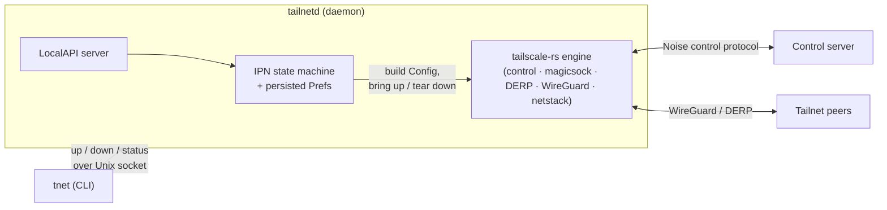

# Status and architecture

## What works today (MVP)

- **Joins a real tailnet** non-interactively with a pre-auth key, obtains a tailnet IP, and
  reaches `Running` over DERP-relayed connectivity.
- **IPN-style state machine** — `NoState → NeedsLogin → Starting → Running → Stopped`, with the
  reported state *derived* from live engine/netmap reality (never stored, so it can't drift).
- **Persisted preferences** — the node's intent (`up`/`down`, hostname, accept-routes) survives a
  restart.
- **LocalAPI over a Unix domain socket** — the daemon (`tailnetd`) serves a local control surface;
  the CLI (`tnet up` / `down` / `status`) is a thin client over it.

## Not yet (the road to a full daemon)

TUN-mode by default and per-OS routing/DNS programming, interactive (browser) login,
`netmon`-driven endpoint re-binding on network change, service installation
(systemd/launchd/Windows), MagicDNS OS integration, exit-node/subnet-router operation, Tailscale
SSH / Serve / Funnel, and Tailnet Lock enforcement. The MVP runs in **userspace-networking** mode
(no TUN, no OS routing/DNS changes) — applications reach the tailnet via the daemon rather than
the kernel. See [`docs/DESIGN.md`](DESIGN.md) for the full architecture and phased plan.

## Architecture

The daemon owns the **lifecycle and intent**; the engine owns the **cryptography and data plane**.
See [`docs/DESIGN.md`](DESIGN.md) for the component graph, the state machine, and what each
layer is responsible for.
