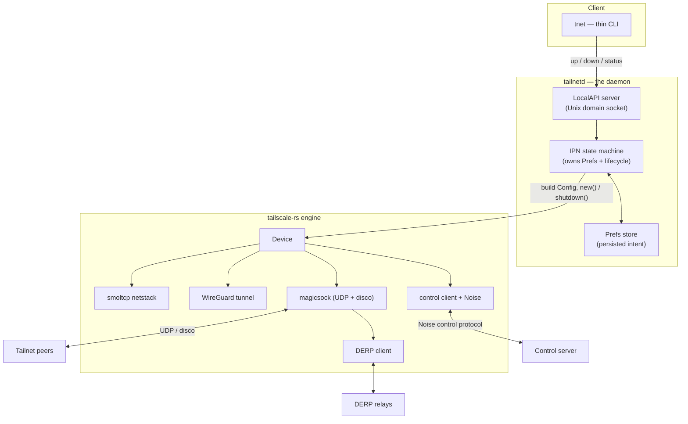
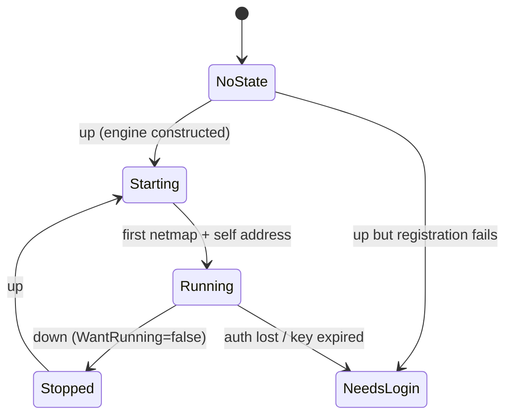
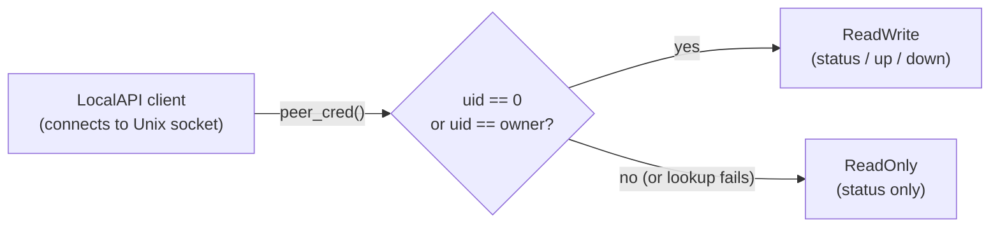

# Design: a Rust `tailscaled`

This document describes what `tailscaled-rs` is, how it is layered on the
[`tailscale-rs`](https://github.com/GeiserX/tailscale-rs) engine, and the phased plan from the
current MVP toward a full system daemon. It is the condensed, public design rationale; the
implementation is the source of truth.

## The two-layer split

A Tailscale-style node divides cleanly into two layers with very different shapes:

| Layer | Responsibility | Where it lives |
|---|---|---|
| **Engine** | Cryptography + data plane: the Noise control handshake, the network-map client, magicsock (direct UDP + disco NAT traversal), DERP relay, the WireGuard tunnel, the userspace netstack, packet filtering, and — in TUN mode — the **host route/DNS programming** (`ts_host_net`: the OS routing table + system resolver, the analogue of Go's `wgengine/router` + DNS manager). | `tailscale-rs` (an embeddable library) |
| **Daemon** | Lifecycle + intent + control surface: a state machine, persisted preferences, a local IPC socket, a CLI, service install (systemd/launchd), and the TUN-mode *selection* (transport mode + privilege preflight + interface-name default). The per-OS routing/DNS *mechanism* itself lives in the engine (above), not here — the daemon has no routing seam. | **this project** |

The engine is `tsnet`-shaped: you construct an immutable node from a config and it runs in-process.
The daemon is `tailscaled`-shaped: a long-running service you reconfigure at runtime and control
over a socket. `tailscaled-rs` is the second layer, and it treats the engine as a dependency.

## Component graph

**Control flow (downward):** a CLI command hits the LocalAPI, which mutates Prefs and drives the
state machine; the state machine builds a fresh engine `Config` from current Prefs and brings the
`Device` up or tears it down.

**Data flow (inside the engine):** application/overlay packets traverse the netstack → WireGuard →
magicsock (direct UDP when disco finds a path, else DERP relay) → peer, and the reverse. This loop
is entirely the engine's; the daemon never touches packets.

## The state machine (the spine)

The reported state is **derived** from `(is the engine up?, has a netmap arrived?, what do Prefs
say?)` rather than stored — so it can never drift from reality.

All seven Go `ipn.State` variants now exist as `ipn::State` for wire/API parity:
`NoState`, `NeedsLogin`, `NeedsMachineAuth`, `InUseOtherUser`, `Starting`, `Running`, `Stopped`
(`ipn::State::as_str` is the authoritative list). `NeedsLogin` IS produced — interactive/browser
login works (see below). Two variants are **parity-only and not yet reachable** because the engine
emits no typed signal for them: `NeedsMachineAuth` (node registered, awaiting admin approval) and
`InUseOtherUser` (node key already bound to another user/profile). A node awaiting admin approval
currently presents as `Starting` (indistinguishable from one still converging); a multi-user daemon
contention as an error. They are kept so the state name set never has to change once the engine
surfaces those conditions (tracked as a bead). `InUseOtherUser` is largely moot for this fork's
single-user model.

## Minimal Viable Daemon — in / out

**In (the smallest useful closed loop):** pre-auth-key **AND keyless interactive/browser**
registration (a keyless `up` reaches `NeedsLogin(url)` and auto-advances to `Running` once the user
authorizes), obtaining a tailnet IP, DERP-relayed connectivity, the IPN state machine, persisted
Prefs, the LocalAPI socket (`status`/`up`/`down`), and the thin CLI. Runs in **userspace-networking**
mode by default.

> Note: this list has grown well beyond the original MVP. Since first draft the daemon has also
> shipped: the TUN data path + per-OS route/DNS programming (engine-owned `ts_host_net`, Linux+macOS),
> exit-node use/advertise, subnet-route advertise, Tailscale SSH, Serve/Funnel, Taildrop, `cert`,
> `accept-dns`, multi-profile switching, systemd/launchd install, and link-change rebind. See the
> phase table + the bead backlog for the current frontier.

**Still out / deferred (a gap we *would* close given the unblock):** the `tnet login` *verb* (the
interactive (re)auth capability already exists via keyless `up`; shipping the verb now — the
full-fidelity "switch to a different account while logged in" case can layer an empty-profile model
later, but the verb itself is the interactive-login path), Taildrop `file get --wait`/`--loop`
(engine-gated on an IPN-bus file-arrival signal, #20), a configurable WireGuard listen `--port`
(engine-gated — the engine binds ephemeral, ask #22), MagicDNS OS-resolver integration, the richer
operator/GID authorization matrix, and Windows service + host-net (engine port). `dns query` (#15)
and Tailnet Lock write-ops/enforcement (#17) are **done** (consumed in the v0.31.0 / v0.32.0 engine
bumps). These are *deferred*, not non-goals — each is tracked and ships when the engine/port unblocks
it.

## Remaining Go surface to match (deferred / blocked — none are "won't do")

**The goal is full `tailscaled` + `tailscale`-CLI parity** — a complete Rust copy of the daemon and
its command surface. Nothing Go does is "out of scope by choice." The items below are the Go features
we do **not yet** match; each is either *not-yet-built* (a real target — file a bead and ship it) or
*blocked* on a substrate the fork doesn't have yet (an engine capability or an OS port). When a thing
is blocked, that is a **deferral with a named unblock**, never a decision to skip it. (This list
exists only so a parity pass records *why* each is still open and what unblocks it — not to wave any
of it off.)

- **`web`** — Go's local management **web UI** (an HTTP admin server that *mutates* prefs). A real
  target: it needs an embedded HTTP server that drives the same LocalAPI verbs the CLI does. Build it
  when wanted (distinct from our existing read-only `status --web` snapshot). *Not-yet-built.*
- **`update` / self-update** — Go checks a release server and self-installs. To match it we need a
  release/update feed for this fork's artifacts (the GitHub releases the CI already publishes are a
  candidate source) + an in-daemon updater. *Not-yet-built* (needs an update-feed decision, then
  wire it — no longer "there is no server, so never").
- **`syspolicy`** — the MDM / device-management policy store (Windows registry / Apple managed-prefs /
  Group Policy). To match: read the platform policy store and apply it over prefs. *Blocked* on the
  per-OS policy-store readers (and most useful once Windows lands).
- **`systray`** — Go's desktop system-tray GUI. To match: a tray app driving the LocalAPI. A real
  target when a desktop UX is wanted; *not-yet-built* (a separate UI surface, not daemon-internal).
- **`configure` (synology / sysext / jetkvm / kubeconfig)** — host-specific setup glue. Each is a
  concrete file/host-config generator we can match per platform; **`configure kubeconfig`** (pure
  file generation) is the cleanest first one. *Not-yet-built* — file beads per sub-target.
- **Exotic OS targets** — Plan9 / AIX / Solaris / illumos. *Blocked* on engine support for those
  targets (the engine builds Linux + macOS today; Windows is the next port). Match them as the engine
  grows targets.
- **TPM / Secure-Enclave `--encrypt-state`** — at-rest state encryption backed by a hardware key
  store. A real target (Go has it); *not-yet-built* — needs a platform keystore integration. Today the
  state dir is `0700` + the process-hardening posture; that is the interim, not the end state.

> The one **gate** (not a feature, can't be "matched away"): the **unaudited-crypto production bar**
> (bead tsd-q8o) — this fork must not be *claimed production-ready* until an external crypto audit of
> the engine, regardless of feature parity. A release gate, tracked, never closed by feature work.

## Phased plan

| Phase | Goal | Milestone |
|---|---|---|
| **1 — MVP** *(done)* | userspace-networking node: authkey join, `status`/`up`/`down` over LocalAPI, `SO_PEERCRED` LocalAPI authorization (read for all, write for root/same-UID), persisted prefs in a `0700` state dir, zeroized secret handling | A node joins a tailnet and answers `status` |
| **2 — Daemonize** | service install (systemd/launchd), `netmon`-driven re-bind on network change, Linux OS-DNS | Survives reboot + link-change as a managed service |
| **3 — Platform breadth** | TUN-mode selection + privilege preflight + per-OS interface-name defaults (the daemon's part); the per-OS **host route/DNS programming itself is engine-owned** (`ts_host_net`, Linux + macOS shipped, wired into the TUN datapath — the daemon has no routing seam by design); port mapping | Transparent OS-wide connectivity (Linux/macOS done via the engine; Windows host-net is an engine gap) |
| **4 — Feature parity** | MagicDNS, exit/subnet routing, Serve/Funnel, SSH, Tailnet Lock enforcement | Approaches `tailscaled` feature parity |

## Hard problems (tracked honestly)

- **The control protocol is a moving target** defined by the upstream Go source, not a frozen spec;
  the daemon pins a capability version and must track upstream deliberately.
- **disco / NAT traversal** is the subtlest surface; "works but never leaves DERP" is a silent
  failure mode, not a crash.
- **Per-OS routing and DNS** is an irreducible platform matrix and is the largest body of net-new
  work in Phases 2–3.
- **Unaudited cryptography** in the engine gates any production claim on an independent audit.

## Security posture

See [`../SECURITY.md`](../SECURITY.md). In short: experimental, **unaudited crypto** — do not rely
on it for data privacy until independently audited.

Several local-host protections that an earlier draft listed as "do it yourself" are now **shipped**:

- **`0700` state directory.** The daemon creates and `chmod`s its state dir to `0700` on startup
  (it holds unencrypted key material), and re-tightens the socket's parent dir in `serve` itself —
  it doesn't trust the launcher to have done it.
- **Zeroized secret handling.** Auth keys are carried as `secrecy::SecretString` (zeroized on drop,
  no `Debug`/serialize), exposed exactly once at the engine registration call and never stored on
  the backend or logged.
- **`SO_PEERCRED` LocalAPI authorization.** Every control-socket connection is authorized by its
  peer process credentials, mirroring Tailscale's `ipnauth` model: anyone who can reach the socket
  may **read** (`status`), but only **root or the daemon's own UID may write** (`up`/`down`). The
  `0700` dir is the first gate; peer-cred is the second — it still denies writes even if the socket
  is ever reachable by another user.

Not yet done (honest scope): the richer Tailscale "operator user" GID matrix is a later phase —
the seam exists (the policy is built once at startup and threaded per-connection, and the peer's
`gid` is already read) but is not enforced; and the crypto remains unaudited.
