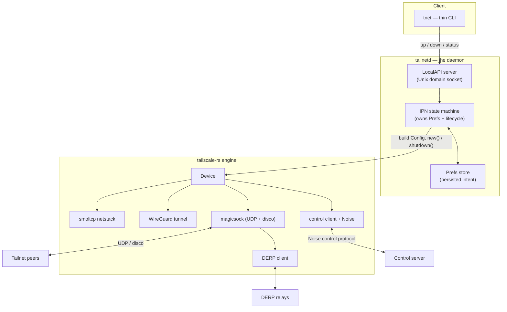
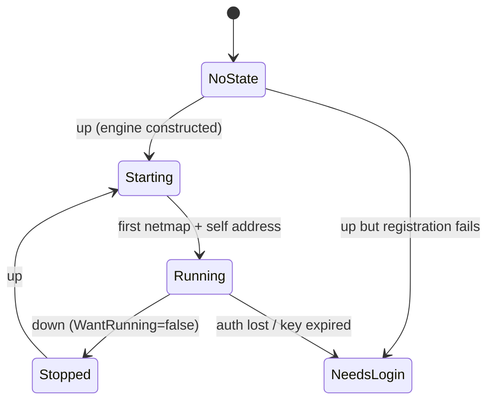

# Design: a Rust `tailscaled`

This document describes what `tailscaled-rs` is, how it is layered on the
[`tailscale-rs`](https://github.com/GeiserX/tailscale-rs) engine, and the phased plan from the
current MVP toward a full system daemon. It is the condensed, public design rationale; the
implementation is the source of truth.

## The two-layer split

A Tailscale-style node divides cleanly into two layers with very different shapes:

| Layer | Responsibility | Where it lives |
|---|---|---|
| **Engine** | Cryptography + data plane: the Noise control handshake, the network-map client, magicsock (direct UDP + disco NAT traversal), DERP relay, the WireGuard tunnel, the userspace netstack, packet filtering. | `tailscale-rs` (an embeddable library) |
| **Daemon** | Lifecycle + intent + control surface: a state machine, persisted preferences, a local IPC socket, a CLI, and (eventually) per-OS routing/DNS/service integration. | **this project** |

The engine is `tsnet`-shaped: you construct an immutable node from a config and it runs in-process.
The daemon is `tailscaled`-shaped: a long-running service you reconfigure at runtime and control
over a socket. `tailscaled-rs` is the second layer, and it treats the engine as a dependency.

## Component graph

**Control flow (downward):** a CLI command hits the LocalAPI, which mutates Prefs and drives the
state machine; the state machine builds a fresh engine `Config` from current Prefs and brings the
`Device` up or tears it down.

**Data flow (inside the engine):** application/overlay packets traverse the netstack → WireGuard →
magicsock (direct UDP when disco finds a path, else DERP relay) → peer, and the reverse. This loop
is entirely the engine's; the daemon never touches packets.

## The state machine (the spine)

The reported state is **derived** from `(is the engine up?, has a netmap arrived?, what do Prefs
say?)` rather than stored — so it can never drift from reality.

Compared to the full Tailscale state machine, the MVP omits `NeedsMachineAuth` and
`InUseOtherUser` (it is pre-auth-key only) and interactive login; those currently surface as a
`NeedsLogin`/error rather than dedicated states.

## Minimal Viable Daemon — in / out

**In (the smallest useful closed loop):** pre-auth-key registration, obtaining a tailnet IP,
DERP-relayed connectivity, the IPN state machine, persisted Prefs, the LocalAPI socket
(`status`/`up`/`down`), and the thin CLI. Runs in **userspace-networking** mode.

**Out (explicitly deferred):** TUN data path + OS routing + OS DNS programming, MagicDNS OS
integration, exit nodes / subnet routers, interactive/browser login, Tailscale SSH / Serve /
Funnel / Taildrop, Tailnet Lock enforcement, fine-grained operator authorization, and Windows
service packaging.

## Phased plan

| Phase | Goal | Milestone |
|---|---|---|
| **1 — MVP** *(done)* | userspace-networking node: authkey join, `status`/`up`/`down` over LocalAPI, persisted prefs | A node joins a tailnet and answers `status` |
| **2 — Daemonize** | service install (systemd/launchd), `netmon`-driven re-bind on network change, richer LocalAPI auth (`SO_PEERCRED`), Linux OS-DNS | Survives reboot + link-change as a managed service |
| **3 — Platform breadth** | TUN mode + per-OS router/DNS (Linux/macOS/Windows), port mapping | Transparent OS-wide connectivity on three platforms |
| **4 — Feature parity** | MagicDNS, exit/subnet routing, Serve/Funnel, SSH, Tailnet Lock enforcement | Approaches `tailscaled` feature parity |

## Hard problems (tracked honestly)

- **The control protocol is a moving target** defined by the upstream Go source, not a frozen spec;
  the daemon pins a capability version and must track upstream deliberately.
- **disco / NAT traversal** is the subtlest surface; "works but never leaves DERP" is a silent
  failure mode, not a crash.
- **Per-OS routing and DNS** is an irreducible platform matrix and is the largest body of net-new
  work in Phases 2–3.
- **Unaudited cryptography** in the engine gates any production claim on an independent audit.

## Security posture

See [`../SECURITY.md`](../SECURITY.md). In short: experimental, unaudited crypto, protect the state
directory yourself, and do not rely on it for data privacy until audited.
