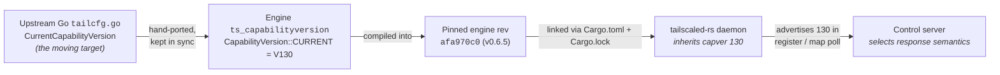

# The engine: pinning, bumping, and capability-version discipline

`tailscaled-rs` is the **daemon**; the cryptography and data plane live in a separate
**engine**, [`tailscale-rs`](https://github.com/GeiserX/tailscale-rs) (imported as the crate
`tailscale`). The daemon links the engine at a **single pinned revision** so every build —
CI, a fresh clone, a release — produces the exact same engine.

This document covers two related maintainer responsibilities:

1. **[Bumping the engine rev + `Cargo.lock`](#1-bumping-the-engine-rev)** — the deliberate process for
   moving the daemon to a newer engine commit.
2. **[Capability-version tracking discipline](#2-capability-version-tracking-discipline)** — why the
   advertised control-protocol `CapabilityVersion` matters, and how to treat it at bump time.

> The engine carries **unaudited cryptography** and offers **no stability guarantees**. Treat
> every engine bump as a tested change, never a blind `cargo update`.

---

## 1. Bumping the engine rev

### Where the pin lives

The pin is one line in [`Cargo.toml`](../Cargo.toml):

```toml
tailscale = { package = "tailscale-rs", git = "https://github.com/GeiserX/tailscale-rs", rev = "afa970c04ad1a98e6dc88484294f360439a24725" }
```

Three things to note:

- The crate is imported as `tailscale` but its published package name is `tailscale-rs`. That
  `package = "tailscale-rs"` name is what `cargo update -p …` and `Cargo.lock` key on — **not**
  `tailscale`.
- `rev` is a **full commit SHA**, not a branch or tag. A branch would let the engine drift between
  builds; a SHA freezes it.
- [`Cargo.lock`](../Cargo.lock) **is committed** (this is a daemon/binary crate, not a library).
  The lockfile records the same `rev` as a `git+https://…?rev=<sha>#<sha>` source, so CI and every
  clone resolve the identical engine tree. Reproducibility comes from the lockfile, not just the
  manifest.

### What "current" is, right now

| Field                              | Value                                                                 |
| ---------------------------------- | --------------------------------------------------------------------- |
| Pinned engine `rev`                | `afa970c04ad1a98e6dc88484294f360439a24725`                            |
| Engine version at that rev         | `0.6.5`                                                               |
| Engine `CapabilityVersion::CURRENT`| `130` (see [§2](#2-capability-version-tracking-discipline))           |

### Step-by-step

Do these in order. Do not commit until the gate suite passes.

1. **Pick the new upstream rev.** Choose a specific commit SHA from
   [`GeiserX/tailscale-rs`](https://github.com/GeiserX/tailscale-rs) — typically a release tag's
   commit or a reviewed `main` commit. Read what changed since the current pin; pay attention to
   anything touching `ts_control`, `ts_capabilityversion`, the Noise/control handshake, or
   `ts_runtime`'s config boundary.

2. **Update `rev=` in `Cargo.toml`.** Replace the SHA in the `tailscale = { … rev = "…" }` line
   with the new one. Change nothing else on that line.

3. **Update the lockfile:**

   ```bash
   cargo update -p tailscale-rs
   ```

   This re-resolves only the engine (and any of its transitive deps that moved) to match the new
   `rev`, and rewrites `Cargo.lock`. Confirm the new SHA now appears in the lockfile's
   `source = "git+…?rev=<sha>#<sha>"` line for `tailscale-rs`.

4. **Run the full gate suite.** The engine requires an explicit acknowledgement that it is
   experimental, so export it first:

   ```bash
   export TS_RS_EXPERIMENT=this_is_unstable_software

   cargo fmt --all --check
   cargo clippy --all-targets -- -D warnings
   cargo test --all-targets
   cargo build --release --bins
   ```

   These are exactly the four gates CI enforces (see [`.github/workflows/ci.yml`](../.github/workflows/ci.yml)),
   which also sets `TS_RS_EXPERIMENT`. Running them locally first means a format/lint slip never
   burns a CI cycle.

5. **Run a live smoke test.** Unit tests do not exercise a real control plane, and an engine bump
   can change wire behavior (see [§2](#2-capability-version-tracking-discipline)). Join a real
   tailnet, confirm status, and tear down:

   ```bash
   export TS_RS_EXPERIMENT=this_is_unstable_software

   # Terminal 1: run the daemon in the foreground.
   ./target/release/tailnetd

   # Terminal 2: bring the node up with a pre-auth key, check it, take it down.
   ./target/release/tnet up --authkey tskey-auth-XXXX --hostname bump-smoke
   ./target/release/tnet status   # expect: Running, with a tailnet IP
   ./target/release/tnet down
   ```

   A clean run reaches `Running` with a tailnet IP and a peer/netmap, then returns to `Stopped` on
   `down`. If `status` stalls before `Running` or the control handshake errors after a bump, treat
   it as a capability-version / control-protocol regression and investigate before committing
   (again, see [§2](#2-capability-version-tracking-discipline)).

6. **Only now, commit.** Commit `Cargo.toml` and `Cargo.lock` **together** in one change — the
   manifest and lockfile must never disagree about the engine rev. Note the engine version and the
   capver in the commit message if either moved.

### Checklist

A maintainer can follow this on every bump:

- [ ] New upstream `rev` chosen (a specific commit SHA), and its changelog/diff since the current pin reviewed.
- [ ] `rev=` updated in `Cargo.toml`.
- [ ] `cargo update -p tailscale-rs` run; new SHA confirmed in `Cargo.lock`.
- [ ] `export TS_RS_EXPERIMENT=this_is_unstable_software`.
- [ ] `cargo fmt --all --check` clean.
- [ ] `cargo clippy --all-targets -- -D warnings` clean.
- [ ] `cargo test --all-targets` green.
- [ ] `cargo build --release --bins` succeeds.
- [ ] Live smoke test: `tnet up` → `status` reaches **Running** → `down` returns to **Stopped**.
- [ ] Engine `CapabilityVersion::CURRENT` re-checked; any move understood (see [§2](#2-capability-version-tracking-discipline)).
- [ ] `Cargo.toml` + `Cargo.lock` committed **together**.

### Local iteration (co-developing the engine)

When you are editing the engine and the daemon at the same time, you do **not** keep bumping the
`rev`. Point Cargo at a local checkout with a **gitignored** `.cargo/config.toml` source override —
this is documented in the README's [**"Developing against a local engine"**](../README.md#developing-against-a-local-engine)
section. In short:

```toml
# .cargo/config.toml  (gitignored — never committed)
paths = ["/path/to/your/tailscale-rs"]
```

Cargo transparently substitutes the local source when its version matches the pinned one, so you
can edit the engine and rebuild the daemon with no manifest change. `.cargo/config.toml` is listed
in [`.gitignore`](../.gitignore), so this override can never leak into a commit. The deliberate
`rev` bump above is the *opposite* workflow: it is how you promote a finished engine change into a
reproducible, committed pin.

---

## 2. Capability-version tracking discipline

### What a capability version is

The Tailscale control protocol is a **moving target**: it is defined by the upstream Go
`tailcfg` source (`tailcfg/tailcfg.go`), where each behavioral change to the client⇄control
contract bumps a single, monotonically increasing integer — the `CapabilityVersion`. It is, in
effect, the client's protocol version number: not the `x.y.z` release version, but "which set of
control-plane semantics this node understands."

The engine mirrors that constant in
[`ts_capabilityversion/src/lib.rs`](https://github.com/GeiserX/tailscale-rs/blob/main/ts_capabilityversion/src/lib.rs).
Its own doc comment states the rule plainly:

> *"This must be kept in-sync with the CapabilityVersion constants in the Golang codebase
> (`tailcfg/tailcfg.go`)."*

When the engine registers and polls the map, it advertises this number to the control plane, which
in turn decides which response semantics to use.

### The current value

As of the pinned engine rev (`afa970c0`, engine `0.6.5`), the engine advertises:

```rust
/// The current capability version of this Tailscale node.
pub const CURRENT: Self = Self::V130;
```

So the daemon's effective capability version is **130** — dated `2025-10-06` in the engine's table,
described there as *"Fixed sleep/wake deadlock in magicsock when using peer relay."*

Note that the engine's source file *defines constants past the one it advertises* — it carries
`V131`, `V132`, and `V133` (the latter dated `2026-02-17`) as known points on the upstream timeline,
but `CURRENT` is deliberately set to **V130**. Defining a constant is not the same as claiming it:
the engine only asserts the capabilities it has actually implemented. The exact upstream Go
`CurrentCapabilityVersion` is not vendored into this repo, so compare against the
[upstream `tailcfg` source](https://github.com/tailscale/tailscale/blob/main/tailcfg/tailcfg.go)
directly when you need the live upstream number; the presence of `V131`–`V133` constants here
indicates upstream had advanced at least to **133** when this rev was cut, while the engine
deliberately still advertises **130**.

### The version flow



The arrow that matters: the daemon **inherits** whatever capver the pinned engine advertises. The
daemon contains no capver of its own — it does not set, override, or re-declare it. Bumping the
engine `rev` is therefore the *only* way the daemon's capver changes.

### The discipline

Because the value is inherited, capver discipline is concentrated almost entirely at
**engine-bump time** (the process in [§1](#1-bumping-the-engine-rev)):

- **Pin deliberately.** The daemon advertises exactly the engine's `CURRENT`. Know what that number
  is for the rev you pin.
- **Check whether it moved on every bump.** When you change the `rev`, diff
  `ts_capabilityversion/src/lib.rs` between the old and new pin. If `CURRENT` changed, read the
  doc-comment(s) for the new version(s) to understand what control-plane behavior the bump opts into.
- **Treat each bump as a tested change.** A capver move can change wire semantics with the control
  plane, which is exactly why the live smoke test in [§1](#1-bumping-the-engine-rev) (join → status →
  down) is part of the gate. Compile-time success does not prove control-plane negotiation still
  works.
- **Don't chase upstream blindly.** A higher number is not automatically better. Advertise a capver
  only when the engine actually implements its semantics.

### The risk

The capver is a **promise** to the control plane: "I understand the semantics of every version up
to and including this one." Over-claiming — advertising a capver whose behavior the client does not
fully implement — invites **silent control-plane mis-negotiation**: the control server tailors its
`MapResponse` (packet filters, DNS config, peer-change patches, and similar) to a contract the
client does not actually honor, and the failure mode is quiet wrong behavior rather than a clean
error. This is why the engine sets `CURRENT` to **130** even though it *defines* constants up to
**133**: it refuses to claim more than it implements.

Crucially, this correctness boundary is **fundamentally an engine concern that the daemon
consumes**. The daemon's job is not to manage capver — it is to (a) inherit it from a deliberately
chosen engine rev, and (b) re-verify, at each bump, that the inherited value and its behavior are
intentional and tested. That is the whole of the daemon-side discipline: **track it at
engine-bump time.**
