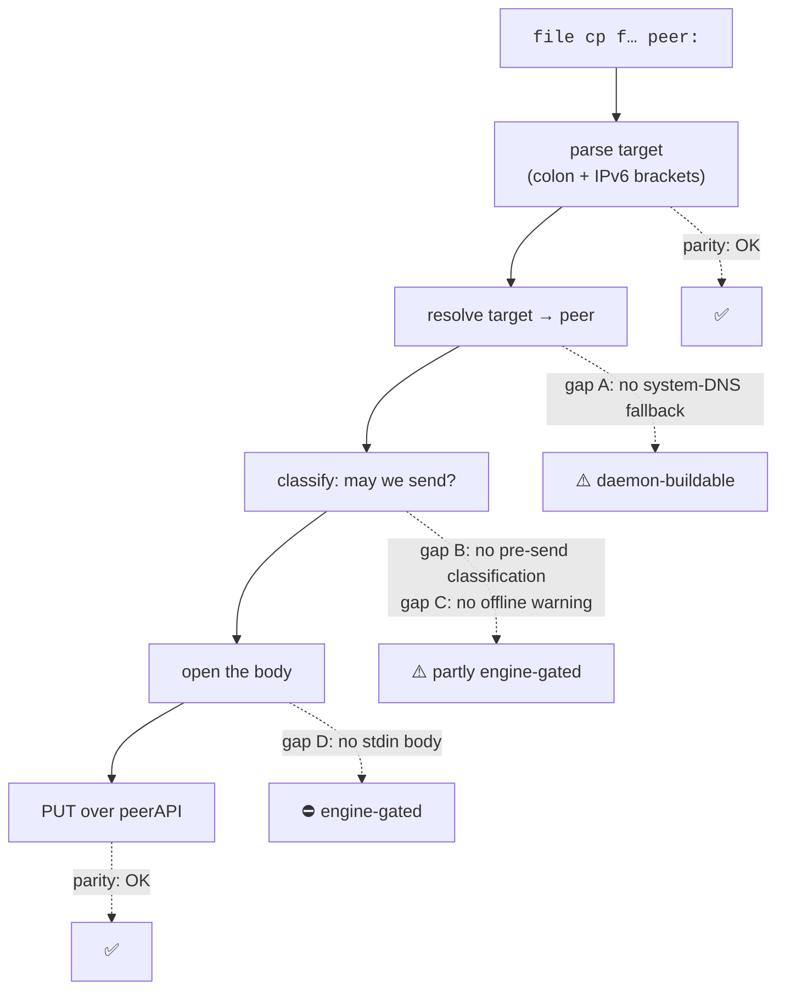

# `tnet file cp` vs Go `tailscale file cp` — the residual drift map

Scope: bead **`tsd-52k`** — the four residual Go-fidelity gaps left open by the PR #137 review
(stdin streaming, rich pre-send errors, the offline warning, system-DNS fallback), listed as one row
in [`PARITY_GAP_ANALYSIS.md` §4.5](PARITY_GAP_ANALYSIS.md). That row records the gaps by name but not
by *shape*, and its gating note is wrong (see [§6](#6-correcting-the-parity-doc-note)). This document
is the source-grounded version: for each item, what Go actually does, what this fork actually does,
and what closing it costs — so the implementing change can be scoped without re-deriving any of it.

**Sources read.** Go `tailscale` **v1.100.0**: `cmd/tailscale/cli/file.go` (`runCp`,
`watchOutgoingFiles`, `getTargetStableID`, `pickStdinFilename`, `runCpTargets`) and
`cmd/tailscale/cli/ping.go` (`tailscaleIPFromArg`). This fork at the current tree:
`src/bin/tnet.rs` (`run_file_cp`, `resolve_cp_file`, `parse_cp_target`, `format_file_targets`),
`src/ipn/diag.rs` (`file_cp`, `file_targets`), `src/localapi.rs`, `src/server.rs`. Engine
`geiserx_tailscale` at the **pinned rev `9d847a6e` (v0.43.0)**: `src/lib.rs`
(`Device::{send_file, file_targets, peer_by_name, peer_by_tailnet_ip}`),
`ts_runtime/src/taildrop_send.rs`, `ts_runtime/src/status.rs`, `ts_control/src/node.rs`,
`ts_runtime/src/peer_tracker/peer_db.rs`.

---

## 1. Verdicts at a glance

| # | Gap | Verdict | Blocker |
| --- | --- | --- | --- |
| A | System-DNS fallback for a non-peer target name | **daemon-buildable** | none — one design call (CLI-side vs daemon-side lookup) |
| B | Rich pre-send errors | **partly daemon-buildable** | 5 of Go's 10 reasons are visible today; the rest need an engine primitive |
| C | The offline / not-replying warning | **partly daemon-buildable** | the *"reportedly offline"* half is free; the timer half needs a send-progress signal from the engine |
| D | stdin (`-`) streaming | **engine-gated** | `Device::send_file` cannot express an unknown-length body; the LocalAPI framing is *not* the blocker |

Per the bead's rule, the engine-side halves of **B**, **C** and **D** are filed as
[`ENGINE_ASKS.md` #31](ENGINE_ASKS.md) and go no further here — no vendoring, no patching around, no
pin bump.

What is **already faithful** and must not regress: the `<target>:` trailing-colon rule and the
IPv6-bracket grammar (`parse_cp_target`, `src/bin/tnet.rs:1274`, unit-tested); `--targets` rejecting
positional args; the `--name`-with-multiple-files and `-`-with-multiple-files guards; per-file
basename derivation; and the send-name hardening (`cp_send_name_ok`, `src/ipn/diag.rs:678`) plus the
`symlink_metadata` + `O_NOFOLLOW` source hardening (`taildrop_source_ok`, `src/ipn/diag.rs:1321`),
which are this fork's own additions over Go and are deliberate.

---

## 2. Gap A — system-DNS fallback for the target name

**Go** (`ping.go:195`, `tailscaleIPFromArg`, called from `file.go:117`) resolves the target in three
ordered steps: a literal IP is used as-is; otherwise the netmap peer list is matched
case-insensitively against each peer's display name and its `DNSName`; and **only if both miss** does
it fall back to the host resolver — `net.Resolver.LookupHost(ctx, hostOrIP)`, taking `addrs[0]`, with
`error looking up IP of %q: %v` on failure and `no IPs found for %q` on an empty answer. The self node
is matched too (it resolves, then fails later at `getTargetStableID` as "not in your Tailnet").

**This fork** (`diag::file_cp`, `src/ipn/diag.rs:585`) does the first two steps and stops: a literal
IP goes to `Device::peer_by_tailnet_ip`, anything else to `Device::peer_by_name`, and a miss is
`no tailnet peer matches "<target>"`.

**Delta.** Only the third step. The first two are already equivalent — the engine's name index
canonicalizes with `canon_name` (lowercase, one trailing dot stripped) over both the bare hostname and
the FQDN (`ts_runtime/src/peer_tracker/peer_db.rs:44`), which is the same match set as Go's
name-or-`DNSName` comparison. So the observable difference is exactly: a target name that resolves in
the *host's* DNS to a tailnet IP works in Go and fails here. That covers a split-horizon corporate name
or a `/etc/hosts` alias pointing at a tailnet address.

**Closing it** is a handful of lines, but carries one real design call:

- **CLI-side** (Go's placement): `tnet` resolves the name itself before the round-trip and sends the
  resolved IP. Keeps the daemon — which may be running as root — free of host-network name lookups
  performed on a caller's behalf, and matches Go's process split exactly.
- **Daemon-side**: `file_cp` retries with the host resolver after `peer_by_name` misses. Fewer moving
  parts, but it hands an unprivileged caller a root-side DNS lookup primitive, which the daemon's
  threat model otherwise avoids.

The CLI-side placement is recommended: it is both the Go-faithful one and the conservative one. Either
way the resolved address must still go back through `peer_by_tailnet_ip` — a resolver answer is not a
send target on its own.

---

## 3. Gap B — rich pre-send errors

**Go** (`file.go:440`, `getTargetStableID`, wrapped by the caller as `can't send to %s: %v`) does a
full pre-send admission check before it opens a single byte:

- No peer holds that IP → `unknown target; %v is not a Tailscale IP address` when the address is
  outside the Tailscale range, else `unknown target; not in your Tailnet`.
- A peer was found → switch on `ipnstate.PeerStatus.TaildropTarget`, a daemon-computed enum with ten
  values, each with its own message: `Available` (proceed), `Offline` (proceed anyway — Go explicitly
  refuses to gate on the lagging `Online` bit), and eight refusals — no netmap, IPN state not running,
  missing Taildrop capability, no peer info, unsupported target OS, target advertises no file-sharing
  API, peer owned by a different user, and an indeterminate catch-all.

**This fork** has no pre-send classification at all. `file_cp` resolves the peer, hardens and opens the
path, and calls `Device::send_file`; every refusal surfaces afterwards as
`taildrop send failed: <engine error Debug>`. The most common real failure — a peer that advertises no
IPv4 peerAPI — reaches the operator as a bare `BadRequest`.

**Delta, reason by reason**, against what the pinned engine exposes:

| Go `TaildropTarget` | Visible to the daemon today? |
| --- | --- |
| `Available` | ✅ peer is present in `Device::file_targets()` |
| `NoPeerAPI` | ✅ `Node::peerapi_addr()` is `None` (the same test `file_targets` filters on) |
| `Offline` | ✅ `Node::online == Some(false)` (tri-state, `None` = unknown) |
| `IpnStateNotRunning` | ✅ the daemon's own IPN state — already the "node is not up" branch |
| `NoNetmapAvailable` | ✅ no netmap yet ⇒ an empty peer set |
| `OwnedByOtherUser` | ❌ the engine applies `peer.user_id == self_user_id` **inside** `build_file_targets` and exposes neither the self user id nor the per-peer reason |
| `MissingCap` | ❌ the engine gates `file_targets` on the node-level file-sharing capability and returns an **empty list** — indistinguishable from "no eligible peers" |
| `UnsupportedOS` | ❌ `ts_control::Node` carries no `Hostinfo.OS` field |
| `NoPeerInfo` / `Unknown` | ❌ catch-alls with no analogue |

**Closing it.** The daemon-buildable half is worth having on its own: before the open+send, check the
resolved peer against `Device::file_targets()` and refuse with a specific message for the five visible
reasons, plus Go's two `unknown target;` forms for an address no peer holds. That converts the most
common failure from a post-hoc `BadRequest` into a pre-send sentence, and it costs one extra engine
call on a path that already does several. Full ten-way fidelity needs the engine to classify a peer as
a Taildrop target *with a reason* — [ask #31](ENGINE_ASKS.md).

---

## 4. Gap C — the offline / not-replying warning

This is the item most likely to be under-scoped from the bead's one-word summary. It is **not** a
static "peer is offline" print.

**Go** (`file.go:230-241`, with `watchOutgoingFiles` at `file.go:289`):

1. Before the loop, subscribe to the IPN bus for `OutgoingFile` events for the target peer.
2. For the **first file only**, arm a 3-second `time.AfterFunc`.
3. The timer is disarmed by the first `OutgoingFile.Sent > 0` — the *bytes-pulled-toward-peerAPI*
   signal, deliberately not the CLI's own local write count, which would read "100% sent" as soon as
   the body lands in the local socket buffer — or by `PushFile` returning.
4. If it does fire, it prints (after `\r\x1b[K` to clear the progress line) either
   `# warning: %s is reportedly offline; trying anyway` or `# warning: %s is not replying; trying
   anyway`, chosen by the netmap `Online` bit.

So the netmap `Online` bit only picks the *wording*; the trigger is "no bytes have moved in 3s". Go
does not gate the send on it either way.

**This fork** prints nothing. It has the `online` bit — `FileTargetReport.online`
(`src/localapi.rs:866`) already carries it tri-state, and `format_file_targets` renders it — but only
on the `--targets` path, never on a send.

**Delta and what closes it.** Two halves:

- **The "reportedly offline" half is free.** Go itself learns `isOffline` from a `FileTargets`
  round-trip before sending, and this fork's `Request::FileTargets` already returns the same tri-state
  bit. `run_file_cp` can do that one round-trip first and print
  `# warning: <target> is reportedly offline; trying anyway` to stderr before the send. It also gives
  Gap B's target check for free — one call serves both.
- **The 3-second timer half is engine-gated.** There is no outgoing-file progress signal anywhere:
  `ts_runtime::taildrop_send::send_file` (`taildrop_send.rs:164`) streams the body to the overlay with
  no callback, and the `Device` surface has no `OutgoingFile` bus event. Without it "is not replying"
  is unobservable. A CLI-local 3-second timer is **not** an acceptable substitute: with nothing to
  disarm it, it would fire on every healthy transfer larger than 3 seconds of bandwidth — a warning
  that cries wolf is worse than no warning, and it violates the honest-omission rule this daemon holds
  elsewhere. Filed as [ask #31](ENGINE_ASKS.md).

Worth recording for whoever implements the engine side: because `Device::send_file` takes the body as
an `AsyncRead`, a counting wrapper in the daemon would observe reads that happen only as the engine
writes to the overlay stream — which is close to Go's semantics for `OutgoingFile.Sent`. That makes a
progress callback a small engine change, not a new subsystem.

---

## 5. Gap D — stdin (`-`) streaming

**Go** (`file.go:176-186`, `pickStdinFilename` at `file.go:536`): `-` reads from `os.Stdin` with
`contentLength = -1`, so `PushFile` sends the body with **no `Content-Length`** (chunked). When
`--name` is absent, `pickStdinFilename` reads up to `maxSniff` (4 MiB) from stdin, names the transfer
`stdin` + an extension — `.txt` when the sniff is under 4 MiB *and* valid UTF-8, else the first
`mime.ExtensionsByType(http.DetectContentType(...))` match, else none — and hands back the sniffed
prefix concatenated with the unread remainder, so nothing is lost. With `--name`, the sniff is skipped
entirely.

**This fork** rejects `-` up front in `resolve_cp_file` (`src/bin/tnet.rs:4597`), which is the honest
behavior for a build that cannot do it.

**The blockers, precisely — and the parity-doc note has them wrong:**

1. **Transport: not a blocker.** The LocalAPI is one JSON line in / one JSON line out, capped at
   `MAX_LINE_BYTES` = 64 KiB (`src/server.rs:31`), so a body cannot ride the request. But the pattern
   for streaming a body *into* the daemon already exists in this tree: `Request::Nc`
   (`src/localapi.rs:406`) answers with a one-line ack and then **hijacks** the connection for a
   bidirectional byte splice (`stream_nc`, `src/server.rs:686`), with the very same `BufReader`
   carrying whatever the client already sent after the request line. A `file cp -` body is the
   client→daemon half of exactly that shape. No new framing has to be invented.
2. **Engine: the real blocker.** `Device::send_file(peer, name, content_length: u64, reader)`
   (engine `src/lib.rs:1116`) takes a **required** `u64` length, and
   `ts_runtime::taildrop_send::send_file` unconditionally writes
   `Content-Length: {content_length}` into the peerAPI `PUT` head (`taildrop_send.rs:188`). There is no
   unknown-length or chunked mode, so Go's `contentLength = -1` push cannot be expressed. The only
   daemon-side workaround is to spool the whole of stdin to a temp file (or memory) to learn its length
   before sending — which is not streaming, turns an unbounded pipe into unbounded local disk, and
   would be a new resource-exhaustion surface on a root-run daemon. Not worth doing to fake a feature.
3. **A dependency question, once unblocked.** `pickStdinFilename`'s extension choice leans on Go's
   `http.DetectContentType` + `mime.ExtensionsByType`. Rust's std has neither, so a faithful port means
   either a new dependency or a hand-rolled subset of the sniff table. Given that `--name` skips the
   sniff entirely, shipping stdin support with `--name` **required** would be a defensible first slice.

Ordering, therefore: Gap D waits on [ask #31](ENGINE_ASKS.md) and on nothing in this repo.

---

## 6. Correcting the parity-doc note

The §4.5 row reads *"stdin streaming needs a daemon→client stream-back protocol."* Both halves are
wrong, which is why the item has looked larger and more daemon-shaped than it is:

- **Direction.** A `file cp` body flows **client→daemon**. A daemon→client stream is what `Watch`
  already does; it has nothing to do with sending a file.
- **What is actually missing.** The client→daemon streaming pattern is already implemented for
  `Request::Nc`. The blocker is the engine's fixed-length send path (§5, blocker 2), which is engine
  work under this bead's engine-pin rule.

§4.5 is updated in this change to say so and to point here.

---

## 7. Suggested landing order for the implementable parts

1. **Gap A** — the system-DNS fallback, CLI-side. Self-contained, unit-testable on the resolution
   helper, no wire change.
2. **Gaps B + C together** — one `FileTargets` round-trip before the send serves both: it yields the
   pre-send target check with a specific refusal reason *and* the `reportedly offline` warning. Doing
   them separately means paying for the same round-trip twice.
3. **Gap D** and the residue of B (`OwnedByOtherUser` / `MissingCap` / `UnsupportedOS`) and of C (the
   3-second timer) — blocked on [ask #31](ENGINE_ASKS.md); revisit at the next pin bump.

Steps 1 and 2 leave `tsd-52k` partially closed by design, with the remainder gated on a named engine
ask rather than on unscoped work.

---

## 8. Adjacent drift found while mapping this — *not* part of `tsd-52k`

Recorded so it is not lost, and deliberately left alone; each wants its own bead:

- **`--targets` omits Go's last-seen detail.** `runCpTargets` (`file.go:563`) appends
  `; last seen <d> ago`, rounded to the minute, to the `offline` / `unknown-status` column.
  `format_file_targets` (`src/bin/tnet.rs:5687`) prints the status word only, and
  `FileTargetReport` has no `last_seen` field — though the engine's `Node::last_seen` is right there
  next to the `online` bit already projected.
- **No `--verbose`, no `--update-interval` progress line.** Go's `cp` has both (`sending %q to
  %v/%v/%v ...` / `sent %q`, and a repainting progress line gated on stderr being a TTY). Both are
  downstream of the same missing send-progress signal as Gap C.
- **Batch failure semantics differ.** Go's `runCp` returns on the first failing file, abandoning the
  rest; `run_file_cp` (`src/bin/tnet.rs:4513`) reports each failure, continues, and exits 1 at the
  end. The fork's behavior is arguably kinder, but it is a divergence and is currently undocumented.
- **Stale engine pin in the docs.** `ENGINE_ASKS.md` and `PARITY_GAP_ANALYSIS.md` both state the pin
  is `35e5db22` / v0.41.0; `Cargo.toml` and `Cargo.lock` pin `9d847a6e` / **v0.43.0**. Every engine
  claim in this document was re-verified against the rev actually pinned.
