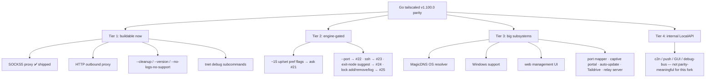

# What's left to port from Go `tailscaled` — parity gap analysis

A source-grounded diff of this Rust daemon (`tailnetd` + `tnet`) against Go
`tailscaled` + the `tailscale` CLI at **v1.100.0**, produced 2026-06-14 from a parallel sweep of the
upstream source (`cmd/tailscaled`, `cmd/tailscale/cli`, `ipn/localapi`, `ipn/ipnlocal`, `feature/`).

**Bottom line:** the user-facing `tnet` CLI surface is ~complete (all 34 commands exist). What remains
is (1) a few buildable daemon-level features, (2) a batch of `up`/`set` pref flags blocked on engine
`Config` fields, (3) larger OS-integration subsystems (Phase 3/4), and (4) internal LocalAPI endpoints
that don't matter for a single-user, CLI-driven fork. Engine-blocked items route through
[`ENGINE_ASKS.md`](./ENGINE_ASKS.md); everything is tracked as beads (`bd`, prefix `tsd-`).

## Tier 1 — buildable now (daemon-side, not engine-gated)

| Item | Go source | Notes | Status |
|---|---|---|---|
| **SOCKS5 proxy** (`--socks5-server`) | `net/socks5`, `startProxy` | The general-purpose outbound path for the netstack (no-TUN) daemon: dial over the overlay via `Device::connect_by_name`. The single most useful unported daemon subsystem. | **✅ shipped** (`src/socks5.rs`) |
| **HTTP outbound proxy** (`--outbound-http-proxy-listen`) | `net/socks5` (HTTP CONNECT), `startProxy` | Sibling of SOCKS5 — same overlay dialer, HTTP `CONNECT` framing. Lets HTTP-proxy-only clients route over the tailnet. | buildable next |
| `tailnetd --cleanup` | `tailscaled --cleanup` | Remove socket + stale state and exit. `tsd-9qm`. | buildable |
| `tailnetd --version` | `tailscaled --version` | Print version + exit (trivial). `tsd-k7s`. | buildable |
| `tailnetd --no-logs-no-support` | daemon flag | Honest no-op for us (we never upload logs) + the posture line should say so. | buildable |
| `tnet debug` subcommands | Go has ~41; we have 2 (capture, prefs) | Thin wrappers over LocalAPI we already expose: `netmap`, `env`, `hostinfo`, `watch-ipn`, `metrics`, `derp-map`. `tsd-b15`. | buildable |
| `tnet configure kubeconfig` | `cli/configure-kube.go` | Pure local kubeconfig YAML generation + a `Status`/`DNSConfig` resolve — no engine dependency. `tsd-37m`/`tsd-k47`. | buildable (needs a YAML dep decision) |

## Tier 2 — engine-gated (asks filed; honest-omission — not faked)

These need a `tailscale-rs` engine `Config` field or `Device::*` method first. Each has an
[`ENGINE_ASKS.md`](./ENGINE_ASKS.md) entry and a bead.

| `up`/`set` flag or feature | Engine ask | Daemon bead |
|---|---|---|
| `--operator`, `--report-posture`, `--advertise-connector`, `--netfilter-mode`, `--snat-subnet-routes`, `--stateful-filtering`, `--exit-node-allow-lan-access`, `--auto-update`/`--update-check`, `--webclient`, `--nickname`, `--relay-server-port` | **#21** (Config fields) | `tsd-1m9` |
| `tailnetd --port` (WireGuard listen port) | **#22** | `tsd-k7s` |
| `tnet ssh` (client; needs per-peer SSH host keys for pinned `known_hosts`) | **#23** | `tsd-dy5` |
| `tnet exit-node suggest` | **#24** (`Device::suggest_exit_node`) | `tsd-j1g` |
| `tnet lock add/remove/log` | **#25** (`tka_{add,remove,log}`) | `tsd-nee` |
| `tnet file get --wait`/`--loop` | **#20** (IPN-bus file-arrival signal) | `tsd-1hr` |

Note: Go froze `upArgsT` in 2024 — genuinely new prefs (`--auto-update`, `--webclient`,
`--relay-server-*`) land on **`set` only**, not `up`. And Go's `set` has **no** `--login-server`
(control-URL is `up`-only) — our `Set` correctly omits `control_url`, confirmed.

## Tier 3 — larger subsystems (Phase 3/4 beads)

Daemon-resident machinery that's a real port each, not a one-shot command:

| Subsystem | Go package | Bead |
|---|---|---|
| MagicDNS / OS-resolver programming (resolv.conf / resolved / NRPT / scutil) | `net/dns` | `tsd-ioh`, `tsd-m8s` |
| Windows support (wintun + service + named-pipe LocalAPI + route/DNS) | `cmd/tailscaled` + `net/dns` | `tsd-1yw` (needs engine Windows port, ask #18) |
| Local web management UI (mutating) | `client/web` | `tsd-bvc` |
| Port mapper (UPnP-IGD / NAT-PMP / PCP) | `net/portmapper` | `tsd-vxb` (likely engine-side) |
| Captive-portal detection | `net/captivedetection` + `ipnlocal` loop | `tsd-iqq.5` |
| Auto-update (self-install) | `clientupdate` | `tsd-aqu` |
| Taildrive (WebDAV shares) | `drive/` | `tsd-eka` (engine-gated — no WebDAV surface) |
| App connectors / relay server / TPM posture | `feature/{appconnectors,relayserver,tpm}` | (lower priority; mostly engine) |
| TPM/Secure-Enclave `--encrypt-state` | platform keystore | not-yet-built |

**At v1.100.0 Go refactored most of these out of `ipn/ipnlocal/` into a `feature/` plugin system**
(`ipnext.Extension`, registered via `feature/condregister/maybe_*.go`, toggled by `ts_omit_*` build
tags). A faithful structural model is: a `LocalBackend` core + independently-toggleable long-running
services. Our daemon already mirrors the load-bearing core (LocalAPI server, link-change monitor,
serve/funnel lanes, watch stream) + delegates the data plane (magicsock/DERP/netcheck/netstack) to the
engine.

## Tier 4 — internal LocalAPI endpoints (not parity-meaningful here)

Go exposes ~73 LocalAPI paths; we have 39 `Request` variants. Most of the ~34 unmatched are
**internal/coordination/debug** endpoints irrelevant to a single-user, CLI-driven fork:
`handle-push-message`, `set-push-device-token`, `set-gui-visible`, `disconnect-control`,
`dev-set-state-store`, `alpha-set-device-attrs`, the `debug-bus-*` family, `upload-client-metrics`,
`logtap`, `pprof`, `goroutines`. These back the GUI apps, mobile push, and control-plane coordination
(c2n) — not a headless CLI daemon. They are **deliberately out of scope** unless a consumer appears.

A few user-facing-adjacent endpoints we could still add cheaply: `check-ip-forwarding` (subnet-router
readiness diagnostic), `dns-osconfig` (engine-gated), `services` (VIP services), `peer-by-id`.

## The release gate (not a feature)

`tsd-q8o` / [`DESIGN.md`](./DESIGN.md): **never claim production-ready** until an external crypto audit
of the engine, regardless of feature parity. This is never closed by feature work.

---

*Generated from the v1.100.0 source diff. The authoritative live backlog is the bead set
(`bd list --status open`) + [`ENGINE_ASKS.md`](./ENGINE_ASKS.md); this doc is the orienting map.*
