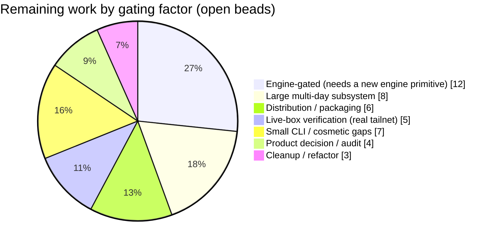
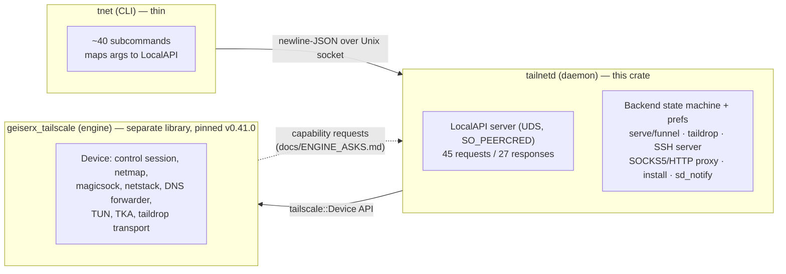
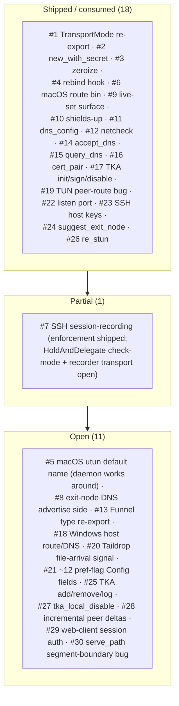

# What's left to port from Go `tailscaled` — parity gap analysis

A source-grounded diff of this Rust daemon (`tailnetd` + `tnet`) against Go `tailscaled` + the
`tailscale` CLI at the pinned upstream tag **v1.100.0**, refreshed **2026-06-16** from a parallel sweep
of both trees (the upstream `cmd/tailscaled`, `cmd/tailscale/cli`, `ipn/`, `net/`, `wgengine/` packages,
and this crate's `src/bin/{tailnetd,tnet}.rs`, `src/localapi.rs`, `src/ipn/`, `Cargo.toml`,
`docs/ENGINE_ASKS.md`).

- **This crate:** `tailscaled-rs` v0.51.0 — daemon `tailnetd` + CLI `tnet`, over the `geiserx_tailscale`
  engine.
- **Engine pin:** `35e5db22` = engine **v0.41.0** (the engine is a separate library released
  independently; the daemon consumes it and files capability requests in `docs/ENGINE_ASKS.md`).
- **Beads:** 50 closed / 45 open (see [the full open list](#7-full-open-bead-list)). The umbrella goal is
  bead `tsd-iqq` ("full Go `tailscaled` parity — a complete Rust copy of `tailscaled`").

> **How to read this.** The daemon's surface is split across two boundaries: what the **CLI/daemon
> code** can implement directly, and what must come from the **engine library** first. A large fraction
> of the remaining gaps are *engine-gated* — the daemon-side wiring is small and ready, but the engine
> doesn't yet expose the primitive. Those are tracked as numbered "engine asks". The rest are large
> subsystems, live-box verification, distribution, or deliberate product decisions.

---

## 1. Executive summary

**Where the port stands.** The core daemon is feature-rich and faithful: node lifecycle (`up`/`down`/
`login`/`logout`/`set`/`reload-config`), status/watch (incl. a masked IPN-bus notify stream),
diagnostics (`ip`/`whois`/`ping`/`netcheck`/`dns`/`metrics`/`bugreport`), Taildrop send+receive,
Tailscale SSH **server** *and* host-key-pinned SSH **client**, serve/funnel (TCP + web), exit-node
use/advertise + **suggest**, subnet routes, TUN data path (feature-gated), TLS cert provisioning,
tailnet-lock (init/status/sign/disable/disablement-kdf), profiles/switch, syspolicy, a SOCKS5 + HTTP
outbound proxy, a debug-metrics HTTP server, systemd/launchd install with `sd_notify(READY=1)`
(`Type=notify`), and a read-only loopback web UI. The LocalAPI exposes **45 request** / **27 response**
verbs over a `SO_PEERCRED`-authorized Unix socket.

**What's left, in one breath.** The biggest remaining buckets are: **per-OS platform breadth** (the
Linux OS-DNS configurator matrix, the port mapper, MagicDNS OS integration, and full **Windows**
support); **engine-gated features** (the ~12 missing `up`/`set` pref flags, tailnet-lock key-set
mutation, the incremental peer-delta bus, the mutating web UI, and a Taildrop file-arrival signal);
**distribution** (crates.io, `.deb`/`.rpm`, Homebrew); **live-tailnet verification** of paths CI can't
reach; and a basket of **small CLI/cosmetic flag gaps**. Each is enumerated below with its bead and
gating factor.

---

## 2. The two boundaries

A gap is **daemon-buildable** when the engine already exposes the needed primitive (the work is CLI +
LocalAPI wiring) and **engine-gated** when it does not (a numbered ask must land first, then a small
consuming change rides the next pin bump).

---

## 3. What is DONE (for orientation)

Closed this migration so far (50 beads). The consumed engine capabilities and shipped daemon features:

- **Lifecycle / prefs:** `up` (full flag surface incl. workload-identity-federation auth keys), `down`,
  `login` (interactive + authkey), `logout`, `set` (live pref mutation), `reload-config` (3-way
  persisted/rebuild/bring-down), `get`, `wait`, `whoami`, `version` (rich `--version` w/ commit+rustc).
- **Status / observability:** `status` (+`--json`/`--watch`/filters/`--web`), WatchNotifications (masked
  IPN-bus notify stream), `metrics`, `bugreport`, `netcheck` (DERP-latency scope), `dns status`/`query`,
  `syspolicy`, `ip`/`whois`/`ping`, `licenses`.
- **Connectivity:** exit-node use/advertise + **suggest**, advertise-routes, accept-routes/dns,
  shields-up, TUN data path (feature `tun`), `--port`/`PORT` listen-port pinning.
- **Services:** serve (tcp/https/http/redirect/status/reset), funnel on/off, Taildrop `cp`/`get`/`list`,
  TLS `cert` (feature `acme`), `nc`.
- **SSH:** Tailscale SSH **server** (feature `ssh`, control-policy authz, privilege drop) + host-key-
  pinned SSH **client** (`tnet ssh`).
- **Tailnet lock:** `init`/`status`/`sign`/`disable`/`disablement-kdf`.
- **Profiles:** `switch` (+`--list`/`--json`), profile create/delete.
- **Daemon plumbing:** systemd + launchd install (`ExecStopPost=--cleanup`, `EnvironmentFile`,
  feature-aware TUN-vs-userspace unit, `Type=notify` via `sd_notify(READY=1)`), SOCKS5 proxy, outbound
  HTTP proxy (CONNECT), debug-metrics HTTP server, `--cleanup`, `--config` declarative bring-up, process
  hardening, IP-forwarding readiness check, link-change auto-rebind, `is_ssh_over_tailscale` `/proc`
  sudo-fallback.
- **`debug`:** capture, prefs, env, metrics, via, rebind, restun, check-ip-forwarding, check-prefs,
  watch-ipn, local-creds, stat.

---

## 4. What's LEFT — by category

### 4.1 Engine-gated (the daemon-side wiring is small/ready; needs an engine primitive first)

These cannot be faithfully built until the engine exposes the capability (building a degraded facsimile
would violate the honest-omission rule). Each rides the next pin bump once its ask lands.

| Gap | Bead | Engine ask | Note |
| --- | --- | --- | --- |
| ~12 missing `up`/`set` pref flags (`--operator`, `--auto-update`/`--update-check`, `--report-posture`, `--advertise-connector`, `--webclient`, `--exit-node-allow-lan-access`, `--nickname`, Linux subnet-router knobs) | `tsd-1m9` | **#21** | Each needs a `Config`/pref field the engine doesn't carry. The workload-identity slice already shipped. |
| `lock add`/`remove`/`log` (tailnet-lock key-set mutation + AUM log) | `tsd-nee` | **#25** | Engine exposes `tka_{init,sign,disable}` but not `add`/`remove`/`log`. |
| `lock local-disable` (disable lock for THIS node only) | — | **#27** | `disablement-kdf` already ships daemon-side; `local-disable` needs `Device::tka_local_disable()`. |
| LocalAPI peer-by-id | `tsd-iqq.15` | — | Needs a numeric NodeID on `StatusNode` (engine surfaces only the stable id). |
| LocalAPI `set-expiry-sooner` + `reset-auth` | `tsd-iqq.12` | — | Engine-gated lifecycle verbs. |
| Incremental peer deltas on the notify bus (`PeerChangedPatch`/`PeersChanged`/`PeersRemoved`) | `tsd-iqq.11` (Phase 3) | **#28** | `net_map` is currently always the FULL peer set; correct but not delta-efficient. |
| Mutating web UI (Go `ManageServerMode`) | `tsd-bvc` (closed-partial) | **#29** | Needs a control-backed web-client session-auth flow + owner identity on whois. The read-only loopback UI ships; mutation would *exceed* Go without this. |
| `file get --wait` / `--loop` | `tsd-1hr` | **#20** | Needs a Taildrop file-arrival bus signal; the engine exposes only a `waiting_files()` poll. Busy-polling would be a CPU-spin facsimile. |
| `tnet drive` (Taildrive) | `tsd-eka` | — | Needs a whole engine WebDAV / virtual-disk subsystem; none exists. |
| `debug` rich reads (`netmap`/`hostinfo`/`derp-map`/`control-knobs`) + magicsock knobs (`rotate-disco-key`, `derp-set-on-demand`, `break-*-conns`, `force-netmap-update`, `peer-endpoint-changes`, `set-expire`, `ts2021`, `dial-types`, `peer-relay-servers`) | `tsd-b15` | — | Each needs a netmap field or magicsock knob the engine doesn't expose. The clean pure-local cherry-picks (`prefs`/`env`/`via`/`local-creds`/`stat`/`restun`) are already shipped. |
| `serve_path` segment-boundary match (`/apifoo` must not match a `/api` mount) | `tsd-k4q` | **#30** | Engine bug (the request-time mux is engine-owned); the fix is transparent to the daemon. |

### 4.2 Large multi-day subsystems (daemon-buildable, but each is a significant project)

| Subsystem | Bead | Note |
| --- | --- | --- |
| **Windows support** (wintun + Windows service/SCM + named-pipe LocalAPI + route/DNS via WFP/NRPT) | `tsd-1yw` | The single largest gap; Go has a full `tailscaled_windows.go` + `winRouter` + `windowsManager`. Also engine ask **#18** (Windows host route/DNS in `ts_host_net`). |
| **Linux OS-DNS configurator** (systemd-resolved / NetworkManager / resolvconf / direct `/etc/resolv.conf` matrix, with trample detection) | `tsd-m8s` | Re-scoped: the engine's `ts_host_net` already programs the resolver via `resolvectl` in TUN mode — so this is now largely a **verify-on-a-live-Linux-box** task to confirm the matrix + that Windows returns `Unsupported` cleanly. |
| **Port mapper** (UPnP-IGD / NAT-PMP / PCP) | `tsd-vxb` | Go has `net/portmapper`; improves NAT traversal. Engine-side concern (the daemon doesn't own magicsock). |
| **MagicDNS OS integration** (the `100.100.100.100` resolver wired into the host) | `tsd-ioh` | Depends on the OS-DNS configurator (`tsd-m8s`). |
| **Serve / Funnel runtime** (the full Go v2 grammar: `--bg`/`--service`/`--tun`/`--tls-terminated-tcp`/`--proxy-protocol`, service `drain`/`clear`/`advertise`/`get-config`/`set-config`) | `tsd-z40`, `tsd-c3w` | The TCP + web serve lanes ship; the Tailscale **Services** (VIP) layer and the v2 flag grammar are unmodeled. Partly engine-gated (Services are a netmap+control feature). |
| **Captive-portal detection** | `tsd-iqq.5` | Go's `ipnlocal/captiveportal.go`: probe the DERP map, mark a health warning on detection. |
| **`--state mem:` / non-file state backends** | `tsd-iqq.10` | Go's `--state` supports `mem:`/`kube:`/`arn:aws:ssm:` prefixes; this fork is file-only. |
| **LocalAPI → HTTP/1-over-UDS** (the eventual transport, matching Go's LocalAPI exactly) | `tsd-euv` | Currently newline-delimited JSON; Go is HTTP/1 with `PermitRead`/`PermitWrite`. A faithfulness upgrade, not a feature gap. |

### 4.3 Distribution & release

| Item | Bead | Note |
| --- | --- | --- |
| Publish `tailscaled-rs` to crates.io | `tsd-6y1` | |
| Get the `tailscale-rs` engine onto crates.io | `tsd-d6n` | Unblocks consuming the engine as a published crate instead of a git pin. |
| `.deb` / `.rpm` packaging (nfpm) + ship the `acme` feature in distributed builds | `tsd-k4a` | On a stock (feature-less) build, `cert`/`serve-https`/`funnel` are inert — distributed builds must enable `acme`. |
| Homebrew tap | `tsd-0s6` | |
| Release & distribution epic / repo finalization | `tsd-9ye`, `tsd-aiz` | |

### 4.4 Live-box verification (cannot be exercised in CI; needs a real tailnet / Linux box)

| Item | Bead | Note |
| --- | --- | --- |
| Gated live e2e campaign against a real tailnet | `tsd-6hx` | |
| Live proxy-splice proof (serve-tcp backend → SOCKS5/HTTP CONNECT through the proxy) | `tsd-49c` | |
| Live interactive-login (no-authkey) flow vs Headscale (rotating reg-key harness) | `tsd-9et` | |
| OS-DNS matrix verify on a live Linux box | `tsd-m8s` | (see §4.2) |
| External crypto audit gate before any production claim | `tsd-q8o` | The README already warns: experimental, unaudited. |

### 4.5 Small CLI / cosmetic gaps (daemon-buildable, low value, opportunistic)

| Item | Bead | Note |
| --- | --- | --- |
| `tnet configure kubeconfig` (pure-local kubeconfig YAML gen + Status resolve) | `tsd-37m`, `tsd-k47` | Deferred: merging an existing `~/.kube/config` needs a YAML parser dependency for one niche command this fork has no k8s-operator integration to use. |
| Small flag/grammar batch (`cert --min-validity`/`--serve-demo`, `netcheck --bind-address`, `status --browser`, etc.) | `tsd-dru` | Several items already shipped (`switch --json`, `version --track`, `metrics print`, `login`). Residual `logout --reason` is engine-gated (engine `logout()` takes no reason). |
| `file cp` residual Go-fidelity gaps (stdin streaming, rich pre-send errors, offline-warning, system-DNS fallback) | `tsd-52k` | stdin streaming needs a daemon→client stream-back protocol. |
| Taildrop `file get` dest parent-dir validation (symlinked ancestor) + same-uid trust doc | `tsd-k97` | The write is `SO_PEERCRED` same-uid-gated; a symlinked ancestor is the caller's own-namespace concern (matches Go's residual). Mostly a trust-model doc. |
| `serve redirect` `${HOST}`/`${REQUEST_URI}` expansion (doc claims it; engine doesn't do it) | `tsd-rjf` | Correct the doc, or implement with re-validation. |

### 4.6 Cleanup / refactor / documentation

| Item | Bead | Note |
| --- | --- | --- |
| Document the reduced fork shapes (`status --json` / `whois` / `netcheck` / `dns-status`) as the Go-tooling-compat boundary; fix RFC3339 timestamps + `nodekey:` peer-key keying | `tsd-efv` | The deviations are listed in §6; this bead is about documenting the boundary cleanly. |
| `tnet` startup stale-route/scutil reaper (exceeds Go macOS crash-safety) | `tsd-v0x` | An enhancement *beyond* Go, not a gap. |
| Extract a shared `rebuild_running_device` helper for `reload-config`/`drive_set` + richer reload success message | `tsd-iqq.16` | Internal tidy. |

---

## 5. Engine-ask ledger (the engine boundary)

The daemon files capability requests in `docs/ENGINE_ASKS.md` against the separate `tailscale-rs`
engine. Status as of the v0.41.0 pin:

**18 shipped, 1 partial, 11 open.** The open asks are exactly the engine-gated features in §4.1 plus the
platform-breadth item #18 (Windows). The engine is an actively-developed sibling lane; each release has
reliably unblocked daemon work (v0.40.0 unblocked #22/#23/#26; v0.41.0 unblocked #24), so the cadence
is: engine ships an ask → bump the pin → small consuming change.

---

## 6. Intentional deviations & honest-omission shapes

These are *documented, deliberate* reductions where the engine doesn't expose the data — not bugs, and
not silently weaker than Go. They are surfaced to the user where relevant.

- **`netcheck`** measures **only DERP-region latency** — no UDP/IPv4/IPv6 probe, no
  `MappingVariesByDestIP`, no PortMapping (UPnP/PMP/PCP); regions are identified by id, not name.
- **`whois`** never carries the owner login/email (`WhoisReport.user` is always `None` — the engine
  doesn't retain it). This also blocks the mutating web UI's owner-authz (ask #29).
- **`dns query`** returns the raw response datagram as hex; answer records are not decoded.
- **`dns status`** omits the "Use Tailscale DNS" accept-dns line + the system-DNS section.
- **Notify stream (`watch`)** carries `state`/`error`/`browse_to_url`/`net_map`/`prefs`; `net_map` is
  always the **full** peer set (no incremental `PeerChangedPatch` — ask #28); Go's
  Health/Engine/FilesWaiting/SuggestedExitNode notify fields are absent.
- **`status --json` peer key:** keyed by **StableNodeID**, where Go keys by the node public key
  (`nodekey:…`).
- **`up --json`** has no `QR` field (Go gates QR on a build feature).
- **web UI** is **read-only** (status + a login link); the mutating `ManageServerMode` is not shipped
  (ask #29) — and adding mutation to the *loopback* server would bypass the `SO_PEERCRED` write-gate, so
  it correctly belongs behind ManageServerMode's session auth.
- **`--cleanup`** removes only the stale LocalAPI socket — in the default netstack mode the daemon
  programs no OS DNS/route/firewall state, so there is nothing else to undo (matching Go's
  userspace-networking path).
- **`--no-logs-no-support`** is an honest no-op (this daemon never uploads logs anywhere).
- **Outbound HTTP proxy** implements CONNECT only; absolute-form forwarding returns `501`.
- **`update`** verifies **integrity** (SHA-256), not **authenticity** (no signature chain) — stated
  plainly.

These are the subject of `tsd-efv` (document the Go-tooling-compatibility boundary cleanly).

---

## 7. Full open bead list

45 open beads (`bd list --status open`), grouped by priority. Epics are umbrella trackers.

### Epics (P1–P3)
- `tsd-iqq` (P1) — **GOAL:** full Go `tailscaled` parity (the umbrella).
- `tsd-aiz` (P1) — Repo finalization & distribution setup.
- `tsd-cjd` (P1) — Security & audit.
- `tsd-p6n` (P1) — MVP hardening & known gaps.
- `tsd-3qf` (P2) — Testing & CI hardening.
- `tsd-6te` (P2) — Engine co-development & dependency management.
- `tsd-9ye` (P2) — Release & distribution.
- `tsd-rli` (P2) — Phase 3: platform breadth (TUN + per-OS router/DNS).
- `tsd-s5j` (P2) — Phase 2: daemonize.
- `tsd-49u` (P3) — Phase 4: feature parity.

### Features / tasks / bugs
- **P2:** `tsd-1m9` pref flags (#21) · `tsd-6y1` crates.io (daemon) · `tsd-d6n` crates.io (engine) ·
  `tsd-k4a` .deb/.rpm + ship acme · `tsd-m8s` Linux OS-DNS configurator · `tsd-q8o` external crypto audit.
- **P3:** `tsd-1yw` Windows support · `tsd-37m` configure kubeconfig · `tsd-52k` file-cp residual gaps ·
  `tsd-6hx` live e2e campaign · `tsd-91w` profiles/multi-account · `tsd-b15` debug subcommands ·
  `tsd-c3w` serve/funnel v2 grammar · `tsd-efv` document reduced shapes · `tsd-euv` HTTP/1-over-UDS ·
  `tsd-ioh` MagicDNS OS integration · `tsd-iqq.10` `--state mem:` · `tsd-iqq.12` set-expiry/reset-auth
  (engine-gated) · `tsd-iqq.15` peer-by-id (engine-gated) · `tsd-nee` lock add/remove/log (#25) ·
  `tsd-v0x` stale-route reaper (exceeds Go) · `tsd-vxb` port mapper · `tsd-z40` serve/funnel runtime.
- **P4:** `tsd-0s6` Homebrew tap · `tsd-1hr` file get --wait/--loop (#20) · `tsd-49c` live proxy-splice
  proof · `tsd-9et` live interactive-login vs Headscale · `tsd-dru` small flag batch · `tsd-eka`
  Taildrive (engine-gated) · `tsd-iqq.5` captive-portal detection · `tsd-iqq.16` reload-config refactor ·
  `tsd-k47` configure kubeconfig (local YAML) · `tsd-k4q` serve path-mux bug (#30) · `tsd-k97` file-get
  dest parent validation · `tsd-rjf` serve redirect var-expansion doc.

> The authoritative live backlog is the bead set (`bd list --status open`) + `docs/ENGINE_ASKS.md`. This
> doc is the orienting map; regenerate it after a batch of merges.

---

## 8. Bottom line

The daemon + CLI surface is **substantially complete and faithful** — the everyday `tailscale`/
`tailscaled` workflow works, with the deliberate reductions in §6 stated honestly. The remaining work is
dominated by **platform breadth** (Windows, the OS-DNS matrix, the port mapper), **engine-gated
features** that arrive on the engine-release cadence, **distribution** plumbing, and **live-tailnet
verification** of paths CI can't reach. None of it is a redesign; it is breadth and polish on a working
core. The single highest-leverage item is **Windows support** (`tsd-1yw`); the highest-frequency unblock
is the **engine pin bump** (each release has converted a filed ask into a shipped feature).

*Generated 2026-06-16 against engine v0.41.0 / daemon v0.51.0. Regenerate from `bd list` +
`docs/ENGINE_ASKS.md` + a fresh upstream sweep.*
