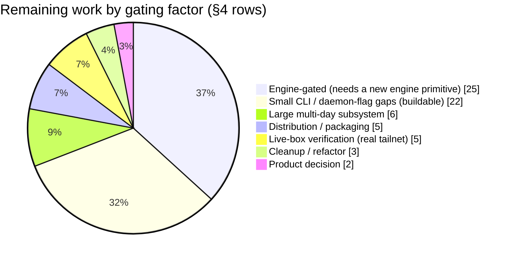
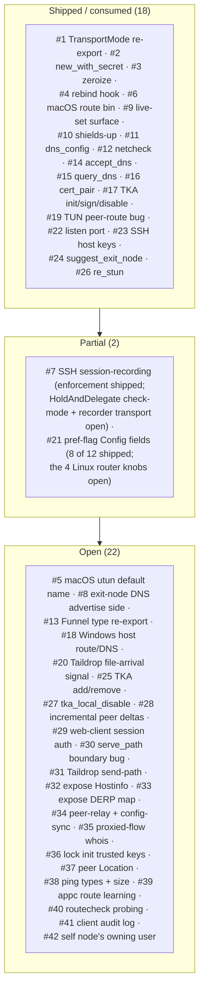

# What's left to port from Go `tailscaled` — parity gap analysis

A source-grounded diff of this Rust daemon (`tailnetd` + `tnet`) against Go `tailscaled` + the
`tailscale` CLI at the pinned upstream tag **v1.102.4** (commit
`bbcd7d1fc2054b9189ebc1531acf74bd880ca0c8`), refreshed **2026-09-11** from a parallel sweep of both
trees (the upstream `cmd/tailscaled`, `cmd/tailscale/cli`, `ipn/`, `net/`, `wgengine/` packages, and
this crate's `src/bin/{tailnetd,tnet}.rs`, `src/localapi.rs`, `src/ipn/`, `Cargo.toml`,
`docs/ENGINE_ASKS.md`).

- **The pin did not move, because there is nowhere to move it to.** `git ls-remote --tags`
  (2026-09-11) still puts **v1.102.4** at the top of the stable list; the only newer ref is
  `v1.103.0-pre`, the marker for the unstable branch, and this ledger tracks stable. So this pass has
  no release delta at all — it re-reads the same tree the last refresh read, at a different **depth**.
  The last refresh swept the daemon's pref-validation chain (`checkPrefsLocked` and its children) and
  the CLI's argument grammar; this one swept the layer under both: the daemon's **serve-config**
  validation (`setServeConfigLocked`, `validateServeConfigUpdate`), the CLI's client-side **value
  resolution** (`exitNodeIPOfArg`, `dnsname.ValidHostname` — the code that decides whether what the
  operator typed names anything real), and the two platform/environment predicates the prefs chain
  delegates to (`featureknob.CanRunTailscaleSSH`, `feature.CanAutoUpdate`). Seven gaps came back, and
  one of them **corrects** the pass before it: that pass recorded that Go "re-checks nothing" when
  Funnel is turned on under shields-up, and Go does re-check — in `setServeConfigLocked`, with its own
  message. The sweep also found the first subsystem this ledger had never carried a row for at all:
  the control-to-node (**c2n**) RPC channel (§4.1).
- **This crate:** `tailscaled-rs` v0.55.13 — daemon `tailnetd` + CLI `tnet`, over the
  `geiserx_tailscale` engine.
- **Engine pin:** `9d847a6e` — unchanged since the last refresh. The engine tree *after* the
  released **v0.43.0** (the release cut from this tree is `0.43.1`; the pin exists for a russh
  security bump v0.43.0 predates). The engine is a separate library released independently; the
  daemon consumes it and files capability requests in `docs/ENGINE_ASKS.md`. Note
  `docs/ENGINE_ASKS.md`'s own header still says `35e5db22`/v0.41.0 — that header is stale and is not
  this document's to fix.
- **Beads:** the tracker DB is not present in this checkout (`bd list` has nothing to read here), so
  §7 carries the open list from the previous regeneration, minus what merged since, plus the gaps this
  pass filed. Re-derive it from `bd list --status open` on a checkout that has the DB. The umbrella
  goal is bead `tsd-iqq` ("full Go `tailscaled` parity — a complete Rust copy of `tailscaled`").

> **How to read this.** The daemon's surface is split across two boundaries: what the **CLI/daemon
> code** can implement directly, and what must come from the **engine library** first. A large fraction
> of the remaining gaps are *engine-gated* — the daemon-side wiring is small and ready, but the engine
> doesn't yet expose the primitive. Those are tracked as numbered "engine asks". The rest are large
> subsystems, live-box verification, distribution, or deliberate product decisions.

---

## 1. Executive summary

```mermaid
pie showData
    title Remaining work by gating factor (§4 rows)
    "Engine-gated (needs a new engine primitive)" : 25
    "Small CLI / daemon-flag gaps (buildable)" : 22
    "Large multi-day subsystem" : 6
    "Distribution / packaging" : 5
    "Live-box verification (real tailnet)" : 5
    "Cleanup / refactor" : 3
    "Product decision" : 2
```

**Where the port stands.** The core daemon is feature-rich and faithful: node lifecycle (`up`/`down`/
`login`/`logout`/`set`/`reload-config`), status/watch (incl. a masked IPN-bus notify stream),
diagnostics (`ip`/`whois`/`ping`/`netcheck`/`dns`/`metrics`/`bugreport`), Taildrop send+receive,
Tailscale SSH **server** *and* host-key-pinned SSH **client**, serve/funnel (TCP + web) in Go's v2 flag
grammar, exit-node use/advertise + **suggest**, subnet routes, TUN data path (feature-gated), TLS cert
provisioning, tailnet-lock (init/status/log/sign/disable/disablement-kdf) in Go's own `lock init`
argument grammar, profiles/switch, syspolicy (over an admin-supplied `--syspolicy-file` source),
captive-portal detection, a **port-mapping client** (NAT-PMP + PCP mapping, UPnP-IGD discovery)
behind `tnet debug portmap`, a SOCKS5 + HTTP outbound proxy, a debug-metrics HTTP server,
systemd/launchd install with `sd_notify(READY=1)` (`Type=notify`), `configure kubeconfig` (with Go's
writability precheck), the read half of Tailscale **Services** (VIPs), and a read-only loopback web
UI that can state the origin it is reverse-proxied at. The LocalAPI exposes **47 request** /
**31 response** verbs over a `SO_PEERCRED`-authorized Unix socket, and `tnet` carries **38**
top-level subcommands — 35 with a Go counterpart, plus this fork's own `reload-config`, `install` and
`uninstall` — against upstream's **39** plus the `completion` command `ffcomplete.Inject` adds at
runtime.

**What's left, in one breath.** The biggest remaining buckets are: **per-OS platform breadth** (the
Linux OS-DNS configurator matrix, MagicDNS OS integration, and full **Windows** support);
**engine-gated features** (the Linux router pref flags, the four peer-relay/remote-config `set` prefs
behind ask #34, tailnet-lock key-set mutation, the incremental peer-delta bus, the mutating web UI, a
Taildrop file-arrival signal, the DERP map that would bring captive-portal detection to full strength,
`routecheck` reachability probing, app-connector route readback, peer **Location** for `exit-node list
--filter`, and the magicsock endpoint injection that would turn the new port mapper from a diagnostic
into a NAT-traversal win); **distribution** (crates.io, `.deb`/`.rpm`); **live-tailnet verification**
of paths CI can't reach; and a basket of **small CLI/daemon gaps**, in two flavours: command lines a
Go user would reasonably type and this fork rejects, and — the flavour this pass turned up — command
lines this fork accepts and then does nothing with, because the value was never checked against
anything real.

**What moved in this repo since the last refresh (2026-09-01 → 2026-09-11).** Twelve of the thirteen
gaps the previous regeneration handed to the tracker have merged: `down`'s `--reason` and its
lose-SSH refusal (`#336`, with Go's abort error restored in `#416`), `bugreport --diagnose`/`--record`
(`#330`), `exit-node list`'s columns/`--filter`/refusals (`#331`), `lock init`'s Go argument grammar
(`#329`), `ping`'s hostname target (`#337`) and its four selectors as by-name refusals, `whois`'s flow
arguments (`#327`), `dns status --all` (`#333`), `web --cgi`/`--origin` (`#326`, `#389`), `tailnetd
--tun` (`#344`, `#401`), Go's two TPM flags refused by name with the state-at-rest decision recorded
(`#325`), the `tailnetd debug` subcommand (`#324`), and the `--config` loader's drift from both
`ipn.ConfigVAlpha` and this fork's prefs (`#323`, `#391`). From the batch before that, `appc-routes`
(`#341`) and the versioned `--json=<version>` envelope (`#403`) also landed, and `routecheck` became
engine ask #40 with `exit-node suggest --force-probe` refused by name (`#343`). Two larger items
shipped outright: the **port mapper** (`#370`, `#372`, `#373` — `src/portmap.rs`, a port of Go
`net/portmapper` plus `netmon`'s gateway lookup) and the **Homebrew formula** (`packaging/homebrew`).
Of the six gaps the last restock handed over, `login`'s shared `up`/`login` flag set (`#397`) merged
outright and Go's `isRunningOrStarting` gate merged **in part** (`#405` ported the state table
faithfully but wired it to `ping` alone, where Go gates six commands); the rest are carried below.

**What the previous pass handed over.** Seven gaps, none of them merged since and all carried in
§4.5 below:
Go's single-dash long-flag spelling, the `--posture-checking` legacy spelling, the missing
`mac-app-connector` risk, `--exit-node=auto:any`, `--config`'s unenforced and inverted `Locked`
default, `set --shields-up` while Funnel is on, and a `--nickname` another profile already holds.

**What this sweep found.** Seven more, and they share a shape: this fork validates the *form* of what
the operator types and almost never the *substance*. `--exit-node` is checked for an `auto:` prefix
and then handed to the engine unresolved, so naming your own address, a mistyped peer, or a peer that
advertises no exit is accepted in silence — Go resolves the argument against the netmap and has six
refusals for it. `--hostname` takes any bytes at all, where Go runs `dnsname.ValidHostname` before it
builds the prefs. On the serve side, turning Funnel on under shields-up is accepted where Go refuses,
and a second `serve` on a busy port silently **replaces** the first where Go refuses by name. Two more
are predicates the prefs chain calls out to and this fork never ported: `set --auto-update` is
accepted on an installation that cannot update itself, and the SSH gate is a build-feature check only,
so `TS_DISABLE_SSH_SERVER` does not disable anything. The seventh is the missing mechanism behind
three reductions this fork already documents one at a time — there is no c2n channel, so control can
ask this node for nothing.

---

## 2. The two boundaries

```mermaid
flowchart LR
    subgraph CLI["tnet (CLI) — thin"]
        direction TB
        C1["38 subcommands<br/>maps args to LocalAPI"]
    end
    subgraph DAEMON["tailnetd (daemon) — this crate"]
        direction TB
        D1["LocalAPI server (UDS, SO_PEERCRED)<br/>47 requests / 31 responses"]
        D2["Backend state machine + prefs<br/>serve/funnel · taildrop · SSH server<br/>SOCKS5/HTTP proxy · portmap · install"]
    end
    subgraph ENGINE["geiserx_tailscale (engine) — separate library, pinned 9d847a6e"]
        direction TB
        E1["Device: control session, netmap,<br/>magicsock, netstack, DNS forwarder,<br/>TUN, TKA, taildrop transport"]
    end
    CLI -->|"newline-JSON over Unix socket"| DAEMON
    DAEMON -->|"tailscale::Device API"| ENGINE
    ENGINE -.->|"capability requests<br/>(docs/ENGINE_ASKS.md)"| DAEMON
```

A gap is **daemon-buildable** when the engine already exposes the needed primitive (the work is CLI +
LocalAPI wiring) and **engine-gated** when it does not (a numbered ask must land first, then a small
consuming change rides the next pin bump).

---

## 3. What is DONE (for orientation)

The consumed engine capabilities and shipped daemon features:

- **Lifecycle / prefs:** `up` (full flag surface incl. workload-identity-federation auth keys and Go's
  own `--auth-key`/`--login-server`/`--nickname`/`--host-routes` spellings), `down` (incl. `--reason`
  and the lose-SSH risk refusal), `login` (the flags Go's shared `up`/`login` flag set gives it),
  `logout` (incl. `--reason`, logged locally), `set` (live pref mutation, incl. by-name refusals for
  `--relay-server-port`/`--relay-server-static-endpoints`/`--remote-config`/`--sync`),
  `reload-config` (3-way persisted/rebuild/bring-down, in Go's own wording), `get`, `wait`, `whoami`,
  `version` (rich `--version` w/ commit+rustc, `--daemon`/`--json`/`--upstream`/`--track`).
- **Status / observability:** `status` (+`--json`/`--watch`/filters/`--web`/`--browser`, behind Go's
  `isRunningOrStarting` gate), WatchNotifications (masked IPN-bus notify stream), `metrics`,
  `bugreport` (incl. `--diagnose`/`--record`), `netcheck` (DERP-latency scope, `--format`/`--every`/
  `--verbose`), `dns status` (incl. `--all`)/`query`, `syspolicy` (`list`/`reload`, over an
  admin-supplied `tailnetd --syspolicy-file` device-scope source), `ip`/`whois` (Go's `ip[:port]` +
  `--proto` flow arguments)/`ping` (hostname or IP), `licenses`, **captive-portal detection** (Go's
  prober + the `captive-portal-detected` health warnable).
- **Connectivity:** exit-node use/advertise + **suggest**, advertise-routes, accept-routes/dns,
  shields-up, TUN data path (feature `tun`), `--port`/`PORT` listen-port pinning; the carried Go pref
  flags (`--operator`, `--nickname`, `--report-posture`, `--webclient`, `--auto-update`/
  `--update-check`, `--advertise-connector`, `--exit-node-allow-lan-access`); a **port-mapping
  client** (NAT-PMP + PCP mapping, UPnP-IGD discovery) surfaced by `tnet debug portmap`.
- **Services (VIPs), read half:** `service list`, the `tnet ip <service-VIP>` fallback that resolves a
  Service's addresses instead of failing with "no peer found", and Service-name resolution in
  `configure kubeconfig` — over the `services` LocalAPI verb. (`tsd-z40` still owns the *serving* half,
  `serve --service`.)
- **Services:** serve + funnel in Go v1.100.0's flag grammar (`--https`/`--http`/`--tcp`/
  `--tls-terminated-tcp`/`--set-path`/`--bg`/`--yes`, a foreground default, `<target> off`,
  `status`/`reset`) alongside this fork's positional sub-verbs (incl. the Go-less `serve redirect`)
  and the legacy `funnel <port> on|off`; Taildrop `cp`/`get` (incl. `--verbose`, and a resolved+vetted
  destination directory)/`list`, TLS `cert` (feature `acme`, incl. `--min-validity`/`--serve-demo`),
  `nc`, `configure kubeconfig` (standalone generation over http or https, with Go's writability
  precheck; no merge).
- **SSH:** Tailscale SSH **server** (feature `ssh`, control-policy authz, privilege drop) + host-key-
  pinned SSH **client** (`tnet ssh`, which since `#305` leaves the destination bare when the target
  omits `user@`, so the caller's `ssh_config` `User` directive decides).
- **Tailnet lock:** `init`/`status`/`log`/`sign`/`disable`/`disablement-kdf`. `init` now takes **Go's**
  positional grammar (trusted `tlpub:` keys and/or `disablement:` values, `--gen-disablements`,
  `--gen-disablement-for-support`, `--confirm`) and refuses by name what the engine cannot yet do
  (ask #36).
- **Profiles:** `switch` (+`--list`/`--json`, Go's usage refusals, `remove` incl. Go's current-profile
  and first-hit name matching; an unknown target is refused rather than created), profile
  create/delete.
- **Daemon plumbing:** systemd + launchd install (`ExecStopPost=--cleanup`, `EnvironmentFile`,
  feature-aware TUN-vs-userspace unit, `Type=notify` via `sd_notify(READY=1)`), SOCKS5 proxy, outbound
  HTTP proxy (CONNECT), debug-metrics HTTP server, `--cleanup`, `--config` as a declarative *source*
  (a path, `vm:user-data`, or either behind `optional:`), `--tun` in Go's own grammar, `--bird-socket`
  and Go's two TPM flags accepted and refused by name, a `tailnetd debug` subcommand that diagnoses a
  node that never comes up without a running daemon, process hardening, IP-forwarding readiness check,
  link-change auto-rebind, macOS startup route/DNS reaper, `is_ssh_over_tailscale` `/proc`
  sudo-fallback.
- **`debug`:** capture, prefs, env, metrics, via, rebind, restun, check-ip-forwarding, check-prefs,
  watch-ipn, local-creds, stat, statedir, resolve, portmap, build-info (Go `go-buildinfo`, kept as an
  alias).
- **`configure`:** `kubeconfig`; `sysext`/`mac-vpn` answer with Go's own explanatory refusal, and the
  rest of the host-integration tree (`synology`, `synology-cert`, `configure-host`, `flash-appliance`,
  `pve-appliance`, `jetkvm`) is recorded as out of scope for a daemon that ships no platform packages.

---

## 4. What's LEFT — by category

### 4.1 Engine-gated (the daemon-side wiring is small/ready; needs an engine primitive first)

These cannot be faithfully built until the engine exposes the capability (building a degraded facsimile
would violate the honest-omission rule). Each rides the next pin bump once its ask lands.

| Gap | Bead | Engine ask | Note |
| --- | --- | --- | --- |
| Linux subnet-router pref flags (`--snat-subnet-routes`, `--stateful-filtering`, `--netfilter-mode`, `--unattended`) | `tsd-1m9` (residual) | **#21** | These four ride the Linux OS-router layer (`tsd-m8s`); the engine has no netfilter/router knob to carry them. The other eight `up`/`set` pref flags **shipped** — the engine grew every `Config` field they need. |
| The behaviour behind `set --relay-server-port`/`--relay-server-static-endpoints`/`--remote-config`/`--sync` | *(previous pass)* | **#34** | The flags themselves shipped as by-name refusals, so a ported command line now says what is missing instead of dying at the parser. The behaviour needs a peer-relay listen port, static relay endpoints, control-delegated configuration and a config-sync kill switch on the engine's `Config`. `--remote-config` additionally needs a product decision: it hands the tailnet admin full control of prefs and LocalAPI. |
| `tailscale routecheck` + `exit-node suggest --force-probe` | *(previous pass)* | **#40** | New upstream command over LocalAPI `RouteCheck`/`RouteCheckProbe`, backed by `net/routecheck` peer reachability probing; `exit-node suggest --force-probe` re-ranks suggestions off a fresh probe. The ask is filed and the `--force-probe` flag already refuses by name (`#343`). |
| `tailscale appc-routes` (app-connector route readback) | *(previous pass)* | **#39** | LocalAPI `appc-route-info` returns the learned domain→route map. The command ships and tells the operator plainly that this fork advertises a connector but never learns a route (`#341`); the learning half is the ask. |
| `exit-node list --filter` + the COUNTRY/CITY columns, with live data | *(previous pass)* | **#37** | Go's grammar, columns, `--filter` and refusals all shipped (`#331`), but `PeerReport` still carries no `Location`, because `StatusNode` has none — so the country/city columns are empty and `--filter` matches nothing until the ask lands. |
| `lock init`'s trusted-key set, multiple disablements, and this node's own lock key | *(previous pass)* | **#36** | Go's argument grammar shipped (`#329`). What is engine-gated is the substance: `Device::tka_init` accepts exactly one `disablement_secret` and no trusted-key list, so a multi-key or multi-disablement init is refused by name rather than reinterpreted. |
| `lock add`/`remove`/`revoke-keys` (tailnet-lock key-set mutation) | `tsd-nee` | **#25** | Engine exposes `tka_{init,sign,disable,log}` but no key-set mutation: no `tka_add`/`tka_remove`, no AddKey/RemoveKey AUM builder, no public accessor for the live verified `Authority`. Go's `revoke-keys` (`--cosign`/`--finish`/`--fork-from`) is the recovery path on top of the same primitive. |
| `lock local-disable` (disable lock for THIS node only) | — | **#27** | `disablement-kdf` already ships daemon-side; `local-disable` needs `Device::tka_local_disable()`. |
| Full-strength captive-portal detection (the live DERP endpoint set) | `tsd-iqq.5` (residual) | **#33** | The prober and the health warnable **shipped** (`#290`, refined by `#411`/`#414`). Go builds most of its endpoint list from the live `DERPMap`'s `CanPort80` node IPv4s; the engine surfaces only region ids + latencies, so this fork probes the two endpoints Go always appends. |
| LocalAPI peer-by-id | `tsd-iqq.15` | — | Needs a numeric NodeID on `StatusNode` (engine surfaces only the stable id). |
| LocalAPI `set-expiry-sooner` + `reset-auth` | `tsd-iqq.12` | — | Engine-gated lifecycle verbs. |
| Incremental peer deltas on the notify bus (`PeerChangedPatch`/`PeersChanged`/`PeersRemoved`) | `tsd-iqq.11` (Phase 3) | **#28** | `net_map` is currently always the FULL peer set; correct but not delta-efficient. Upstream's v1.102.4 work on the delta path (`deleteIfOwned`, `RemovedPeers`) is entirely inside this boundary. |
| Mutating web UI (Go `ManageServerMode`) | `tsd-bvc` (closed-partial) | **#29** | Needs a control-backed web-client session-auth flow + owner identity on whois. The read-only loopback UI ships; mutation would *exceed* Go without this. |
| `file get --wait` / `--loop` | `tsd-1hr` | **#20** | Needs a Taildrop file-arrival bus signal; the engine exposes only a `waiting_files()` poll. Busy-polling would be a CPU-spin facsimile. |
| `tnet drive` (Taildrive) | `tsd-eka` | — | Needs a whole engine WebDAV / virtual-disk subsystem; none exists. |
| `debug hostinfo` (the local `Hostinfo` this node advertises to control) | `tsd-b15` | **#32** | NOT a netmap gap: the engine already computes the whole thing (`ts_control::hostinfo::HostInfoData::detect()`, the mirror of Go `hostinfo.New()`). Its module is private and nothing re-exports it, so the daemon cannot read the values it is itself sending. One `pub use` unblocks it. |
| `debug` rich reads (`netmap`/`derp-map`/`control-knobs`) + magicsock knobs (`rotate-disco-key`, `derp-set-on-demand`, `derp-unset-on-demand`, `pick-new-derp`, `force-prefer-derp`, `break-*-conns`, `force-netmap-update`, `peer-endpoint-changes`, `set-expire`, `ts2021`, `dial-types`, `peer-relay-servers`) + the event-bus reads (`daemon-bus-events`/`-graph`/`-queues`) | `tsd-b15` | — | Each needs a netmap field, a magicsock knob or an event bus that the engine doesn't expose. Re-confirmed against pin `9d847a6e`. `debug portmap` left this row when the port mapper shipped; every other pure-local cherry-pick is already shipped. |
| The port mapper's mapping reaching the data plane | `tsd-vxb` (residual) | *(no ask filed)* | `src/portmap.rs` acquires a real NAT-PMP/PCP mapping and reports it, but Go hands the resulting `external` address to magicsock as an advertised endpoint. The engine owns magicsock and exposes no way to inject an externally-learned endpoint, so the mapping is diagnostic only. Filing this ask is what turns the port mapper from an answer to "would my router help?" into a NAT-traversal win. |
| `serve_path` segment-boundary match (`/apifoo` must not match a `/api` mount) | `tsd-k4q` | **#30** | Engine bug (the request-time mux is engine-owned); the fix is transparent to the daemon. |
| `serve redirect` `${HOST}`/`${REQUEST_URI}` expansion | `tsd-rjf` (residual) | *(no ask filed)* | The doc half shipped — the CLI and rustdoc no longer promise expansion the stack never did. Implementing it is engine-side: both placeholders are per-request values, resolvable only inside `ts_runtime`'s `serve_redirect`, which never parses the request. |
| `ping --icmp`/`--tsmp`/`--peerapi`/`--size` (the ping-type selectors) | *(previous pass)* | **#38** | `Device::ping`/`ping_disco` do a disco ping and return a `Duration`; there is no TSMP, ICMP-through-WireGuard or peerAPI probe, and no message-size knob. All four flags parse and are refused by name (`#337`), so a ported command line says what is missing. |
| `whois --proto`'s flow lookup (the response half) | `tsd-efv` (residual) | **#35** | The request half shipped (`#327`): `whois --proto=tcp <ip>:<port>` parses and reaches the daemon. The engine resolves a bare address only, so the proxied-flow distinction Go's `WhoIsProto` exists for is not yet honoured. |
| `down --reason` / `logout --reason` reaching control | — | **#41** | Both flags ship and the reason is recorded locally, but Go submits it as a client audit log to control. The engine has no audit-log submission path. |
| `switch --list`'s `Tailnet`/`Account` columns, and Go's `--nickname=` login-name restore | `tsd-91w` (residual) | **#42** | The engine joins user profiles for PEERS only; the self node carries no owning user, so a cleared nickname falls back to the profile id where Go restores the login name. |
| The control-to-node (**c2n**) RPC channel — control can ask this node for nothing | *(new — filed by this pass)* | *(ask to file)* | Upstream registers ~20 handlers on an HTTP surface the control plane reaches over the existing noise session: `ipn/ipnlocal/c2n.go` (`RegisterC2N`/`handleC2N`, the `/debug/*` family, `/echo`, logtail flush, sockstats, netfilter-kind) plus `GET`+`POST /update`, `GET /posture/identity`, `GET /appconnector/routes`, `POST /wol`, `GET /vip-services`, `GET /tls-cert-status` and `/ssh/usernames`. The session is engine-owned end to end, so no daemon-side handler can be reached until the engine offers a registration hook — the ask this row exists to file. It is the missing mechanism behind three reductions this fork already documents one at a time: `--report-posture` is a carried pref because nothing answers the posture pull, `--auto-update` advertises `Hostinfo.AllowsUpdate` while nothing acts on a trigger, and ask #39's app-connector readback is the LocalAPI half of a readback control performs here. |

### 4.2 Large multi-day subsystems (daemon-buildable, but each is a significant project)

| Subsystem | Bead | Note |
| --- | --- | --- |
| **Windows support** (wintun + Windows service/SCM + named-pipe LocalAPI + route/DNS via WFP/NRPT) | `tsd-1yw` | The single largest gap; Go has a full `tailscaled_windows.go` + `winRouter` + `windowsManager`. Also engine ask **#18** (Windows host route/DNS in `ts_host_net`). |
| **Linux OS-DNS configurator** (systemd-resolved / NetworkManager / resolvconf / direct `/etc/resolv.conf` matrix, with trample detection) | `tsd-m8s` | Re-scoped: the engine's `ts_host_net` already programs the resolver via `resolvectl` in TUN mode — so this is now largely a **verify-on-a-live-Linux-box** task to confirm the matrix + that Windows returns `Unsupported` cleanly. |
| **MagicDNS OS integration** (the `100.100.100.100` resolver wired into the host) | `tsd-ioh` | Depends on the OS-DNS configurator (`tsd-m8s`). |
| **Serve / Funnel runtime** (`--service`/`--tun`/`--proxy-protocol`; service `drain`/`clear`/`advertise`/`get-config`/`set-config`) | `tsd-z40` | The v2 flag grammar, the foreground default and `--tls-terminated-tcp` now ship (`tsd-c3w`). What is left is the *serving* half of Tailscale Services (VIP) — engine-gated — plus `--tun` (netstack-only serve lanes) and `--proxy-protocol` (the engine's TCP serve target cannot emit the header). All three are *parsed* and refused by name, so a ported Go command line says what is missing. |
| **`--state mem:` / non-file state backends** | `tsd-iqq.10` | Go's `--state` supports `mem:`/`kube:`/`arn:aws:ssm:` prefixes; this fork has no `--state` flag at all (only `--statedir`), so the whole flag, not just the prefixes, is the gap. |
| **LocalAPI → HTTP/1-over-UDS** (the eventual transport, matching Go's LocalAPI exactly) | `tsd-euv` | Currently newline-delimited JSON; Go is HTTP/1 with `PermitRead`/`PermitWrite`. A faithfulness upgrade, not a feature gap. |

### 4.3 Distribution & release

| Item | Bead | Note |
| --- | --- | --- |
| Publish `tailscaled-rs` to crates.io | `tsd-6y1` | Registry metadata and the packaged file set are in place; `cargo package` succeeds once a `version` is present, so the daemon's own `git`+`rev` engine pin is the only remaining objection. The pin is deliberately not a same-version source swap: published `geiserx_tailscale` 0.43.0 predates the russh security bump this rev exists for, and the release cut from the pinned tree is `0.43.1` — so the honest unblock is an engine-version change under [`docs/ENGINE.md` §3](ENGINE.md#3-the-engine-on-cratesio). |
| Get the `tailscale-rs` engine onto crates.io | `tsd-d6n` | **Done upstream** — every `geiserx_*` engine crate in the daemon's resolved graph is published and unyanked at the locked version (`scripts/check-engine-on-crates-io.sh` re-checks it for whatever the pin resolves to). What is left is daemon-side and belongs to `tsd-6y1`. |
| `.deb` / `.rpm` packaging (nfpm) + ship the `acme` feature in distributed builds | `tsd-k4a` | On a stock (feature-less) build, `cert`/`serve-https`/`funnel` are inert — distributed builds must enable `acme`. |
| Homebrew tap | `tsd-0s6` (residual) | The formula **shipped** (`packaging/homebrew/tailscaled-rs.rb`, held by `tests/homebrew_formula.rs`). What is left is repo-external: standing up the tap and pointing it at a release artifact. |
| Release & distribution epic / repo finalization | `tsd-9ye`, `tsd-aiz` | |

### 4.4 Live-box verification (cannot be exercised in CI; needs a real tailnet / Linux box)

| Item | Bead | Note |
| --- | --- | --- |
| Gated live e2e campaign against a real tailnet | `tsd-6hx` | |
| Live proxy-splice proof (serve-tcp backend → SOCKS5/HTTP CONNECT through the proxy) | `tsd-49c` | |
| Live interactive-login (no-authkey) flow vs Headscale (rotating reg-key harness) | `tsd-9et` | |
| OS-DNS matrix verify on a live Linux box | `tsd-m8s` | (see §4.2) |
| External crypto audit gate before any production claim | `tsd-q8o` | The README already warns: experimental, unaudited. |

### 4.5 Small CLI / daemon gaps (daemon-buildable, opportunistic)

| Item | Bead | Note |
| --- | --- | --- |
| `--exit-node` is never resolved, so none of Go's six refusals fire | *(new — filed by this pass)* | Go resolves the argument CLI-side against the status it has just fetched (`SetExitNodeIP` → `exitNodeIPOfArg`, `ipn/prefs.go`). Your own address is `ExitNodeLocalIPError`, which `up` and `set` re-wrap as "did you mean --advertise-exit-node?"; on a Running node an IP with no peer behind it is "no node found in netmap with IP", and a peer not offering exit is "node %v is not advertising an exit node"; a non-IP argument is matched against every peer in three spellings and yields a starting-up refusal, "invalid value %q for --exit-node; must be IP or peer hostname", or "ambiguous exit node name %q". `validate_exit_node_selector` (`src/ipn/mod.rs`) checks the `auto:` prefix and nothing else, so every other wrong value is accepted and exit routing silently does nothing. The inputs are here: `PeerReport.is_exit_node` carries the advertisement and `exit-node list` already builds its table from it. |
| `--hostname` accepts any bytes, where Go validates it as a DNS name | *(new — filed by this pass)* | `prefsFromUpArgs` runs `dnsname.ValidHostname` before it builds the prefs: at most 254 bytes overall, every dot-separated label non-empty and at most 63 bytes, first and last byte alphanumeric, interior bytes letters, digits or `-`. Nothing between `tnet`'s flag and the engine `Config.hostname` looks at the value, so `--hostname "my laptop"`, a leading dash and a 300-character name are all accepted — and the value becomes this node's MagicDNS name. `--config` can set it without the CLI running, which argues for the check landing daemon-side rather than where Go puts it. |
| Funnel can be turned on while shields-up is set | *(new — filed by this pass)* | `setServeConfigLocked` refuses "Unable to turn on Funnel while shields-up is enabled" — the serve-side half of an exclusion whose prefs-side half is the `set --shields-up` row further down this table, and the correction to that filing's claim that Go re-checks nothing when the order is reversed. `Backend::set_serve_config` validates no prefs at all; both inputs are already at that call site (`self.prefs.shields_up`, and `serve::funnel_ports` as this fork's `IsFunnelOn`). |
| A second `serve` on a busy port replaces the first instead of being refused | *(new — filed by this pass)* | `validateServeConfigUpdate` refuses a serve-type change on a port already in use ("want to serve %q, but port %d is already serving %q"), plus two foreground-listener rules and the same check per Service. This fork writes the port map with a plain `BTreeMap::insert` at every serve and funnel call site, so `serve --tcp` aimed at a port already terminating HTTPS reports success and the previous serve is gone with no diagnostic. The two foreground rules have no state to run against here yet — a foreground serve is torn down by `tnet`, not the daemon (§6). |
| `set --auto-update` is accepted where the installation cannot update itself | *(new — filed by this pass)* | `checkAutoUpdatePrefsLocked` refuses `Apply=true` with "Auto-updates are not supported on this platform." or "Auto-update support is disabled in this build". The pref is not local: the engine advertises `Hostinfo.AllowsUpdate` from it, so accepting it tells the tailnet admin a remote trigger will be honoured. This fork already computes the predicate and never consults it: `run_update`'s install path refuses `--yes` when a Homebrew formula owns the binary, and again when `host_release_triple` finds no published artifact for the host (Linux x86_64/aarch64 tarballs only) — so on macOS this binary provably cannot replace itself while the pref still advertises that it can. Choosing which of those conditions gates the pref is the substance of the fix, since no background updater runs here at all. |
| `TS_DISABLE_SSH_SERVER` does not disable the SSH server | *(new — filed by this pass)* | `checkSSHPrefsLocked` delegates to `featureknob.CanRunTailscaleSSH`, whose final arm refuses "The Tailscale SSH server has been administratively disabled." whenever that envknob is set, on every OS — it is the operator's off switch for an image or a managed host. This fork's gate is the `ssh` Cargo feature alone (`Backend::check_prefs`), so on an ssh-enabled build the knob does nothing and `set --ssh` starts the server. `TS_DISABLE_PORTMAPPER` (`src/portmap.rs`) is the precedent for reading one. The unsupported-OS arm and the Synology/QNAP arms want an explicit port-or-decline rather than silence. |
| Every long flag dies unless it is spelled with two dashes | *(previous pass, filed)* | Go's CLI is built on the standard `flag` package, which treats `-hostname` and `--hostname` as the same flag; `cli.go`'s `CleanUpArgs` rewrites both `-authkey` and `--authkey`, which is upstream stating outright that the one-dash form reaches the parser. `tnet` is `Cli::parse()` with no pre-pass, and clap reads `-hostname` as a cluster of short flags, so every single-dash command line copied from Go's own docs fails. Most fail loudly — `tnet up -authkey=x` exits 2 with `unexpected argument '-a' found` — but `-hostname` does not: clap takes the leading `-h` as its own help flag, prints `up`'s help and **exits 0**, so a script that checks the status is told the node came up when nothing ran. |
| `--posture-checking` is an unknown argument, not the old spelling of `--report-posture` | *(previous pass, filed)* | The other half of `CleanUpArgs`: Go rewrites `--posture-checking` and `--posture-checking=<v>` (and their one-dash forms) to `--report-posture`, so the flag's former name keeps working. This fork carries `--report-posture` alone, so a runbook written before the rename dies at the parser — the same failure `#313` fixed for Go's four other `up` spellings. |
| The `mac-app-connector` risk has no counterpart, so macOS app-connector setup never warns | *(previous pass, filed)* | `risks.go` registers exactly two real risk types, `lose-ssh` and `mac-app-connector` (plus `all`). Both `up` and `set` present the second one when `goos == "darwin"` and `--advertise-connector` is set, with a specific message: macOS app connectors are not officially supported and should not carry anything mission-critical. This fork ports `lose-ssh` and `all` and ships `--advertise-connector` on both commands, and this daemon builds and runs on macOS — so the one platform Go warns about is the one where the warning is missing. |
| `--exit-node=auto:any` is refused by name where Go re-resolves it continuously | *(previous pass, filed)* | Go's `ipn.Prefs.AutoExitNode` holds an expression (`any` today); `resolveAutoExitNodeLocked` turns it into a concrete `ExitNodeID` from the current suggestion and re-runs it whenever a netcheck report or a rebind suggests the pick has gone stale. This fork rejects the `auto:` prefix up front (honestly — the alternative was a silent match against a peer named `auto:any`), but the primitive it would need is already consumed: `exit-node suggest` ships over `Device::suggest_exit_node()`. |
| `tailnetd --config`'s `Locked` defaults to **true** upstream and is enforced; here it is neither | *(previous pass, filed)* | Go's `ipn.ConfigVAlpha.Locked` is an `opt.Bool` documented as defaulting to true, and `isConfigLocked_Locked()` reads it as locked *unless* explicitly false — so with any config file in use, `checkPrefsLocked` refuses every prefs edit with "can't reconfigure tailscaled when using a config file; config file is locked". `src/conffile.rs` parses the field, warns only when it is explicitly `true`, and enforces nothing — so a config-driven node accepts `tnet set` silently, and the code comment asserting "absent is the default (no lock)" has the default backwards. |
| `set --shields-up` is accepted while Funnel is running | *(previous pass, filed)* | `checkFunnelEnabledLocked` refuses "Cannot enable shields-up when Funnel is enabled." — shields-up drops the inbound connections Funnel exists to accept, so the pair is a silent outage. Both halves are already modelled here: `shields_up` is a pref and `serve::funnel_ports` is the exact "is Funnel on" signal, so this is one check on the `up`/`set` path. |
| A `--nickname` another profile already holds is accepted | *(previous pass, filed)* | `checkProfileNameLocked` refuses `profile name %q already in use` when the name resolves to a different profile, which is what keeps Go's name→profile lookup unambiguous. `rename_current_profile` writes the name unconditionally, so two profiles can share one — and `switch <name>` then resolves to whichever comes first, a behaviour this fork documents as "first-hit matching" but which Go makes unreachable. |
| Go's `isRunningOrStarting` gate reaches one command of six | *(previous pass, residual)* | `#405` ported the state table exactly — `Tailscale is stopped.`, `Logged out.` plus the `Log in at:` line, `Machine is not yet approved by tailnet admin.`, and the `unexpected state:` default — and `is_running_or_starting` is called from `resolve_ping_target` and nowhere else. Go gates six: `status` (human path only), `ping`, `nc`, `switch`, `serve` and two `debug` verbs, each exiting 1. So `tnet status` on a stopped node still prints an empty peer table and exits 0. `nc`'s two argument refusals (`usage: tailscale nc <hostname-or-IP> <port>`, `invalid port number %q`) belong to the same call site and are also still missing. |
| `tnet` has no `completion` subcommand, so no shell can tab-complete it | *(previous pass)* | `ffcomplete.Inject` adds a `completion` command (`bash`/`zsh`/`fish`/`powershell`) plus a hidden `__complete` verb, and commands register dynamic completers so `tailscale nc <TAB>` offers live peer names. The static half is `clap_complete` over the existing derive; the dynamic half needs the hidden verb and a status round-trip. |
| `up`/`set` never run Go's advertise-routes warnings | *(previous pass)* | `warnOnAdvertiseRoutes` runs after every `up`/`set` that advertises routes or a connector, calling `CheckIPForwarding` and — on Linux — `CheckUDPGROForwarding`. This fork has the first check and reaches it only through `tnet debug check-ip-forwarding`, whose own rustdoc already claims `up`/`set` run it. The GRO half has no counterpart. |
| Four duration flags take bare integers where Go takes a duration string | *(previous pass)* | `up --timeout`, `wait --timeout` and `netcheck --every` take integer seconds; `ping --timeout` takes integer *milliseconds*, so `ping --timeout 5` means 5ms where Go means 5s — the one case that fails quietly instead of loudly. `src/goduration.rs` already ports `time.ParseDuration` faithfully and is used by `cert --min-validity`. |
| There is no health tracker, so `status` Health can only carry the captive-portal line | *(previous pass)* | Go's `health` package registers ~30 `Warnable`s and `Tracker.Strings()` fills `ipnstate.Status.Health`. The renderer is ported; what is missing is everything that would put a line in it. Split it honestly: ipn-state, login-state, warming-up, apply-disk-config, ip-forwarding and the two update warnables are daemon-buildable today; every DERP/magicsock/map-poll/packet-filter warnable is engine-gated. |
| `tnet configure kubeconfig` merging into an existing `~/.kube/config` | `tsd-k47` | Generation shipped (`#288`, `#309`) and the writability precheck followed (`#385`, `#422`): `configure kubeconfig <peer-or-service>` emits a **standalone** kubeconfig (stdout, or `--output PATH`). Merging stays deferred: it needs a YAML parser dependency for one niche command this fork has no k8s-operator integration to use. |
| Small flag/grammar batch (`status --header`, `login --qr`/`up --qr-format`, `netcheck --bind-address`/`--bind-port`, …) | `tsd-dru` | Residual: `--bind-address`/`--bind-port` are engine-gated (the probes run in the engine, not the CLI); `--qr` needs a QR-encoder dependency, a bigger call than a cosmetic batch should make; `status --header` (column headers in table format) is unclaimed and cheap. |
| `file cp` residual Go-fidelity gaps (stdin streaming, rich pre-send errors, offline-warning, system-DNS fallback, `--verbose`/`--update-interval` progress) | `tsd-52k` | Mapped item-by-item in [`FILE_CP_PARITY.md`](FILE_CP_PARITY.md). The system-DNS fallback is daemon-buildable; the pre-send errors and the offline warning are half daemon-buildable; **stdin is engine-gated** — the blocker is the engine's required `content_length: u64` on `Device::send_file`, which cannot express Go's chunked `-1` push (ask #31). |
| Taildrop `file get` same-uid trust doc | `tsd-k97` (residual) | The destination-directory resolve+vet shipped (`#286`): the parent is resolved and stat'd, not just the leaf. What is left is the trust-model note — the write is `SO_PEERCRED` same-uid-gated, so a symlinked ancestor is the caller's own-namespace concern (matching Go's residual). |

### 4.6 Product decisions (adopt, or declare out of scope and say so)

| Item | Bead | Note |
| --- | --- | --- |
| `tailscale systray` (a Linux system-tray applet) | — | Out of scope by construction: this repo ships a daemon and a CLI, not a desktop GUI. Recorded here so the sweep doesn't keep re-finding it. |
| External crypto audit gate | `tsd-q8o` | See §4.4. |

> The rows that used to live here — the appliance/host `configure` subcommands, `tailnetd
> --bird-socket`, and Go's two TPM flags — were all ruled and shipped (`#303`, `#302`, `#325`). The
> pattern held every time: the answer was "accept it and refuse by name", not silence.

### 4.7 Cleanup / refactor / documentation

| Item | Bead | Note |
| --- | --- | --- |
| Document the reduced fork shapes (`status --json` / `whois` / `netcheck` / `dns-status`) as the Go-tooling-compat boundary; fix RFC3339 timestamps + `nodekey:` peer-key keying | `tsd-efv` | The deviations are listed in §6; this bead is about documenting the boundary cleanly. |
| `tailnetd` startup stale-route/scutil reaper (exceeds Go macOS crash-safety) | `tsd-v0x` | **Shipped** (`src/hostreap.rs`, called from `tailnetd` startup before the engine comes up). An enhancement *beyond* Go, not a gap: Go's darwin `Close()` is a no-op, so a hard-killed Go node re-converges only on the next `Set`. The root-only delete leg still wants the Mac gate (root + a live FIB) to be exercised end to end. |
| Extract a shared `rebuild_running_device` helper for `reload-config`/`drive_set` | `tsd-iqq.16` (residual) | Internal tidy. |

---

## 5. Engine-ask ledger (the engine boundary)

The daemon files capability requests in `docs/ENGINE_ASKS.md` against the separate `tailscale-rs`
engine. Status as of the `9d847a6e` pin:

```mermaid
flowchart TB
    subgraph SHIPPED["Shipped / consumed (18)"]
        S["#1 TransportMode re-export · #2 new_with_secret · #3 zeroize ·<br/>#4 rebind hook · #6 macOS route bin · #9 live-set surface ·<br/>#10 shields-up · #11 dns_config · #12 netcheck · #14 accept_dns ·<br/>#15 query_dns · #16 cert_pair · #17 TKA init/sign/disable ·<br/>#19 TUN peer-route bug · #22 listen port · #23 SSH host keys ·<br/>#24 suggest_exit_node · #26 re_stun"]
    end
    subgraph PARTIAL["Partial (2)"]
        P["#7 SSH session-recording (enforcement shipped;<br/>HoldAndDelegate check-mode + recorder transport open) ·<br/>#21 pref-flag Config fields (8 of 12 shipped;<br/>the 4 Linux router knobs open)"]
    end
    subgraph OPEN["Open (22)"]
        O["#5 macOS utun default name · #8 exit-node DNS advertise side ·<br/>#13 Funnel type re-export · #18 Windows host route/DNS ·<br/>#20 Taildrop file-arrival signal · #25 TKA add/remove ·<br/>#27 tka_local_disable · #28 incremental peer deltas ·<br/>#29 web-client session auth · #30 serve_path boundary bug ·<br/>#31 Taildrop send-path · #32 expose Hostinfo · #33 expose DERP map ·<br/>#34 peer-relay + config-sync · #35 proxied-flow whois ·<br/>#36 lock init trusted keys · #37 peer Location ·<br/>#38 ping types + size · #39 appc route learning ·<br/>#40 routecheck probing · #41 client audit log ·<br/>#42 self node's owning user"]
    end
    SHIPPED --> PARTIAL --> OPEN
```

**18 shipped, 2 partial, 22 open, of 42 filed.** Eight asks were filed since the last regeneration —
**#35** through **#42** — and most of them close out a §4 row that previously read "*(no ask filed)*":
peer `Location`, the ping types, app-connector route learning and routecheck probing were all named
as engine-gated with nothing filed against them, and now are. That is the boundary working as
intended: a sweep finds the gap, the row names the missing primitive, and the ask turns it into
something the engine lane can schedule. Two §4 rows still have no ask — `serve redirect`'s
`${HOST}`/`${REQUEST_URI}` expansion, and the port mapper's mapping reaching magicsock, which is new
this pass. The engine is an
actively-developed sibling lane and each release has reliably unblocked daemon work (v0.40.0 unblocked
#22/#23/#26; v0.41.0 unblocked #24), so the cadence holds: engine ships an ask → bump the pin → small
consuming change. The pin has not moved since the last refresh, so no ask changed status this pass.

---

## 6. Intentional deviations & honest-omission shapes

These are *documented, deliberate* reductions where the engine doesn't expose the data — not bugs, and
not silently weaker than Go. They are surfaced to the user where relevant.

- **`netcheck`** measures **only DERP-region latency** — no UDP/IPv4/IPv6 probe, no
  `MappingVariesByDestIP`, no PortMapping (UPnP/PMP/PCP) section; regions are identified by id, not
  name. (The port-mapping *client* now exists, but as `tnet debug portmap`, not as a netcheck row.)
- **`tnet debug portmap`** acquires a real NAT-PMP or PCP mapping and reports it, but the mapping is
  **diagnostic only** — the engine owns magicsock and takes no externally-learned endpoint (§4.1).
  UPnP-IGD is **discovery-only**: a UPnP router is detected and named, and acquiring a mapping over it
  would need an XML + SOAP stack this tree does not have, so it says so rather than reporting absence.
- **`whois`** never carries the owner login/email (`WhoisReport.user` is always `None` — the engine
  doesn't retain it), and `--proto` is parsed but not yet honoured as a flow distinction (ask #35).
- **`dns query`** returns the raw response datagram as hex; answer records are not decoded.
- **`dns status`** omits the "Use Tailscale DNS" accept-dns line + the system-DNS section.
- **Notify stream (`watch`)** carries `state`/`error`/`browse_to_url`/`net_map`/`prefs`; `net_map` is
  always the **full** peer set (no incremental `PeerChangedPatch` — ask #28); Go's
  Health/Engine/FilesWaiting/SuggestedExitNode notify fields are absent.
- **`status --json` peer key:** keyed by **StableNodeID**, where Go keys by the node public key
  (`nodekey:…`).
- **`up --json`** has no `QR` field (Go gates QR on the `HasQRCodes` build feature).
- **Versioned `--json=<version>`** reports `SchemaVersion: "tailscaled-rs.1"`, not Go's schema 1: the
  envelope grammar is ported, the payload inside it is this fork's shape and says so (`#403`).
- **`--exit-node auto:any`** is **refused by name**, not silently read as a peer called `auto:any`.
  §4.5 tracks implementing it over the `exit-node suggest` primitive that already ships.
- **Captive-portal detection** probes only the two endpoints Go always appends, not the live DERP
  map's `CanPort80` nodes (ask #33), and does not re-probe once per interface.
- **web UI** is **read-only** (status + a login link); the mutating `ManageServerMode` is not shipped
  (ask #29) — and adding mutation to the *loopback* server would bypass the `SO_PEERCRED` write-gate, so
  it correctly belongs behind ManageServerMode's session auth.
- **`--cleanup`** removes only the stale LocalAPI socket — in the default netstack mode the daemon
  programs no OS DNS/route/firewall state, so there is nothing else to undo (matching Go's
  userspace-networking path).
- **`--no-logs-no-support`** is an honest no-op (this daemon never uploads logs anywhere).
- **Outbound HTTP proxy** implements CONNECT only; absolute-form forwarding returns `501`.
- **`update`** verifies **integrity** (SHA-256), not **authenticity** (no signature chain) — stated
  plainly.
- **`serve redirect`** sends its target verbatim: `${HOST}`/`${REQUEST_URI}` are NOT expanded, and the
  CLI no longer claims they are (§4.1).
- **Foreground `serve`/`funnel`** is torn down by the **CLI**, not the daemon. Go ties a foreground
  serve to the CLI's IPN-bus watch session, so the daemon drops the config the moment that connection
  goes away (`SIGKILL`, a lost SSH session); here `tnet` restores the previous config from its own
  `SIGINT`/`SIGTERM` handler, so a killed foreground `tnet serve` leaves its serve installed until
  `tnet serve reset`.
- **`funnel <bare-port> off`** keeps this fork's legacy reading (turn the funnel off on
  `<bare-port>`), where Go reads the bare port as a *target* and turns off the funnel on the default
  port 443. Retargeting an existing `tnet funnel 8443 off` at 443 would report success while leaving
  8443 publicly exposed; `funnel --https=443 off` spells Go's reading explicitly.
- **TUN is a pref as well as a daemon flag** — `tnet up --tun` is this fork's own spelling and stays;
  `tailnetd --tun=<name>` is Go's and now works too (`#344`, `#401`).

These are the subject of `tsd-efv` (document the Go-tooling-compatibility boundary cleanly).

---

## 7. Full open bead list

Carried from the previous regeneration (`bd list --status open`) minus what merged since, grouped by
priority; the tracker DB is not in this checkout, so re-derive this section where it is. Epics are
umbrella trackers.

### Epics (P1–P3)
- `tsd-iqq` (P1) — **GOAL:** full Go `tailscaled` parity (the umbrella).
- `tsd-aiz` (P1) — Repo finalization & distribution setup.
- `tsd-cjd` (P1) — Security & audit.
- `tsd-p6n` (P1) — MVP hardening & known gaps.
- `tsd-3qf` (P2) — Testing & CI hardening.
- `tsd-6te` (P2) — Engine co-development & dependency management.
- `tsd-9ye` (P2) — Release & distribution.
- `tsd-rli` (P2) — Phase 3: platform breadth (TUN + per-OS router/DNS).
- `tsd-s5j` (P2) — Phase 2: daemonize.
- `tsd-49u` (P3) — Phase 4: feature parity.

### Features / tasks / bugs
- **P2:** `tsd-1m9` pref flags (#21) · `tsd-6y1` crates.io (daemon) · `tsd-d6n` crates.io (engine) ·
  `tsd-k4a` .deb/.rpm + ship acme · `tsd-m8s` Linux OS-DNS configurator · `tsd-q8o` external crypto audit.
- **P3:** `tsd-1yw` Windows support · `tsd-52k` file-cp residual gaps · `tsd-6hx` live e2e campaign ·
  `tsd-91w` profiles/multi-account · `tsd-b15` debug subcommands · `tsd-efv` document reduced shapes ·
  `tsd-euv` HTTP/1-over-UDS · `tsd-ioh` MagicDNS OS integration · `tsd-iqq.10` `--state` backends ·
  `tsd-iqq.12` set-expiry/reset-auth (engine-gated) · `tsd-iqq.15` peer-by-id (engine-gated) ·
  `tsd-nee` lock add/remove (#25) · `tsd-v0x` stale-route reaper (exceeds Go) · `tsd-vxb` port mapper
  (residual: the magicsock endpoint injection) · `tsd-z40` serve/funnel runtime.
- **P4:** `tsd-0s6` Homebrew tap (residual: stand up the tap) · `tsd-1hr` file get --wait/--loop (#20) ·
  `tsd-49c` live proxy-splice proof · `tsd-9et` live interactive-login vs Headscale · `tsd-dru` small
  flag batch · `tsd-eka` Taildrive (engine-gated) · `tsd-iqq.16` reload-config refactor · `tsd-k47`
  configure kubeconfig merge · `tsd-k4q` serve path-mux bug (#30) · `tsd-k97` file-get trust doc ·
  `tsd-rjf` serve redirect expansion (residual, engine-side).
- **Still open from the last restock's filings:** `tnet completion` · `warnOnAdvertiseRoutes` on
  `up`/`set` · the four bare-integer duration flags · the health tracker · the residual five call
  sites of Go's `isRunningOrStarting` gate, plus `nc`'s two argument refusals (`#405` wired the
  ported state table to `ping` only). `login`'s shared flag set merged outright (`#397`).
- **Handed to the tracker by the previous regeneration**, with nothing merged against them in this
  repo since: Go's single-dash long-flag spelling · the `--posture-checking` legacy spelling · the
  `mac-app-connector` risk · `--exit-node=auto:any` · `--config`'s unenforced and inverted `Locked`
  default · `set --shields-up` while Funnel is on · a `--nickname` another profile already holds. All
  seven are rows in §4.5.
- **Closed since the last regeneration:** `down --reason` + lose-SSH refusal (`#336`, `#416`) ·
  `bugreport --diagnose`/`--record` (`#330`) · `exit-node list` grammar (`#331`) · `lock init` grammar
  (`#329`) · `ping`'s hostname target (`#337`) · `whois` flow arguments (`#327`) · `dns status --all`
  (`#333`) · `web --cgi`/`--origin` (`#326`, `#389`) · `tailnetd --tun` (`#344`, `#401`) · the TPM flag
  refusals (`#325`) · the `tailnetd debug` subcommand (`#324`) · the `--config` drift (`#323`, `#391`) ·
  `appc-routes` (`#341`) · versioned `--json` (`#403`) · the port mapper (`#372`) · the Homebrew
  formula.

### Filed by this pass (not yet in the list above)
The gaps this sweep found that no open bead covered are handed to the tracker in
[`restock-beads.json`](restock-beads.json), each cited to the one upstream file it was verified in, at
`bbcd7d1fc2054b9189ebc1531acf74bd880ca0c8`: the unresolved `--exit-node` argument (`ipn/prefs.go`), the
unvalidated `--hostname` (`cmd/tailscale/cli/up.go`), Funnel turned on under shields-up and the serve
that replaces a busy port (both `ipn/ipnlocal/serve.go`), `set --auto-update` on an installation that
cannot update itself (`ipn/ipnlocal/local.go`), the missing c2n channel (`ipn/ipnlocal/c2n.go`), and
the SSH gate that ignores `TS_DISABLE_SSH_SERVER` (`envknob/featureknob/featureknob.go`).

> The authoritative live backlog is the bead set (`bd list --status open`) + `docs/ENGINE_ASKS.md`. This
> doc is the orienting map; regenerate it after a batch of merges.

---

## 8. Bottom line

The daemon + CLI surface is **substantially complete and faithful** — the everyday `tailscale`/
`tailscaled` workflow works, with the deliberate reductions in §6 stated honestly. The remaining work is
dominated by **platform breadth** (Windows, the OS-DNS matrix), **engine-gated features** that arrive on
the engine-release cadence, **distribution** plumbing, and **live-tailnet verification** of paths CI
can't reach. None of it is a redesign; it is breadth and polish on a working core. The single
highest-leverage item is **Windows support** (`tsd-1yw`); the highest-frequency unblock is the **engine
pin bump** (each release has converted a filed ask into a shipped feature).

What this refresh changes about that picture is again *where* to sweep, and the answer moved one layer
down. The pass before this one read the daemon's `checkPrefsLocked` chain and the CLI's argument
grammar — the code that decides whether an edit is *allowed* and how a command line is *spelled* — and
found seven gaps. This one read what those two layers hand a value to: the serve-config setter, the
exit-node and hostname resolvers, and the platform predicates the prefs chain delegates to. Seven more.
The common shape is worth stating plainly, because it predicts where the next seven are: this fork
checks the **form** of an argument and rarely its **substance**. `--exit-node` is tested for one prefix
and then never resolved against the netmap; `--hostname` is not tested at all; a `serve` aimed at a busy
port takes it by overwriting what was there. Each of those is a command that reports success and does
nothing, which is strictly worse than the exit-2 the earlier flag-by-flag sweeps kept finding — a
refusal at least tells the operator something.

Two of the seven also say something about this document's own hygiene, and both are worth acting on.
The first corrects a claim the previous pass filed: it recorded that Go re-checks nothing when Funnel is
turned on under shields-up, and Go does re-check, in `setServeConfigLocked`. That is two consecutive
passes finding that a confident "Go does not do this" had rotted, so treat every such sentence here as
the least trustworthy kind of row. The second is the c2n channel, which had no row at all even though
two rustdoc comments in `src/prefs.rs` (on `posture_checking` and `auto_update_apply`) and engine ask
#39 each describe one of its consequences without naming the thing they have in common.
A whole subsystem can stay invisible to this ledger by being documented only in pieces, and the way to
catch the next one is to sweep by upstream *mechanism* now and then, not only by command and flag.

*Re-derived 2026-09-11 against upstream v1.102.4 (`bbcd7d1fc2054b9189ebc1531acf74bd880ca0c8`, still the
newest stable tag — the only newer ref, `v1.103.0-pre`, marks the unstable branch), engine pin
`9d847a6e`, daemon v0.55.13. Regenerate from `bd list` + `docs/ENGINE_ASKS.md` + a fresh upstream
sweep; when the pin cannot move, sweep deeper instead of reporting no change.*
