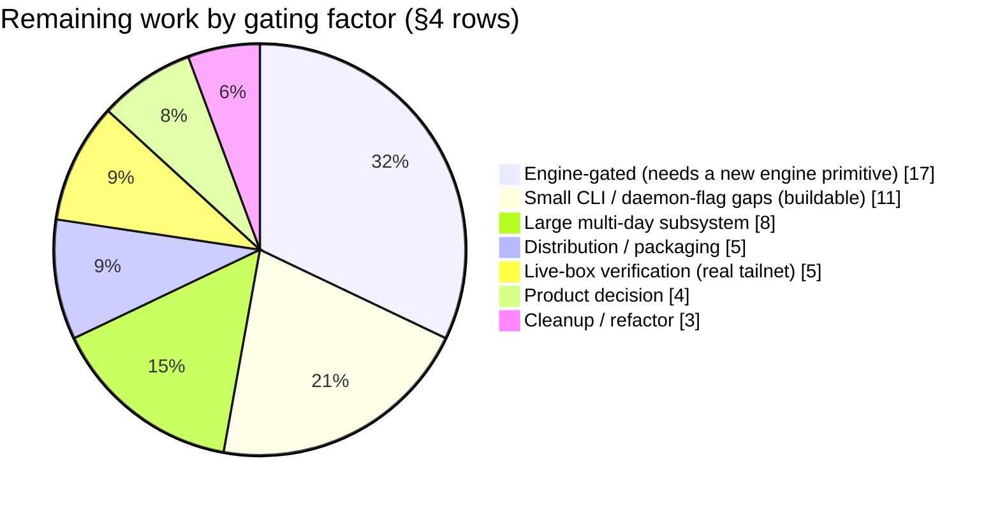
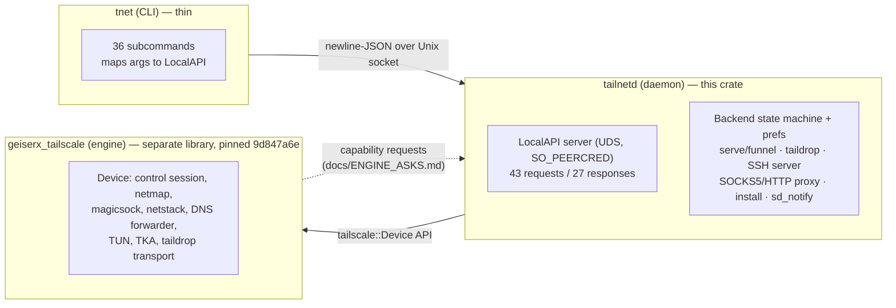
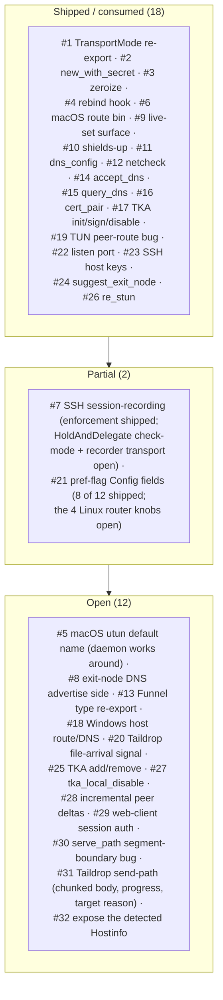

# What's left to port from Go `tailscaled` — parity gap analysis

A source-grounded diff of this Rust daemon (`tailnetd` + `tnet`) against Go `tailscaled` + the
`tailscale` CLI at the pinned upstream tag **v1.102.3** (commit
`53a0d659afa51835dd7a9283873cca44261454f8`), refreshed **2026-08-30** from a parallel sweep of both
trees (the upstream `cmd/tailscaled`, `cmd/tailscale/cli`, `ipn/`, `net/`, `wgengine/` packages, and
this crate's `src/bin/{tailnetd,tnet}.rs`, `src/localapi.rs`, `src/ipn/`, `Cargo.toml`,
`docs/ENGINE_ASKS.md`), plus a `v1.100.0..v1.102.3` upstream diff to catch what moved since the last
refresh.

- **This crate:** `tailscaled-rs` v0.52.2 — daemon `tailnetd` + CLI `tnet`, over the `geiserx_tailscale`
  engine.
- **Engine pin:** `9d847a6e` — the engine tree *after* the released **v0.43.0** (the release cut from
  this tree is `0.43.1`; the pin exists for a russh security bump v0.43.0 predates). The engine is a
  separate library released independently; the daemon consumes it and files capability requests in
  `docs/ENGINE_ASKS.md`. Note `docs/ENGINE_ASKS.md`'s own header still says `35e5db22`/v0.41.0 — that
  header is stale and is not this document's to fix.
- **Beads:** the tracker DB is not present in this checkout (`bd list` has nothing to read here), so
  §7 carries the open list from the previous regeneration plus the gaps this pass filed. Re-derive it
  from `bd list --status open` on a checkout that has the DB. The umbrella goal is bead `tsd-iqq`
  ("full Go `tailscaled` parity — a complete Rust copy of `tailscaled`").

> **How to read this.** The daemon's surface is split across two boundaries: what the **CLI/daemon
> code** can implement directly, and what must come from the **engine library** first. A large fraction
> of the remaining gaps are *engine-gated* — the daemon-side wiring is small and ready, but the engine
> doesn't yet expose the primitive. Those are tracked as numbered "engine asks". The rest are large
> subsystems, live-box verification, distribution, or deliberate product decisions.

---

## 1. Executive summary

```mermaid
pie showData
    title Remaining work by gating factor (§4 rows)
    "Engine-gated (needs a new engine primitive)" : 17
    "Small CLI / daemon-flag gaps (buildable)" : 11
    "Large multi-day subsystem" : 8
    "Distribution / packaging" : 5
    "Live-box verification (real tailnet)" : 5
    "Product decision" : 4
    "Cleanup / refactor" : 3
```

**Where the port stands.** The core daemon is feature-rich and faithful: node lifecycle (`up`/`down`/
`login`/`logout`/`set`/`reload-config`), status/watch (incl. a masked IPN-bus notify stream),
diagnostics (`ip`/`whois`/`ping`/`netcheck`/`dns`/`metrics`/`bugreport`), Taildrop send+receive,
Tailscale SSH **server** *and* host-key-pinned SSH **client**, serve/funnel (TCP + web) in Go's v2 flag
grammar, exit-node use/advertise + **suggest**, subnet routes, TUN data path (feature-gated), TLS cert
provisioning, tailnet-lock (init/status/log/sign/disable/disablement-kdf), profiles/switch, syspolicy,
a SOCKS5 + HTTP outbound proxy, a debug-metrics HTTP server, systemd/launchd install with
`sd_notify(READY=1)` (`Type=notify`), `configure kubeconfig`, and a read-only loopback web UI. The
LocalAPI exposes **43 request** / **27 response** verbs over a `SO_PEERCRED`-authorized Unix socket,
and `tnet` carries **36** top-level subcommands against upstream's **39**.

**What's left, in one breath.** The biggest remaining buckets are: **per-OS platform breadth** (the
Linux OS-DNS configurator matrix, the port mapper, MagicDNS OS integration, and full **Windows**
support); **engine-gated features** (the missing `up`/`set` pref flags, tailnet-lock key-set mutation,
the incremental peer-delta bus, the mutating web UI, a Taildrop file-arrival signal, and — new at this
pin — `routecheck` reachability probing, app-connector route readback and VIP **Services**);
**distribution** (crates.io, `.deb`/`.rpm`, Homebrew); **live-tailnet verification** of paths CI can't
reach; and a basket of **small CLI/daemon-flag gaps**, several of which are flags a command line copied
from Go still dies on. Each is enumerated below with its bead and gating factor.

**What moved upstream since the last refresh (v1.100.0 → v1.102.3).** `tailscale service list` and
`tailscale routecheck` are new commands; `tailscaled` grew `--syspolicy-file` and an `optional:` prefix
for `--config`; `set` grew `--remote-config`; `exit-node suggest` grew `--force-probe`; `ip` now
resolves Service VIPs; `tailscale ssh <host>` stopped injecting the local username; the versioned
`jsonoutput` schema (`--json=<version>`) spread across `lock status`/`lock log`/`dns status`. The
tailnet-lock LocalAPI verbs were renamed `NetworkLock*` → `TailnetLock*` (a Go-side client rename with
no wire change for this fork's own LocalAPI), and `cmd/tailscaled/tailscaled_bird.go` was replaced by a
`wgengine.HookNewBird` hook.

---

## 2. The two boundaries

```mermaid
flowchart LR
    subgraph CLI["tnet (CLI) — thin"]
        direction TB
        C1["36 subcommands<br/>maps args to LocalAPI"]
    end
    subgraph DAEMON["tailnetd (daemon) — this crate"]
        direction TB
        D1["LocalAPI server (UDS, SO_PEERCRED)<br/>43 requests / 27 responses"]
        D2["Backend state machine + prefs<br/>serve/funnel · taildrop · SSH server<br/>SOCKS5/HTTP proxy · install · sd_notify"]
    end
    subgraph ENGINE["geiserx_tailscale (engine) — separate library, pinned 9d847a6e"]
        direction TB
        E1["Device: control session, netmap,<br/>magicsock, netstack, DNS forwarder,<br/>TUN, TKA, taildrop transport"]
    end
    CLI -->|"newline-JSON over Unix socket"| DAEMON
    DAEMON -->|"tailscale::Device API"| ENGINE
    ENGINE -.->|"capability requests<br/>(docs/ENGINE_ASKS.md)"| DAEMON
```

A gap is **daemon-buildable** when the engine already exposes the needed primitive (the work is CLI +
LocalAPI wiring) and **engine-gated** when it does not (a numbered ask must land first, then a small
consuming change rides the next pin bump).

---

## 3. What is DONE (for orientation)

The consumed engine capabilities and shipped daemon features:

- **Lifecycle / prefs:** `up` (full flag surface incl. workload-identity-federation auth keys), `down`,
  `login` (interactive + authkey), `logout` (incl. `--reason`, logged locally), `set` (live pref
  mutation), `reload-config` (3-way persisted/rebuild/bring-down, and it now reports which of the three
  happened), `get`, `wait`, `whoami`, `version` (rich `--version` w/ commit+rustc, `--track`).
- **Status / observability:** `status` (+`--json`/`--watch`/filters/`--web`/`--browser`),
  WatchNotifications (masked IPN-bus notify stream), `metrics`, `bugreport`, `netcheck` (DERP-latency
  scope, `--format`/`--every`/`--verbose`), `dns status`/`query`, `syspolicy`, `ip`/`whois`/`ping`,
  `licenses`.
- **Connectivity:** exit-node use/advertise + **suggest**, advertise-routes, accept-routes/dns,
  shields-up, TUN data path (feature `tun`), `--port`/`PORT` listen-port pinning; the carried Go pref
  flags (`--operator`, `--nickname`, `--report-posture`, `--webclient`, `--auto-update`/
  `--update-check`, `--advertise-connector`, `--exit-node-allow-lan-access`).
- **Services:** serve + funnel in Go v1.100.0's flag grammar (`--https`/`--http`/`--tcp`/
  `--tls-terminated-tcp`/`--set-path`/`--bg`/`--yes`, a foreground default, `<target> off`,
  `status`/`reset`) alongside this fork's positional sub-verbs (incl. the Go-less `serve redirect`)
  and the legacy `funnel <port> on|off`; Taildrop `cp`/`get` (incl. `--verbose`, and a resolved+vetted
  destination directory)/`list`, TLS `cert` (feature `acme`, incl. `--min-validity`/`--serve-demo`),
  `nc`, `configure kubeconfig` (standalone generation over http or https; no merge).
- **SSH:** Tailscale SSH **server** (feature `ssh`, control-policy authz, privilege drop) + host-key-
  pinned SSH **client** (`tnet ssh`).
- **Tailnet lock:** `init`/`status`/`log`/`sign`/`disable`/`disablement-kdf`.
- **Profiles:** `switch` (+`--list`/`--json`, Go's usage refusals, `remove`), profile create/delete.
- **Daemon plumbing:** systemd + launchd install (`ExecStopPost=--cleanup`, `EnvironmentFile`,
  feature-aware TUN-vs-userspace unit, `Type=notify` via `sd_notify(READY=1)`), SOCKS5 proxy, outbound
  HTTP proxy (CONNECT), debug-metrics HTTP server, `--cleanup`, `--config` declarative bring-up, process
  hardening, IP-forwarding readiness check, link-change auto-rebind, macOS startup route/DNS reaper,
  `is_ssh_over_tailscale` `/proc` sudo-fallback.
- **`debug`:** capture, prefs, env, metrics, via, rebind, restun, check-ip-forwarding, check-prefs,
  watch-ipn, local-creds, stat, statedir, build-info (Go `go-buildinfo`, kept as an alias).

---

## 4. What's LEFT — by category

### 4.1 Engine-gated (the daemon-side wiring is small/ready; needs an engine primitive first)

These cannot be faithfully built until the engine exposes the capability (building a degraded facsimile
would violate the honest-omission rule). Each rides the next pin bump once its ask lands.

| Gap | Bead | Engine ask | Note |
| --- | --- | --- | --- |
| Linux subnet-router pref flags (`--snat-subnet-routes`, `--stateful-filtering`, `--netfilter-mode`, `--unattended`) | `tsd-1m9` (residual) | **#21** | These four ride the Linux OS-router layer (`tsd-m8s`); the engine has no netfilter/router knob to carry them. The other eight `up`/`set` pref flags (`--operator`, `--auto-update`/`--update-check`, `--report-posture`, `--advertise-connector`, `--webclient`, `--exit-node-allow-lan-access`, `--nickname`) **shipped** — the engine grew every `Config` field they need. |
| `set` pref flags this fork does not model at all: `--relay-server-port`, `--relay-server-static-endpoints`, `--remote-config`, `--sync` | *(new — filed by this pass)* | — | Present in `cmd/tailscale/cli/set.go` at v1.102.3 (`--remote-config` is new since v1.100.0). No engine `Config` field carries a peer-relay server port, static relay endpoints, control-delegated remote configuration, or the config-sync kill switch, so all four are engine-gated; `--remote-config` additionally needs a product decision, since it hands the tailnet admin full control of prefs and LocalAPI. |
| `tailscale routecheck` + `exit-node suggest --force-probe` | *(new — filed by this pass)* | — | New upstream command over LocalAPI `RouteCheck`/`RouteCheckProbe`, backed by `net/routecheck` peer reachability probing; `exit-node suggest --force-probe` re-ranks suggestions off a fresh probe. The engine has no routecheck subsystem and `Device::suggest_exit_node()` takes no probe hint. |
| `tailscale appc-routes` (app-connector route readback) | *(new — filed by this pass)* | — | LocalAPI `appc-route-info` returns the learned domain→route map. This fork can *advertise* the connector (`--advertise-connector` ships) but the engine learns and stores no app-connector routes, so there is nothing to read back. |
| VIP **Services** are invisible to the read paths (`service list`, `ip <service-VIP>`, `configure kubeconfig <service>`) | *(new — filed by this pass)* | — | Upstream's `services` LocalAPI verb backs a new `service list` command, an `ip` fallback that resolves a Service VIP to its addresses, and Service-name resolution in `configure kubeconfig`. Services are a netmap+control feature the engine does not surface. (`tsd-z40` owns the *serving* half — `serve --service`.) |
| `lock add`/`remove` (tailnet-lock key-set mutation) | `tsd-nee` | **#25** | Engine exposes `tka_{init,sign,disable,log}` but no key-set mutation: no `tka_add`/`tka_remove`, no AddKey/RemoveKey AUM builder, no public accessor for the live verified `Authority`. |
| `lock local-disable` (disable lock for THIS node only) | — | **#27** | `disablement-kdf` already ships daemon-side; `local-disable` needs `Device::tka_local_disable()`. |
| LocalAPI peer-by-id | `tsd-iqq.15` | — | Needs a numeric NodeID on `StatusNode` (engine surfaces only the stable id). |
| LocalAPI `set-expiry-sooner` + `reset-auth` | `tsd-iqq.12` | — | Engine-gated lifecycle verbs. |
| Incremental peer deltas on the notify bus (`PeerChangedPatch`/`PeersChanged`/`PeersRemoved`) | `tsd-iqq.11` (Phase 3) | **#28** | `net_map` is currently always the FULL peer set; correct but not delta-efficient. |
| Mutating web UI (Go `ManageServerMode`) | `tsd-bvc` (closed-partial) | **#29** | Needs a control-backed web-client session-auth flow + owner identity on whois. The read-only loopback UI ships; mutation would *exceed* Go without this. |
| `file get --wait` / `--loop` | `tsd-1hr` | **#20** | Needs a Taildrop file-arrival bus signal; the engine exposes only a `waiting_files()` poll. Busy-polling would be a CPU-spin facsimile. |
| `tnet drive` (Taildrive) | `tsd-eka` | — | Needs a whole engine WebDAV / virtual-disk subsystem; none exists. |
| `debug hostinfo` (the local `Hostinfo` this node advertises to control) | `tsd-b15` | **#32** | NOT a netmap gap: the engine already computes the whole thing (`ts_control::hostinfo::HostInfoData::detect()`, the mirror of Go `hostinfo.New()`). Its module is private and nothing re-exports it, so the daemon cannot read the values it is itself sending. One `pub use` unblocks it. |
| `debug` rich reads (`netmap`/`derp-map`/`control-knobs`) + magicsock knobs (`rotate-disco-key`, `derp-set-on-demand`, `derp-unset-on-demand`, `pick-new-derp`, `force-prefer-derp`, `break-*-conns`, `force-netmap-update`, `peer-endpoint-changes`, `set-expire`, `ts2021`, `dial-types`, `peer-relay-servers`) + `portmap` + the event-bus reads (`daemon-bus-events`/`-graph`/`-queues`) | `tsd-b15` | — | Each needs a netmap field, a magicsock knob, a port-mapping client (there is no NAT-PMP/PCP/UPnP code in the engine at all) or an event bus that the engine doesn't expose. Re-confirmed against pin `9d847a6e`. The pure-local cherry-picks (`prefs`/`env`/`via`/`local-creds`/`stat`/`restun`/`statedir`/`build-info`) are all shipped; `debug resolve` is the one remaining daemon-buildable verb (§4.5). |
| `serve_path` segment-boundary match (`/apifoo` must not match a `/api` mount) | `tsd-k4q` | **#30** | Engine bug (the request-time mux is engine-owned); the fix is transparent to the daemon. |
| `serve redirect` `${HOST}`/`${REQUEST_URI}` expansion | `tsd-rjf` (residual) | *(no ask filed)* | The doc half shipped — the CLI and rustdoc no longer promise expansion the stack never did. Implementing it is engine-side: both placeholders are per-request values, resolvable only inside `ts_runtime`'s `serve_redirect`, which never parses the request. File an ask if this is wanted. |

### 4.2 Large multi-day subsystems (daemon-buildable, but each is a significant project)

| Subsystem | Bead | Note |
| --- | --- | --- |
| **Windows support** (wintun + Windows service/SCM + named-pipe LocalAPI + route/DNS via WFP/NRPT) | `tsd-1yw` | The single largest gap; Go has a full `tailscaled_windows.go` + `winRouter` + `windowsManager`. Also engine ask **#18** (Windows host route/DNS in `ts_host_net`). |
| **Linux OS-DNS configurator** (systemd-resolved / NetworkManager / resolvconf / direct `/etc/resolv.conf` matrix, with trample detection) | `tsd-m8s` | Re-scoped: the engine's `ts_host_net` already programs the resolver via `resolvectl` in TUN mode — so this is now largely a **verify-on-a-live-Linux-box** task to confirm the matrix + that Windows returns `Unsupported` cleanly. |
| **Port mapper** (UPnP-IGD / NAT-PMP / PCP) | `tsd-vxb` | Go has `net/portmapper`; improves NAT traversal. Engine-side concern (the daemon doesn't own magicsock). |
| **MagicDNS OS integration** (the `100.100.100.100` resolver wired into the host) | `tsd-ioh` | Depends on the OS-DNS configurator (`tsd-m8s`). |
| **Serve / Funnel runtime** (`--service`/`--tun`/`--proxy-protocol`; service `drain`/`clear`/`advertise`/`get-config`/`set-config`) | `tsd-z40` | The v2 flag grammar, the foreground default and `--tls-terminated-tcp` now ship (`tsd-c3w`). What is left is the Tailscale **Services** (VIP) layer — engine-gated — plus `--tun` (netstack-only serve lanes) and `--proxy-protocol` (the engine's TCP serve target cannot emit the header). All three are *parsed* and refused by name, so a ported Go command line says what is missing. The read-only Services surface is §4.1's own row. |
| **Captive-portal detection** | `tsd-iqq.5` | Go's `ipnlocal/captiveportal.go`: probe the DERP map, mark a health warning on detection. |
| **`--state mem:` / non-file state backends** | `tsd-iqq.10` | Go's `--state` supports `mem:`/`kube:`/`arn:aws:ssm:` prefixes; this fork has no `--state` flag at all (only `--statedir`), so the whole flag, not just the prefixes, is the gap. |
| **LocalAPI → HTTP/1-over-UDS** (the eventual transport, matching Go's LocalAPI exactly) | `tsd-euv` | Currently newline-delimited JSON; Go is HTTP/1 with `PermitRead`/`PermitWrite`. A faithfulness upgrade, not a feature gap. |

### 4.3 Distribution & release

| Item | Bead | Note |
| --- | --- | --- |
| Publish `tailscaled-rs` to crates.io | `tsd-6y1` | Registry metadata and the packaged file set are in place; `cargo package` succeeds once a `version` is present, so the daemon's own `git`+`rev` engine pin is the only remaining objection. The pin is deliberately not a same-version source swap: published `geiserx_tailscale` 0.43.0 predates the russh security bump this rev exists for, and the release cut from the pinned tree is `0.43.1` — so the honest unblock is an engine-version change under [`docs/ENGINE.md` §3](ENGINE.md#3-the-engine-on-cratesio). |
| Get the `tailscale-rs` engine onto crates.io | `tsd-d6n` | **Done upstream** — every `geiserx_*` engine crate in the daemon's resolved graph is published and unyanked at the locked version (`scripts/check-engine-on-crates-io.sh` re-checks it for whatever the pin resolves to). What is left is daemon-side and belongs to `tsd-6y1`. |
| `.deb` / `.rpm` packaging (nfpm) + ship the `acme` feature in distributed builds | `tsd-k4a` | On a stock (feature-less) build, `cert`/`serve-https`/`funnel` are inert — distributed builds must enable `acme`. |
| Homebrew tap | `tsd-0s6` | |
| Release & distribution epic / repo finalization | `tsd-9ye`, `tsd-aiz` | |

### 4.4 Live-box verification (cannot be exercised in CI; needs a real tailnet / Linux box)

| Item | Bead | Note |
| --- | --- | --- |
| Gated live e2e campaign against a real tailnet | `tsd-6hx` | |
| Live proxy-splice proof (serve-tcp backend → SOCKS5/HTTP CONNECT through the proxy) | `tsd-49c` | |
| Live interactive-login (no-authkey) flow vs Headscale (rotating reg-key harness) | `tsd-9et` | |
| OS-DNS matrix verify on a live Linux box | `tsd-m8s` | (see §4.2) |
| External crypto audit gate before any production claim | `tsd-q8o` | The README already warns: experimental, unaudited. |

### 4.5 Small CLI / daemon-flag gaps (daemon-buildable, opportunistic)

| Item | Bead | Note |
| --- | --- | --- |
| `tnet up` rejects four Go `up` flags: `--auth-key` (Go's canonical spelling, incl. the `file:` prefix), `--login-server`, `--nickname`, `--host-routes` | *(new — filed by this pass)* | Each names something this fork already has (`--authkey`/`--authkey-file`, `--control-url`, `set --nickname`) or deliberately does not do — but a command line copied from Go exits 2 at argument parsing with "unexpected argument", the exact failure `tsd-dru`'s batch was meant to end. `--host-routes` carries Go's `notFalseVar` usage refusal (only `true` is accepted). |
| `tailscaled --syspolicy-file` | *(new — filed by this pass)* | New at v1.102.3: a JSON file registered as a device-scope policy source, defaulting to `/etc/tailscale/syspolicy.json` (`%ProgramData%\Tailscale\syspolicy.json` on Windows), empty to disable. This fork has a syspolicy layer (`src/ipn/syspolicy.rs`, `tnet syspolicy list`/`reload`) but no admin-provided file source to feed it. |
| `tailscaled --config` source prefixes: `vm:user-data` and `optional:` | *(new — filed by this pass)* | This fork takes `--config <PATH>` only. Go reads EC2 VM user-data as a config source, and (new at v1.102.3) an `optional:` prefix means "boot unconfigured if the source is absent" — an invalid-but-present config still fails. Both are error-path shapes, not features. |
| Versioned JSON output (`--json=<version>` + the `ResponseEnvelope`) on `lock status`, `lock log`, `dns status` | *(new — filed by this pass)* | Upstream's `cmd/tailscale/cli/jsonoutput` makes `--json` take either a bool or a schema version, defaulting to 1, refusing anything else with `unrecognised version: %d`, and wraps output in an envelope carrying `SchemaVersion`/errors/warnings. Every `--json` in `tnet` is a plain bool, so a script pinning `--json=1` dies. |
| `tnet ssh <host>` injects the local username where Go now leaves the destination bare | *(new — filed by this pass)* | Upstream changed at v1.102.3: with no `user@`, it passes just the host to `ssh` so `ssh_config`'s `User` directive applies. This fork still resolves `$USER`/`$LOGNAME` and always emits `user@host`, which silently overrides the user's own ssh config. |
| `tnet debug resolve <hostname>` (`--net ip|ip4|ip6`) | *(new — filed by this pass)* | The one Go `debug` verb that needs nothing from the engine: it is a host-resolver lookup in the CLI process with a 5s timeout and a `usage: tailscale debug resolve <hostname>` refusal on the wrong argument count. |
| `tnet configure kubeconfig` merging into an existing `~/.kube/config` | `tsd-k47` | Generation shipped (`tsd-37m`, `#288`): `configure kubeconfig <peer>` resolves the auth-proxy peer against Status and emits a **standalone** kubeconfig (stdout, or `--output PATH`). Merging stays deferred: it needs a YAML parser dependency for one niche command this fork has no k8s-operator integration to use. Upstream also grew a writability precheck (`checkKubeconfigWritable`) and now skips peers with no `AllowedIPs`; both belong to the merge path. |
| Small flag/grammar batch (`status --header`, `login --qr`/`up --qr-format`, `netcheck --bind-address`/`--bind-port`, …) | `tsd-dru` | Six flags shipped in `#289` (`cert --min-validity`/`--serve-demo`, `logout --reason`, `netcheck --verbose`, `status --browser`, `version --track`). Residual: `--bind-address`/`--bind-port` are engine-gated (the probes run in the engine, not the CLI); `--qr` needs a QR-encoder dependency, a bigger call than a cosmetic batch should make; `status --header` (column headers in table format) is unclaimed and cheap. |
| `file cp` residual Go-fidelity gaps (stdin streaming, rich pre-send errors, offline-warning, system-DNS fallback) | `tsd-52k` | Mapped item-by-item in [`FILE_CP_PARITY.md`](FILE_CP_PARITY.md). The system-DNS fallback is daemon-buildable; the pre-send errors and the offline warning are half daemon-buildable; **stdin is engine-gated** — the blocker is the engine's required `content_length: u64` on `Device::send_file`, which cannot express Go's chunked `-1` push (engine ask #31). |
| Taildrop `file get` same-uid trust doc | `tsd-k97` (residual) | The destination-directory resolve+vet shipped (`#286`): the parent is resolved and stat'd, not just the leaf. What is left is the trust-model note — the write is `SO_PEERCRED` same-uid-gated, so a symlinked ancestor is the caller's own-namespace concern (matching Go's residual). |
| `tnet switch` residual Go gaps (`--list`'s `Tailnet`/`Account` columns; how a profile is created) | `tsd-91w` | The grammar, refusals and reports are ported from `cmd/tailscale/cli/switch.go`. What is left is engine-gated or model-level: the engine surfaces no per-profile tailnet/account, so Go's two extra `--list` columns have nothing to print (emitted as JSON `null`, omitted from the human table); and this fork has no interactive multi-profile login, so a profile is created by switching to an unused id, where Go refuses an unknown target outright. |

### 4.6 Product decisions (adopt, or declare out of scope and say so)

| Item | Bead | Note |
| --- | --- | --- |
| Appliance/host `configure` subcommands: `synology`, `synology-cert`, `configure-host`, `flash-appliance`, `pve-appliance`, `jetkvm`, `sysext`, `mac-vpn` | *(new — filed by this pass)* | Upstream's `configure` tree is mostly platform-integration commands; this fork has only `configure kubeconfig`. Each is host-specific plumbing (DSM packages, VM appliances, a macOS system extension), so the answer may well be "out of scope" — but that is a decision to record, not a silence. |
| `tailscaled --bird-socket` (BIRD BGP integration for subnet routers) | *(new — filed by this pass)* | Go still ships the flag, now behind `wgengine.HookNewBird`, and refuses it loudly on platforms that cannot honour it. This fork has no BIRD story at all: the flag is not a no-op, it is an unknown argument. |
| `tailscale systray` (a Linux system-tray applet) | — | Out of scope by construction: this repo ships a daemon and a CLI, not a desktop GUI. Recorded here so the sweep doesn't keep re-finding it. |
| External crypto audit gate | `tsd-q8o` | See §4.4. |

### 4.7 Cleanup / refactor / documentation

| Item | Bead | Note |
| --- | --- | --- |
| Document the reduced fork shapes (`status --json` / `whois` / `netcheck` / `dns-status`) as the Go-tooling-compat boundary; fix RFC3339 timestamps + `nodekey:` peer-key keying | `tsd-efv` | The deviations are listed in §6; this bead is about documenting the boundary cleanly. |
| `tailnetd` startup stale-route/scutil reaper (exceeds Go macOS crash-safety) | `tsd-v0x` | **Shipped** (`src/hostreap.rs`, called from `tailnetd` startup before the engine comes up). An enhancement *beyond* Go, not a gap: Go's darwin `Close()` is a no-op, so a hard-killed Go node re-converges only on the next `Set`. The reaper removes the engine's leftover `scutil` resolver key and its `utun`-scoped static routes, matched by externally observable markers, only where the `utun` they point at is gone. Skippable with `TAILNETD_NO_REAP=1`. The root-only delete leg still wants the Mac gate (root + a live FIB) to be exercised end to end. |
| Extract a shared `rebuild_running_device` helper for `reload-config`/`drive_set` | `tsd-iqq.16` (residual) | Internal tidy. The richer reload success message shipped (`#285`): `reload-config` now says whether the change is live or waits for the next `up`. |

---

## 5. Engine-ask ledger (the engine boundary)

The daemon files capability requests in `docs/ENGINE_ASKS.md` against the separate `tailscale-rs`
engine. Status as of the `9d847a6e` pin:

```mermaid
flowchart TB
    subgraph SHIPPED["Shipped / consumed (18)"]
        S["#1 TransportMode re-export · #2 new_with_secret · #3 zeroize ·<br/>#4 rebind hook · #6 macOS route bin · #9 live-set surface ·<br/>#10 shields-up · #11 dns_config · #12 netcheck · #14 accept_dns ·<br/>#15 query_dns · #16 cert_pair · #17 TKA init/sign/disable ·<br/>#19 TUN peer-route bug · #22 listen port · #23 SSH host keys ·<br/>#24 suggest_exit_node · #26 re_stun"]
    end
    subgraph PARTIAL["Partial (2)"]
        P["#7 SSH session-recording (enforcement shipped;<br/>HoldAndDelegate check-mode + recorder transport open) ·<br/>#21 pref-flag Config fields (8 of 12 shipped;<br/>the 4 Linux router knobs open)"]
    end
    subgraph OPEN["Open (12)"]
        O["#5 macOS utun default name (daemon works around) ·<br/>#8 exit-node DNS advertise side · #13 Funnel type re-export ·<br/>#18 Windows host route/DNS · #20 Taildrop file-arrival signal ·<br/>#25 TKA add/remove · #27 tka_local_disable ·<br/>#28 incremental peer deltas · #29 web-client session auth ·<br/>#30 serve_path segment-boundary bug ·<br/>#31 Taildrop send-path (chunked body, progress, target reason) ·<br/>#32 expose the detected Hostinfo"]
    end
    SHIPPED --> PARTIAL --> OPEN
```

**18 shipped, 2 partial, 12 open, of 32 filed.** The open asks are the engine-gated features in §4.1
plus the platform-breadth item #18 (Windows) and the `file cp` send-path item #31 (§4.5). Four §4.1 rows
are newly engine-gated with **no ask filed yet** — routecheck probing, app-connector route readback, VIP
Services, and the four unmodelled `set` pref flags; filing them is the next engine-boundary step. The
engine is an actively-developed sibling lane and each release has reliably unblocked daemon work
(v0.40.0 unblocked #22/#23/#26; v0.41.0 unblocked #24), so the cadence holds: engine ships an ask → bump
the pin → small consuming change.

---

## 6. Intentional deviations & honest-omission shapes

These are *documented, deliberate* reductions where the engine doesn't expose the data — not bugs, and
not silently weaker than Go. They are surfaced to the user where relevant.

- **`netcheck`** measures **only DERP-region latency** — no UDP/IPv4/IPv6 probe, no
  `MappingVariesByDestIP`, no PortMapping (UPnP/PMP/PCP); regions are identified by id, not name.
- **`whois`** never carries the owner login/email (`WhoisReport.user` is always `None` — the engine
  doesn't retain it). This also blocks the mutating web UI's owner-authz (ask #29).
- **`dns query`** returns the raw response datagram as hex; answer records are not decoded.
- **`dns status`** omits the "Use Tailscale DNS" accept-dns line + the system-DNS section.
- **Notify stream (`watch`)** carries `state`/`error`/`browse_to_url`/`net_map`/`prefs`; `net_map` is
  always the **full** peer set (no incremental `PeerChangedPatch` — ask #28); Go's
  Health/Engine/FilesWaiting/SuggestedExitNode notify fields are absent.
- **`status --json` peer key:** keyed by **StableNodeID**, where Go keys by the node public key
  (`nodekey:…`).
- **`up --json`** has no `QR` field (Go gates QR on the `HasQRCodes` build feature).
- **web UI** is **read-only** (status + a login link); the mutating `ManageServerMode` is not shipped
  (ask #29) — and adding mutation to the *loopback* server would bypass the `SO_PEERCRED` write-gate, so
  it correctly belongs behind ManageServerMode's session auth.
- **`--cleanup`** removes only the stale LocalAPI socket — in the default netstack mode the daemon
  programs no OS DNS/route/firewall state, so there is nothing else to undo (matching Go's
  userspace-networking path).
- **`--no-logs-no-support`** is an honest no-op (this daemon never uploads logs anywhere).
- **Outbound HTTP proxy** implements CONNECT only; absolute-form forwarding returns `501`.
- **`update`** verifies **integrity** (SHA-256), not **authenticity** (no signature chain) — stated
  plainly.
- **`serve redirect`** sends its target verbatim: `${HOST}`/`${REQUEST_URI}` are NOT expanded, and the
  CLI no longer claims they are (§4.1).
- **Foreground `serve`/`funnel`** is torn down by the **CLI**, not the daemon. Go ties a foreground
  serve to the CLI's IPN-bus watch session, so the daemon drops the config the moment that connection
  goes away (`SIGKILL`, a lost SSH session); here `tnet` restores the previous config from its own
  `SIGINT`/`SIGTERM` handler, so a killed foreground `tnet serve` leaves its serve installed until
  `tnet serve reset`.
- **`funnel <bare-port> off`** keeps this fork's legacy reading (turn the funnel off on
  `<bare-port>`), where Go reads the bare port as a *target* and turns off the funnel on the default
  port 443. Retargeting an existing `tnet funnel 8443 off` at 443 would report success while leaving
  8443 publicly exposed; `funnel --https=443 off` spells Go's reading explicitly.

These are the subject of `tsd-efv` (document the Go-tooling-compatibility boundary cleanly).

---

## 7. Full open bead list

Carried from the previous regeneration (`bd list --status open`), grouped by priority; the tracker DB
is not in this checkout, so re-derive this section where it is. Epics are umbrella trackers.

### Epics (P1–P3)
- `tsd-iqq` (P1) — **GOAL:** full Go `tailscaled` parity (the umbrella).
- `tsd-aiz` (P1) — Repo finalization & distribution setup.
- `tsd-cjd` (P1) — Security & audit.
- `tsd-p6n` (P1) — MVP hardening & known gaps.
- `tsd-3qf` (P2) — Testing & CI hardening.
- `tsd-6te` (P2) — Engine co-development & dependency management.
- `tsd-9ye` (P2) — Release & distribution.
- `tsd-rli` (P2) — Phase 3: platform breadth (TUN + per-OS router/DNS).
- `tsd-s5j` (P2) — Phase 2: daemonize.
- `tsd-49u` (P3) — Phase 4: feature parity.

### Features / tasks / bugs
- **P2:** `tsd-1m9` pref flags (#21) · `tsd-6y1` crates.io (daemon) · `tsd-d6n` crates.io (engine) ·
  `tsd-k4a` .deb/.rpm + ship acme · `tsd-m8s` Linux OS-DNS configurator · `tsd-q8o` external crypto audit.
- **P3:** `tsd-1yw` Windows support · `tsd-52k` file-cp residual gaps · `tsd-6hx` live e2e campaign ·
  `tsd-91w` profiles/multi-account · `tsd-b15` debug subcommands · `tsd-efv` document reduced shapes ·
  `tsd-euv` HTTP/1-over-UDS · `tsd-ioh` MagicDNS OS integration · `tsd-iqq.10` `--state` backends ·
  `tsd-iqq.12` set-expiry/reset-auth (engine-gated) · `tsd-iqq.15` peer-by-id (engine-gated) ·
  `tsd-nee` lock add/remove (#25) · `tsd-v0x` stale-route reaper (exceeds Go) · `tsd-vxb` port
  mapper · `tsd-z40` serve/funnel runtime.
- **P4:** `tsd-0s6` Homebrew tap · `tsd-1hr` file get --wait/--loop (#20) · `tsd-49c` live proxy-splice
  proof · `tsd-9et` live interactive-login vs Headscale · `tsd-dru` small flag batch · `tsd-eka`
  Taildrive (engine-gated) · `tsd-iqq.5` captive-portal detection · `tsd-iqq.16` reload-config refactor ·
  `tsd-k47` configure kubeconfig merge · `tsd-k4q` serve path-mux bug (#30) · `tsd-k97` file-get
  trust doc · `tsd-rjf` serve redirect expansion (residual, engine-side).

### Filed by this pass (not yet in the list above)
The gaps this sweep found that no open bead covered are handed to the tracker in
[`restock-beads.json`](restock-beads.json), each cited to its upstream path at
`53a0d659afa51835dd7a9283873cca44261454f8`: the four unmodelled `set` pref flags, `routecheck` +
`exit-node suggest --force-probe`, `appc-routes`, VIP Services on the read paths, `tailscaled
--syspolicy-file`, `--config vm:user-data`/`optional:`, versioned `--json=<version>` output, the four
Go `up` flags `tnet up` rejects, `tnet ssh`'s username injection, `debug resolve`, the appliance
`configure` subcommands, and `--bird-socket`.

> The authoritative live backlog is the bead set (`bd list --status open`) + `docs/ENGINE_ASKS.md`. This
> doc is the orienting map; regenerate it after a batch of merges.

---

## 8. Bottom line

The daemon + CLI surface is **substantially complete and faithful** — the everyday `tailscale`/
`tailscaled` workflow works, with the deliberate reductions in §6 stated honestly. The remaining work is
dominated by **platform breadth** (Windows, the OS-DNS matrix, the port mapper), **engine-gated
features** that arrive on the engine-release cadence, **distribution** plumbing, and **live-tailnet
verification** of paths CI can't reach. None of it is a redesign; it is breadth and polish on a working
core. The single highest-leverage item is **Windows support** (`tsd-1yw`); the highest-frequency unblock
is the **engine pin bump** (each release has converted a filed ask into a shipped feature). The one
thing this refresh changes about that picture: upstream's own surface moved between v1.100.0 and
v1.102.3, and three of the four new commands (`routecheck`, `appc-routes`, `service list`) landed on the
far side of the engine boundary — so the ask queue, not the CLI, is where the next parity move starts.

*Generated 2026-08-30 against upstream v1.102.3 (`53a0d659afa51835dd7a9283873cca44261454f8`), engine pin
`9d847a6e`, daemon v0.52.2. Regenerate from `bd list` + `docs/ENGINE_ASKS.md` + a fresh upstream sweep.*
