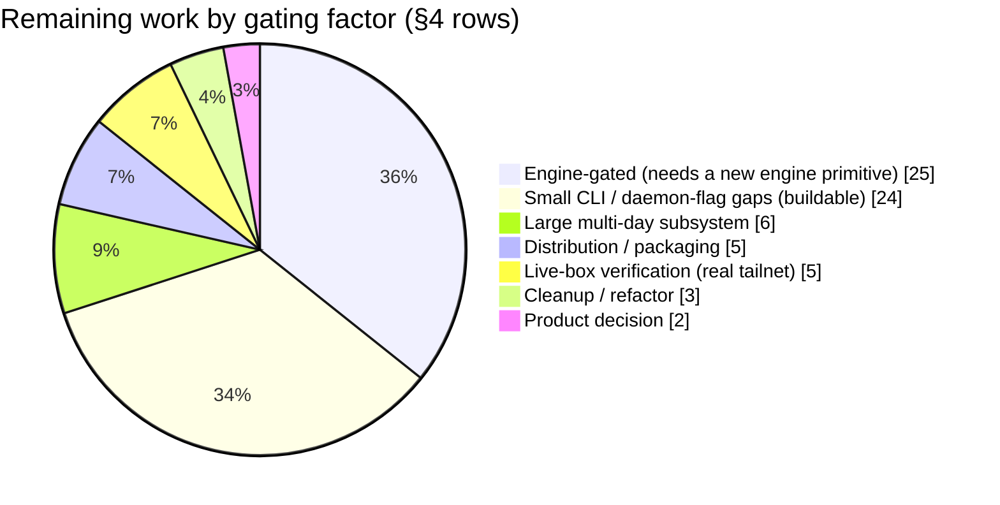
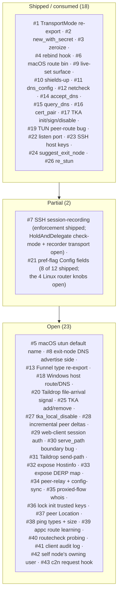

# What's left to port from Go `tailscaled` — parity gap analysis

A source-grounded diff of this Rust daemon (`tailnetd` + `tnet`) against Go `tailscaled` + the
`tailscale` CLI at the pinned upstream tag **v1.102.4** (commit
`bbcd7d1fc2054b9189ebc1531acf74bd880ca0c8`), refreshed **2026-09-13** from a parallel sweep of both
trees (the upstream `cmd/tailscaled`, `cmd/tailscale/cli`, `ipn/`, `net/`, `wgengine/` packages, and
this crate's `src/bin/{tailnetd,tnet}.rs`, `src/localapi.rs`, `src/ipn/`, `Cargo.toml`,
`docs/ENGINE_ASKS.md`).

- **Fourth refresh in a row where the pin cannot move, so this pass swept deeper again.** A fresh
  `git ls-remote --tags` (2026-09-13) still puts **v1.102.4** at the top of the stable list at the same
  commit; the only newer ref is still `v1.103.0-pre`, the marker for the unstable branch, and this
  ledger tracks stable. The last pass read **the policy keys whose consumer is not a pref**, and the
  repo closed the lot: all six merged, and the crate went 0.59.0 → 0.62.2 on them and the batch around
  them. The policy client is now ported exhaustively, which is what makes this pass's layer legible —
  the last of those six gaps put a *new field* on the notify stream, and having done it once, the
  question of what else belongs on that stream can finally be asked as a whole.
- **The layer this pass read: the IPN bus is a subscription protocol, not a state feed.** Upstream
  declares **nineteen** `NotifyWatchOpt` bits (`ipn/backend.go`, `1 << 0` through `1 << 18`) and a
  `Notify` struct with twenty-odd fields, and the two are wired together by a per-session mask: what a
  watcher gets is decided once, at subscribe time, by what it asked for. This fork ships **four**
  boolean mask fields and six notify fields. So the exhaustive question this pass asked was not "does
  this fork have a notify stream" — it has a good one — but **"bit by bit, which of Go's nineteen have
  a consumer this daemon could serve, and what happens to a watcher when it doesn't."**
- **Six gaps, and the bits sort cleanly into three piles.** Four are missing *content* a watcher can
  only get by opening a second connection and polling: the frame envelope (`Notify.SessionID` and
  `Notify.Version`), `NotifyInitialStatus`, `NotifyInitialSuggestedExitNode`, and the un-gated
  `Notify.SelfChange`. One is a missing *failure* mode: Go disconnects a watcher that falls behind with
  a terminal `IPN bus consumer fell behind; closing watch`, where the engine here silently drops the
  notification and streams on. One is the *shape of the mask itself*, which is where Go's two
  subscribe-time refusals would have to live and currently cannot. The rest of the nineteen are
  accounted for and need no bead: `NotifyInitialHealthState`/`NotifyHealthActions` wait on the health
  tracker (already a §4.5 row), `NotifyPeerChanges`/`NotifyPeerPatches`/`NotifyNoNetMap` are the
  incremental peer-delta bus (ask **#28**), `NotifyWatchEngineUpdates` and `NotifyPeerWireGuardState`
  need engine internals, `NotifyInitialDriveShares` belongs to Taildrive (`tsd-eka`),
  `NotifyInitialOutgoingFiles` needs the Taildrop file-arrival signal (§4.1),
  `NotifyInitialClientVersion` needs a control-pushed version this fork has no source for,
  `NotifyNoPrivateKeys` is a documented no-op upstream, `NotifyRateLimit` damps a spam source this
  build largely does not have (the engine's peer feed is a coalescing `watch` channel, so netmap churn
  collapses at the source instead of queueing), and `NotifyInProcessNoDisconnect` is the one bit a
  LocalAPI caller is forbidden to set. Four of the six are daemon-buildable today; one is a
  decision; one has a daemon-buildable half and an engine ask behind it.
- **This crate:** `tailscaled-rs` v0.62.2 — daemon `tailnetd` + CLI `tnet`, over the
  `geiserx_tailscale` engine. All six gaps the last refresh handed over have merged (§1).
- **Engine pin:** `9d847a6e` — set 2026-08-12 and unchanged through every refresh since. The engine tree *after* the
  released **v0.43.0** (the release cut from this tree is `0.43.1`; the pin exists for a russh
  security bump v0.43.0 predates). The engine is a separate library released independently; the
  daemon consumes it and files capability requests in `docs/ENGINE_ASKS.md`. Note
  `docs/ENGINE_ASKS.md`'s own header still says `35e5db22`/v0.41.0 — that header is stale and is not
  this document's to fix.
- **Beads:** the tracker DB is not present in this checkout (`bd list` has nothing to read here), so
  §7 carries the open list from the previous regeneration, minus what merged since, plus the gaps this
  pass filed. Re-derive it from `bd list --status open` on a checkout that has the DB. The umbrella
  goal is bead `tsd-iqq` ("full Go `tailscaled` parity — a complete Rust copy of `tailscaled`").

> **How to read this.** The daemon's surface is split across two boundaries: what the **CLI/daemon
> code** can implement directly, and what must come from the **engine library** first. A large fraction
> of the remaining gaps are *engine-gated* — the daemon-side wiring is small and ready, but the engine
> doesn't yet expose the primitive. Those are tracked as numbered "engine asks". The rest are large
> subsystems, live-box verification, distribution, or deliberate product decisions.

---

## 1. Executive summary

```mermaid
pie showData
    title Remaining work by gating factor (§4 rows)
    "Engine-gated (needs a new engine primitive)" : 25
    "Small CLI / daemon-flag gaps (buildable)" : 24
    "Large multi-day subsystem" : 6
    "Distribution / packaging" : 5
    "Live-box verification (real tailnet)" : 5
    "Cleanup / refactor" : 3
    "Product decision" : 2
```

**Where the port stands.** The core daemon is feature-rich and faithful: node lifecycle (`up`/`down`/
`login`/`logout`/`set`/`reload-config`), status/watch (incl. a masked IPN-bus notify stream),
diagnostics (`ip`/`whois`/`ping`/`netcheck`/`dns`/`metrics`/`bugreport`), Taildrop send+receive,
Tailscale SSH **server** *and* host-key-pinned SSH **client**, serve/funnel (TCP + web) in Go's v2 flag
grammar, exit-node use/advertise + **suggest**, subnet routes, TUN data path (feature-gated), TLS cert
provisioning, tailnet-lock (init/status/log/sign/disable/disablement-kdf) in Go's own `lock init`
argument grammar, profiles/switch, syspolicy *enforcement* (an admin-supplied `--syspolicy-file`
source, resolved, reported **and applied to prefs** on every profile load and every prefs write, with
an always-on gate that can refuse a `down`), a prefs-validation chain that now resolves a named
`--exit-node` against the netmap and refuses an unhonourable auto-update opt-in or an
administratively-disabled SSH server, an advertised-route **set** validated as a set (a lone default
route and a malformed 4via6 prefix are both refused), a serve/funnel setter that refuses Funnel under
shields-up and a second serve on a busy port, captive-portal detection, a **port-mapping client** (NAT-PMP + PCP
mapping, UPnP-IGD discovery)
behind `tnet debug portmap`, a SOCKS5 + HTTP outbound proxy, a debug-metrics HTTP server,
systemd/launchd install with `sd_notify(READY=1)` (`Type=notify`), `configure kubeconfig` (with Go's
writability precheck), the read half of Tailscale **Services** (VIPs), and a read-only loopback web
UI that can state the origin it is reverse-proxied at. The LocalAPI exposes **48 request** /
**31 response** verbs over a `SO_PEERCRED`-authorized Unix socket, and `tnet` carries **39**
top-level subcommands — 35 with a Go counterpart, plus this fork's own `reload-config`, `install`,
`uninstall` and `shutdown` (Go reaches the same LocalAPI verb from `LocalClient.ShutdownTailscaled`
and gives it no CLI spelling) — against upstream's **39** plus the `completion` command
`ffcomplete.Inject` adds at runtime.

**What's left, in one breath.** The biggest remaining buckets are: **per-OS platform breadth** (the
Linux OS-DNS configurator matrix, MagicDNS OS integration, and full **Windows** support);
**engine-gated features** (the Linux router pref flags, the four peer-relay/remote-config `set` prefs
behind ask #34, tailnet-lock key-set mutation, the incremental peer-delta bus, the mutating web UI, a
Taildrop file-arrival signal, the DERP map that would bring captive-portal detection to full strength,
`routecheck` reachability probing, app-connector route readback, peer **Location** for `exit-node list
--filter`, and the magicsock endpoint injection that would turn the new port mapper from a diagnostic
into a NAT-traversal win); **distribution** (crates.io, `.deb`/`.rpm`); **live-tailnet verification**
of paths CI can't reach; and a basket of **small CLI/daemon gaps**, in three flavours: command lines a
Go user would reasonably type and this fork rejects; command lines this fork accepts and then does
nothing with, because the value was never checked against anything real; and settings an
*administrator* configures that this daemon stores, reports, and never acts on. The third flavour was
the last two passes' work and is now closed. This pass worked a fourth: state the daemon already
holds and already computes, which a **subscriber** on the notify bus cannot ask for and must poll a
second connection to see.

**What moved in this repo since the last refresh (2026-09-12).** **All six** of the gaps the previous
regeneration handed to the tracker merged, and the crate went 0.59.0 → 0.62.2 on them and the batch
around them. In merge order: the effective policy on the notify bus, so a watcher sees an
administrative change instead of having to ask for one (`#448`, Go's `NotifySysPolicyChanges`);
`exit-node suggest` filtered through `AllowedSuggestedExitNodes`, so a suggestion the administrator
excluded comes back as Go's honest empty result rather than as a recommendation (`#451`);
`ReconnectAfter`, so a permitted always-on disconnect is bounded by the window the administrator wrote
and reconnects on a profile-guarded timer instead of standing until the next reconcile point (`#454`);
the LocalAPI `shutdown` verb `AllowTailscaledRestart` gates, ported with Go's refusal order intact —
method, then write access, then policy — so a caller can tell "you may not" from "nobody may" (`#455`);
the policy-pinned exit node, now **refused** with Go's `exit node cannot be changed: managed by policy`
rather than accepted and silently overwritten, with `ExitNode.AllowOverride` relaxing it (`#457`); and
the policy `AuthKey`, so a fleet enrols from the same file that pins its `Hostname`, at Go's precedence
(last, behind the flag and the config file) and behind Go's two guards (`#459`). The policy client is
ported exhaustively; that claim was the last pass's stated goal and it now holds. Around them merged a
batch of command-line fidelity work that closed no §4.5 row but is worth knowing about when reading
§3: `tnet ip` resolution and its addressless-target failure (`#466`, `#468`), an explicit empty
`AdvertiseRoutes` in a config file withdrawing the routes (`#469`), `switch`'s bare `No profile named`
refusal (`#471`), the web client started before it is served and `--origin` kept out of the printed
URL (`#472`, `#475`), a refused `serve` command line answering the way Go's does (`#476`), and
kubeconfig write failures worded as Go words them (`#479`).

**What the previous passes handed over and is still open.** Nine rows, all carried in §4.5 below: Go's
single-dash long-flag spelling, the `--posture-checking` legacy spelling, the missing
`mac-app-connector` risk, `--exit-node=auto:any`, `--config`'s unenforced and inverted `Locked` default
(now ruled on — if it is ever honoured it must sit *below* policy, see `#445`), `set --shields-up` while
Funnel is on, a `--nickname` another profile already holds, `--hostname` accepted as any bytes at all,
and `--operator`, which is persisted and grants nobody anything. Nothing merged against any of the nine
in this cycle.

**What this sweep found.** Six gaps in one layer, and — as with the last pass — an inventory rather
than a sample, because the layer is a numbered bit set and can be read to the end. The nineteen
`NotifyWatchOpt` bits sort into three piles, and only one pile is a gap.

The first pile is **content a watcher cannot subscribe to.** `Notify.SessionID` is the largest of them
and does not look it: Go mints one hex id per watch session, puts it in the first frame when
`NotifyInitialState` is set, and registers `defer b.DeleteForegroundSession(sessionID)` for the life of
that watch — which is the entire mechanism behind foreground `serve`. The CLI opens a bus watch, reads
the id, keys its nested `ServeConfig` under it, and the *daemon* drops that config when the watch dies.
§6 already records that this fork's foreground serve is torn down by `tnet`'s own signal handler and so
survives a `SIGKILL`; the reason it has to be is that the notify frame carries no session identity.
`NotifyInitialStatus` (`1 << 14`) front-loads a whole `ipnstate.Status`, which upstream's own doc now
recommends over fetching the netmap — and this daemon builds the exact analogue for `Request::Status`
already. `NotifyInitialSuggestedExitNode` (`1 << 10`) front-loads the suggestion and pushes a fresh one
whenever the pick changes, from inside `suggestExitNodeLocked` itself; this fork computes that value,
policy-filtered since `#451`, and will only hand it over if asked. And `Notify.SelfChange` is not
mask-gated at all — Go sends the self node on every netmap update, for exactly the reactive consumers
this daemon is built for — where `NotifyView::net_map` here carries peers and never self.

The second pile is **one missing failure mode**, and it is the interesting one. Go's `sendToLocked`
does a non-blocking send into a 128-deep per-session channel, and the `default` arm is not a drop:
it removes the session, throws away the queue on the grounds that a delta stream with a hole in it is
not trustworthy, sends one terminal `IPN bus consumer fell behind; closing watch`, and closes. The
engine's `deliver` here treats a full channel as success — drop the notification, keep streaming — so a
watcher that cannot keep up diverges from the daemon silently and permanently. That is Go's older
behaviour, and upstream replaced it deliberately; the terminal frame is daemon-buildable but knowing a
drop occurred is not, so this one is a small consumer waiting on an engine ask.

The third pile is **the shape of the mask**, which is where the other five land. Upstream's
`WatchIPNBus` takes one decimal `mask` and refuses three ways before subscribing: `bad mask` on a value
that will not parse, a named refusal for `NotifyInProcessNoDisconnect` (a bit that makes the producer
block on a slow consumer, so a LocalAPI caller must never hold it), and `ValidateNotifyWatchOpt`
rejecting `NotifyRateLimit` alongside any stateful delta bit. This fork spells the mask as named
booleans, which is a better wire format in every way except that an unrepresentable combination cannot
be refused — there is no value for the daemon to look at. That is a decision, not a defect, and it is
due now rather than later, because four of the five rows above add a field to the same request.

Two things the sweep expected to find and did not are worth recording so the next pass does not
re-derive them. `NotifyRateLimit` (`1 << 8`) has little behind it here: Go rate-limits because its bus
re-sends whole netmaps under churn, and this fork's peer feed is a `tokio::sync::watch` channel, which
coalesces to the latest value at the source — so the burst never forms. The `mpsc` hop between the
engine's bus task and the watcher can still hold distinct frames; what cannot happen is the source
producing a hundred netmaps for one watcher to wade through. And the daemon-built prefs and policy
feeds are immune to the lagging-watcher problem for the same reason — the drop hazard is the engine's
`mpsc` bus alone.

---

## 2. The two boundaries

```mermaid
flowchart LR
    subgraph CLI["tnet (CLI) — thin"]
        direction TB
        C1["38 subcommands<br/>maps args to LocalAPI"]
    end
    subgraph DAEMON["tailnetd (daemon) — this crate"]
        direction TB
        D1["LocalAPI server (UDS, SO_PEERCRED)<br/>47 requests / 31 responses"]
        D2["Backend state machine + prefs<br/>serve/funnel · taildrop · SSH server<br/>SOCKS5/HTTP proxy · portmap · install"]
    end
    subgraph ENGINE["geiserx_tailscale (engine) — separate library, pinned 9d847a6e"]
        direction TB
        E1["Device: control session, netmap,<br/>magicsock, netstack, DNS forwarder,<br/>TUN, TKA, taildrop transport"]
    end
    CLI -->|"newline-JSON over Unix socket"| DAEMON
    DAEMON -->|"tailscale::Device API"| ENGINE
    ENGINE -.->|"capability requests<br/>(docs/ENGINE_ASKS.md)"| DAEMON
```

A gap is **daemon-buildable** when the engine already exposes the needed primitive (the work is CLI +
LocalAPI wiring) and **engine-gated** when it does not (a numbered ask must land first, then a small
consuming change rides the next pin bump).

---

## 3. What is DONE (for orientation)

The consumed engine capabilities and shipped daemon features:

- **Lifecycle / prefs:** `up` (full flag surface incl. workload-identity-federation auth keys and Go's
  own `--auth-key`/`--login-server`/`--nickname`/`--host-routes` spellings), `down` (incl. `--reason`
  and the lose-SSH risk refusal), `login` (the flags Go's shared `up`/`login` flag set gives it),
  `logout` (incl. `--reason`, logged locally), `set` (live pref mutation, incl. by-name refusals for
  `--relay-server-port`/`--relay-server-static-endpoints`/`--remote-config`/`--sync`),
  `reload-config` (3-way persisted/rebuild/bring-down, in Go's own wording), `get`, `wait`, `whoami`,
  `version` (rich `--version` w/ commit+rustc, `--daemon`/`--json`/`--upstream`/`--track`).
  `up`, `set` and `check-prefs` share ONE validation chain (Go's `checkPrefsLocked` and its children):
  a named `--exit-node` is resolved against the netmap with Go's own refusals (`#435`), an
  `--advertise-exit-node`/`--exit-node` conflict is refused, advertise-route CIDRs must be masked,
  `--ssh` must clear both the build feature and `TS_DISABLE_SSH_SERVER` (`#426`), an
  `--auto-update` opt-in must come from an installation that can actually replace its own binary
  (`#430`), a bare `--advertise-tags server` is completed to `tag:server` before `CheckTag` runs
  (`#441`), and the advertised-route **set** is validated as a set — Go's `netutil.CalcAdvertiseRoutes`
  pairing rule, `ValidateViaPrefix`, de-duplication and sort (`#439`, `src/routes.rs`). A `down` or
  `logout` that would disconnect a node under `AlwaysOn.Enabled` is refused first of all (`#442`,
  `src/ipn/alwayson.rs`).
- **Status / observability:** `status` (+`--json`/`--watch`/filters/`--web`/`--browser`, behind Go's
  `isRunningOrStarting` gate), WatchNotifications (masked IPN-bus notify stream, carrying
  `state`/`error`/`browse_to_url`/`net_map`/`prefs` and — since `#448` — the effective policy
  snapshot, Go's `NotifySysPolicyChanges`), `metrics`,
  `bugreport` (incl. `--diagnose`/`--record`), `netcheck` (DERP-latency scope, `--format`/`--every`/
  `--verbose`), `dns status` (incl. `--all`)/`query`, `syspolicy` (`list`/`reload`, over an
  admin-supplied `tailnetd --syspolicy-file` device-scope source — resolved, reported **and applied to
  prefs** at profile load and on every prefs write (`#445`). The keys whose consumer is **not** a pref
  are ported too, and that set is closed: `AuthKey` enrols a node at Go's precedence and behind Go's
  two guards (`#459`), `ExitNode.AllowOverride` relaxes a `managed by policy` refusal that is now
  actually made (`#457`), `ReconnectAfter` bounds a permitted always-on disconnect on a
  profile-guarded timer (`#454`), `AllowTailscaledRestart` gates a real LocalAPI `shutdown` verb with
  Go's refusal order (`#455`), `AllowedSuggestedExitNodes` filters suggestion candidates (`#451`), and
  `NotifySysPolicyChanges` puts the snapshot on the notify bus (`#448`). `ip`/`whois` (Go's `ip[:port]` +
  `--proto` flow arguments)/`ping` (hostname or IP), `licenses`, **captive-portal detection** (Go's
  prober + the `captive-portal-detected` health warnable).
- **Connectivity:** exit-node use/advertise + **suggest**, advertise-routes, accept-routes/dns,
  shields-up, TUN data path (feature `tun`), `--port`/`PORT` listen-port pinning; the carried Go pref
  flags (`--operator`, `--nickname`, `--report-posture`, `--webclient`, `--auto-update`/
  `--update-check`, `--advertise-connector`, `--exit-node-allow-lan-access` — which carries Go's one
  cross-flag usage refusal, "can only be used with --exit-node", on `up` and not on `set`, exactly as
  Go scopes it); a **port-mapping
  client** (NAT-PMP + PCP mapping, UPnP-IGD discovery) surfaced by `tnet debug portmap`.
- **Services (VIPs), read half:** `service list`, the `tnet ip <service-VIP>` fallback that resolves a
  Service's addresses instead of failing with "no peer found", and Service-name resolution in
  `configure kubeconfig` — over the `services` LocalAPI verb. (`tsd-z40` still owns the *serving* half,
  `serve --service`.)
- **Services:** serve + funnel in Go v1.100.0's flag grammar (`--https`/`--http`/`--tcp`/
  `--tls-terminated-tcp`/`--set-path`/`--bg`/`--yes`, a foreground default, `<target> off`,
  `status`/`reset`) alongside this fork's positional sub-verbs (incl. the Go-less `serve redirect`)
  and the legacy `funnel <port> on|off`, with Go's two serve-config refusals — Funnel under shields-up
  (`#433`) and a second serve on a port already serving another type, whatever spelling the port key
  arrives in (`#429`, `#431`); Taildrop `cp`/`get` (incl. `--verbose`, and a resolved+vetted
  destination directory)/`list`, TLS `cert` (feature `acme`, incl. `--min-validity`/`--serve-demo`),
  `nc`, `configure kubeconfig` (standalone generation over http or https, with Go's writability
  precheck; no merge).
- **SSH:** Tailscale SSH **server** (feature `ssh`, control-policy authz, privilege drop) + host-key-
  pinned SSH **client** (`tnet ssh`, which since `#305` leaves the destination bare when the target
  omits `user@`, so the caller's `ssh_config` `User` directive decides).
- **Tailnet lock:** `init`/`status`/`log`/`sign`/`disable`/`disablement-kdf`. `init` now takes **Go's**
  positional grammar (trusted `tlpub:` keys and/or `disablement:` values, `--gen-disablements`,
  `--gen-disablement-for-support`, `--confirm`) and refuses by name what the engine cannot yet do
  (ask #36).
- **Profiles:** `switch` (+`--list`/`--json`, Go's usage refusals, `remove` incl. Go's current-profile
  and first-hit name matching; an unknown target is refused rather than created), profile
  create/delete.
- **Daemon plumbing:** systemd + launchd install (`ExecStopPost=--cleanup`, `EnvironmentFile`,
  feature-aware TUN-vs-userspace unit, `Type=notify` via `sd_notify(READY=1)`), SOCKS5 proxy, outbound
  HTTP proxy (CONNECT), debug-metrics HTTP server, `--cleanup`, `--config` as a declarative *source*
  (a path, `vm:user-data`, or either behind `optional:`), `--tun` in Go's own grammar, an
  `/etc/tailnetd/tailnetd-env.txt` operator seam read before the runtime exists (`#437`, Go's
  `envknob.ApplyDiskConfig`), `--bird-socket`
  and Go's two TPM flags accepted and refused by name, a `tailnetd debug` subcommand that diagnoses a
  node that never comes up without a running daemon, process hardening, IP-forwarding readiness check,
  link-change auto-rebind, macOS startup route/DNS reaper, `is_ssh_over_tailscale` `/proc`
  sudo-fallback.
- **`debug`:** capture, prefs, env, metrics, via, rebind, restun, check-ip-forwarding, check-prefs,
  watch-ipn, local-creds, stat, statedir, resolve, portmap, build-info (Go `go-buildinfo`, kept as an
  alias).
- **`configure`:** `kubeconfig`; `sysext`/`mac-vpn` answer with Go's own explanatory refusal, and the
  rest of the host-integration tree (`synology`, `synology-cert`, `configure-host`, `flash-appliance`,
  `pve-appliance`, `jetkvm`) is recorded as out of scope for a daemon that ships no platform packages.

---

## 4. What's LEFT — by category

### 4.1 Engine-gated (the daemon-side wiring is small/ready; needs an engine primitive first)

These cannot be faithfully built until the engine exposes the capability (building a degraded facsimile
would violate the honest-omission rule). Each rides the next pin bump once its ask lands.

| Gap | Bead | Engine ask | Note |
| --- | --- | --- | --- |
| Linux subnet-router pref flags (`--snat-subnet-routes`, `--stateful-filtering`, `--netfilter-mode`, `--unattended`) | `tsd-1m9` (residual) | **#21** | These four ride the Linux OS-router layer (`tsd-m8s`); the engine has no netfilter/router knob to carry them. The other eight `up`/`set` pref flags **shipped** — the engine grew every `Config` field they need. |
| The behaviour behind `set --relay-server-port`/`--relay-server-static-endpoints`/`--remote-config`/`--sync` | *(previous pass)* | **#34** | The flags themselves shipped as by-name refusals, so a ported command line now says what is missing instead of dying at the parser. The behaviour needs a peer-relay listen port, static relay endpoints, control-delegated configuration and a config-sync kill switch on the engine's `Config`. `--remote-config` additionally needs a product decision: it hands the tailnet admin full control of prefs and LocalAPI. |
| `tailscale routecheck` + `exit-node suggest --force-probe` | *(previous pass)* | **#40** | New upstream command over LocalAPI `RouteCheck`/`RouteCheckProbe`, backed by `net/routecheck` peer reachability probing; `exit-node suggest --force-probe` re-ranks suggestions off a fresh probe. The ask is filed and the `--force-probe` flag already refuses by name (`#343`). |
| `tailscale appc-routes` (app-connector route readback) | *(previous pass)* | **#39** | LocalAPI `appc-route-info` returns the learned domain→route map. The command ships and tells the operator plainly that this fork advertises a connector but never learns a route (`#341`); the learning half is the ask. |
| `exit-node list --filter` + the COUNTRY/CITY columns, with live data | *(previous pass)* | **#37** | Go's grammar, columns, `--filter` and refusals all shipped (`#331`), but `PeerReport` still carries no `Location`, because `StatusNode` has none — so the country/city columns are empty and `--filter` matches nothing until the ask lands. |
| `lock init`'s trusted-key set, multiple disablements, and this node's own lock key | *(previous pass)* | **#36** | Go's argument grammar shipped (`#329`). What is engine-gated is the substance: `Device::tka_init` accepts exactly one `disablement_secret` and no trusted-key list, so a multi-key or multi-disablement init is refused by name rather than reinterpreted. |
| `lock add`/`remove`/`revoke-keys` (tailnet-lock key-set mutation) | `tsd-nee` | **#25** | Engine exposes `tka_{init,sign,disable,log}` but no key-set mutation: no `tka_add`/`tka_remove`, no AddKey/RemoveKey AUM builder, no public accessor for the live verified `Authority`. Go's `revoke-keys` (`--cosign`/`--finish`/`--fork-from`) is the recovery path on top of the same primitive. |
| `lock local-disable` (disable lock for THIS node only) | — | **#27** | `disablement-kdf` already ships daemon-side; `local-disable` needs `Device::tka_local_disable()`. |
| Full-strength captive-portal detection (the live DERP endpoint set) | `tsd-iqq.5` (residual) | **#33** | The prober and the health warnable **shipped** (`#290`, refined by `#411`/`#414`). Go builds most of its endpoint list from the live `DERPMap`'s `CanPort80` node IPv4s; the engine surfaces only region ids + latencies, so this fork probes the two endpoints Go always appends. |
| LocalAPI peer-by-id | `tsd-iqq.15` | — | Needs a numeric NodeID on `StatusNode` (engine surfaces only the stable id). |
| LocalAPI `set-expiry-sooner` + `reset-auth` | `tsd-iqq.12` | — | Engine-gated lifecycle verbs. |
| Incremental peer deltas on the notify bus (`PeerChangedPatch`/`PeersChanged`/`PeersRemoved`) | `tsd-iqq.11` (Phase 3) | **#28** | `net_map` is currently always the FULL peer set; correct but not delta-efficient. Upstream's v1.102.4 work on the delta path (`deleteIfOwned`, `RemovedPeers`) is entirely inside this boundary. |
| Mutating web UI (Go `ManageServerMode`) | `tsd-bvc` (closed-partial) | **#29** | Needs a control-backed web-client session-auth flow + owner identity on whois. The read-only loopback UI ships; mutation would *exceed* Go without this. |
| `file get --wait` / `--loop` | `tsd-1hr` | **#20** | Needs a Taildrop file-arrival bus signal; the engine exposes only a `waiting_files()` poll. Busy-polling would be a CPU-spin facsimile. |
| `tnet drive` (Taildrive) | `tsd-eka` | — | Needs a whole engine WebDAV / virtual-disk subsystem; none exists. |
| `debug hostinfo` (the local `Hostinfo` this node advertises to control) | `tsd-b15` | **#32** | NOT a netmap gap: the engine already computes the whole thing (`ts_control::hostinfo::HostInfoData::detect()`, the mirror of Go `hostinfo.New()`). Its module is private and nothing re-exports it, so the daemon cannot read the values it is itself sending. One `pub use` unblocks it. |
| `debug` rich reads (`netmap`/`derp-map`/`control-knobs`) + magicsock knobs (`rotate-disco-key`, `derp-set-on-demand`, `derp-unset-on-demand`, `pick-new-derp`, `force-prefer-derp`, `break-*-conns`, `force-netmap-update`, `peer-endpoint-changes`, `set-expire`, `ts2021`, `dial-types`, `peer-relay-servers`) + the event-bus reads (`daemon-bus-events`/`-graph`/`-queues`) | `tsd-b15` | — | Each needs a netmap field, a magicsock knob or an event bus that the engine doesn't expose. Re-confirmed against pin `9d847a6e`. `debug portmap` left this row when the port mapper shipped; every other pure-local cherry-pick is already shipped. |
| The port mapper's mapping reaching the data plane | `tsd-vxb` (residual) | *(no ask filed)* | `src/portmap.rs` acquires a real NAT-PMP/PCP mapping and reports it, but Go hands the resulting `external` address to magicsock as an advertised endpoint. The engine owns magicsock and exposes no way to inject an externally-learned endpoint, so the mapping is diagnostic only. Filing this ask is what turns the port mapper from an answer to "would my router help?" into a NAT-traversal win. |
| `serve_path` segment-boundary match (`/apifoo` must not match a `/api` mount) | `tsd-k4q` | **#30** | Engine bug (the request-time mux is engine-owned); the fix is transparent to the daemon. |
| `serve redirect` `${HOST}`/`${REQUEST_URI}` expansion | `tsd-rjf` (residual) | *(no ask filed)* | The doc half shipped — the CLI and rustdoc no longer promise expansion the stack never did. Implementing it is engine-side: both placeholders are per-request values, resolvable only inside `ts_runtime`'s `serve_redirect`, which never parses the request. |
| `ping --icmp`/`--tsmp`/`--peerapi`/`--size` (the ping-type selectors) | *(previous pass)* | **#38** | `Device::ping`/`ping_disco` do a disco ping and return a `Duration`; there is no TSMP, ICMP-through-WireGuard or peerAPI probe, and no message-size knob. All four flags parse and are refused by name (`#337`), so a ported command line says what is missing. |
| `whois --proto`'s flow lookup (the response half) | `tsd-efv` (residual) | **#35** | The request half shipped (`#327`): `whois --proto=tcp <ip>:<port>` parses and reaches the daemon. The engine resolves a bare address only, so the proxied-flow distinction Go's `WhoIsProto` exists for is not yet honoured. |
| `down --reason` / `logout --reason` reaching control | — | **#41** | Both flags ship and the reason is recorded locally, but Go submits it as a client audit log to control. The engine has no audit-log submission path. |
| `switch --list`'s `Tailnet`/`Account` columns, and Go's `--nickname=` login-name restore | `tsd-91w` (residual) | **#42** | The engine joins user profiles for PEERS only; the self node carries no owning user, so a cleared nickname falls back to the profile id where Go restores the login name. |
| The control-to-node (**c2n**) RPC channel — control can ask this node for nothing | *(previous pass)* | **#43** | Upstream registers ~20 handlers on an HTTP surface the control plane reaches over the existing noise session: `ipn/ipnlocal/c2n.go` (`RegisterC2N`/`handleC2N`, the `/debug/*` family, `/echo`, logtail flush, sockstats, netfilter-kind) plus `GET`+`POST /update`, `GET /posture/identity`, `GET /appconnector/routes`, `POST /wol`, `GET /vip-services`, `GET /tls-cert-status` and `/ssh/usernames`. The engine already runs the c2n dispatcher and answers `/echo` and `GET /vip-services` itself; what is missing is a way IN, so no daemon-side handler can be reached until the engine offers one. That is ask **#43** (`#425`). It is the missing mechanism behind three reductions this fork already documents one at a time: `--report-posture` is a carried pref because nothing answers the posture pull — and with it the two policy keys that pull reads, `PostureChecking` (which overrides the pref) and `DeviceSerialNumber` — `--auto-update` advertises `Hostinfo.AllowsUpdate` while nothing acts on a trigger, and ask #39's app-connector readback is the LocalAPI half of a readback control performs here. |

### 4.2 Large multi-day subsystems (daemon-buildable, but each is a significant project)

| Subsystem | Bead | Note |
| --- | --- | --- |
| **Windows support** (wintun + Windows service/SCM + named-pipe LocalAPI + route/DNS via WFP/NRPT) | `tsd-1yw` | The single largest gap; Go has a full `tailscaled_windows.go` + `winRouter` + `windowsManager`. Also engine ask **#18** (Windows host route/DNS in `ts_host_net`). |
| **Linux OS-DNS configurator** (systemd-resolved / NetworkManager / resolvconf / direct `/etc/resolv.conf` matrix, with trample detection) | `tsd-m8s` | Re-scoped: the engine's `ts_host_net` already programs the resolver via `resolvectl` in TUN mode — so this is now largely a **verify-on-a-live-Linux-box** task to confirm the matrix + that Windows returns `Unsupported` cleanly. |
| **MagicDNS OS integration** (the `100.100.100.100` resolver wired into the host) | `tsd-ioh` | Depends on the OS-DNS configurator (`tsd-m8s`). |
| **Serve / Funnel runtime** (`--service`/`--tun`/`--proxy-protocol`; service `drain`/`clear`/`advertise`/`get-config`/`set-config`) | `tsd-z40` | The v2 flag grammar, the foreground default and `--tls-terminated-tcp` now ship (`tsd-c3w`). What is left is the *serving* half of Tailscale Services (VIP) — engine-gated — plus `--tun` (netstack-only serve lanes) and `--proxy-protocol` (the engine's TCP serve target cannot emit the header). All three are *parsed* and refused by name, so a ported Go command line says what is missing. |
| **`--state mem:` / non-file state backends** | `tsd-iqq.10` | Go's `--state` supports `mem:`/`kube:`/`arn:aws:ssm:` prefixes; this fork has no `--state` flag at all (only `--statedir`), so the whole flag, not just the prefixes, is the gap. |
| **LocalAPI → HTTP/1-over-UDS** (the eventual transport, matching Go's LocalAPI exactly) | `tsd-euv` | Currently newline-delimited JSON; Go is HTTP/1 with `PermitRead`/`PermitWrite`. A faithfulness upgrade, not a feature gap. |

### 4.3 Distribution & release

| Item | Bead | Note |
| --- | --- | --- |
| Publish `tailscaled-rs` to crates.io | `tsd-6y1` | Registry metadata and the packaged file set are in place; `cargo package` succeeds once a `version` is present, so the daemon's own `git`+`rev` engine pin is the only remaining objection. The pin is deliberately not a same-version source swap: published `geiserx_tailscale` 0.43.0 predates the russh security bump this rev exists for, and the release cut from the pinned tree is `0.43.1` — so the honest unblock is an engine-version change under [`docs/ENGINE.md` §3](ENGINE.md#3-the-engine-on-cratesio). |
| Get the `tailscale-rs` engine onto crates.io | `tsd-d6n` | **Done upstream** — every `geiserx_*` engine crate in the daemon's resolved graph is published and unyanked at the locked version (`scripts/check-engine-on-crates-io.sh` re-checks it for whatever the pin resolves to). What is left is daemon-side and belongs to `tsd-6y1`. |
| `.deb` / `.rpm` packaging (nfpm) + ship the `acme` feature in distributed builds | `tsd-k4a` | On a stock (feature-less) build, `cert`/`serve-https`/`funnel` are inert — distributed builds must enable `acme`. |
| Homebrew tap | `tsd-0s6` (residual) | The formula **shipped** (`packaging/homebrew/tailscaled-rs.rb`, held by `tests/homebrew_formula.rs`). What is left is repo-external: standing up the tap and pointing it at a release artifact. |
| Release & distribution epic / repo finalization | `tsd-9ye`, `tsd-aiz` | |

### 4.4 Live-box verification (cannot be exercised in CI; needs a real tailnet / Linux box)

| Item | Bead | Note |
| --- | --- | --- |
| Gated live e2e campaign against a real tailnet | `tsd-6hx` | |
| Live proxy-splice proof (serve-tcp backend → SOCKS5/HTTP CONNECT through the proxy) | `tsd-49c` | |
| Live interactive-login (no-authkey) flow vs Headscale (rotating reg-key harness) | `tsd-9et` | |
| OS-DNS matrix verify on a live Linux box | `tsd-m8s` | (see §4.2) |
| External crypto audit gate before any production claim | `tsd-q8o` | The README already warns: experimental, unaudited. |

### 4.5 Small CLI / daemon gaps (daemon-buildable, opportunistic)

| Item | Bead | Note |
| --- | --- | --- |
| A notify watcher has no session identity, so the daemon cannot own a foreground serve | *(new — filed by this pass)* | Two fields are missing from every frame and the second one is load-bearing. `WatchNotificationsAs` (`ipn/ipnlocal/local.go`) mints `sessionID := rands.HexString(16)` per subscription, sets it on the first frame as `Notify.SessionID` when and only when `NotifyInitialState` is requested (the field's doc tells clients to store it, because no later frame repeats it), and registers `defer b.DeleteForegroundSession(sessionID)` for the life of that watch. `cmd/tailscale/cli/serve_v2.go` is the consumer: a foreground `serve`/`funnel` opens `WatchIPNBus(ipn.NotifyInitialState)`, reads one notify, refuses outright with `missing SessionID` if it is empty, and installs its nested config at `sc.Foreground[n.SessionID]`; `ipn/ipnlocal/serve.go`'s `DeleteForegroundSession` deletes exactly that key when the session ends. So upstream's foreground serve is torn down by the **daemon**, and survives nothing — not a `SIGKILL`, not a dropped SSH session. §6 records this fork's weaker shape (`tnet` restores the previous config from its own signal handler, so a killed foreground serve stays installed until `tnet serve reset`) and `src/ipn/serve.rs` says in its own docs that `ServeConfig.Foreground` is not modelled; the primitive underneath both is the session id, and it is one string on the first frame. The other field is `Notify.Version`: `sendToLocked` fills it with `version.Long()` on every frame that does not already carry one, so a watcher always knows which backend it is talking to. `NotifyView` here has neither. |
| A watcher cannot get a status snapshot on the bus, so it opens a second connection and races it | *(new — filed by this pass)* | `NotifyInitialStatus` (`1 << 14`, `ipn/backend.go`) makes the first notify carry a whole `ipnstate.Status` in `Notify.InitialStatus`, and upstream's own doc comment now recommends it over `LocalClient.NetMap` for new code: paired with `Notify.SelfChange` and `Notify.PeersChanged` it lets a watcher stitch a continuous view of the node without ever fetching a netmap. The build order in `WatchNotificationsAs` is deliberate and is the part to port rather than invent. The engine half is built FIRST, outside `b.mu` — `statusSB = &ipnstate.StatusBuilder{WantPeers: true}` then `b.e.UpdateStatus(statusSB)` — with a comment giving the reason: the lock order is backend-then-engine and never the reverse. The backend half (`b.updateStatusLocked(statusSB)`) is then filled under `b.mu`, atomically with registering the session in `b.notifyWatchers`, so no event can be delivered to this watcher before its snapshot is. This fork already builds the exact analogue: `Backend::status()` returns a `StatusReport` and `Request::Status` hands it over, and `Backend::status()` is already written to be careful about the same hazard (it bounds `dev.status()` with `STATUS_QUERY_TIMEOUT` so the backend lock is never held indefinitely). A masked `watch` simply cannot ask for it, so today a watcher that wants a snapshot and a stream opens two connections and has no ordering guarantee between them. |
| `exit-node suggest` never reaches the bus, so a watcher polls for a value the daemon already has | *(new — filed by this pass)* | `NotifyInitialSuggestedExitNode` (`1 << 10`) front-loads `Notify.SuggestedExitNode` — a bare `tailcfg.StableNodeID` — into the first frame when `b.suggestExitNodeLocked()` succeeds. The ongoing half lives inside that same function (`ipn/ipnlocal/local.go`) rather than in a separate watcher: it captures `prevSuggestion := b.lastSuggestedExitNode`, computes the new pick, and only when the two differ does `b.sendToLocked(ipn.Notify{SuggestedExitNode: &res.ID}, allClients)` before storing the new value. Three properties come with that placement and are worth keeping: the push is change-triggered so a stable answer costs nothing, it goes to `allClients` rather than the asking session, and it happens wherever a suggestion is computed — including the re-run `sysPolicyChanged` performs after `AllowedSuggestedExitNodes` moves, so a policy edit re-picks and tells every watcher. This fork ships `tnet exit-node suggest` over `Backend::suggest_exit_node`, and since `#451` the pick is already filtered through the administrator's allow-list, so the value exists and is already correct — it is just unreachable except by asking. §6 lists `SuggestedExitNode` among the absent notify fields without ruling on it; the ranking work that made the *suggestion* hard is the engine's, and the *notification* is not. Cache the last suggestion on the backend and push from the one place the pick is made. |
| A watcher is told the peer set changed and never that its OWN node did | *(new — filed by this pass)* | `Notify.SelfChange` is not mask-gated: `ipn/ipnlocal/local.go` builds it on every netmap update (`selfChange = st.NetMap.SelfNode.AsStruct()` whenever the self node is valid) and again on the initial frame when `NotifyInitialNetMap` is set. Upstream added it as the scalable replacement for the now-deprecated bus `NetMap` and names the consumers in the field's doc — containerboot, kube agents, sniproxy — reactive processes that need to know their own addresses, MagicDNS name, key expiry or capability set moved without paying for the whole map, and are told to re-fetch the netmap on demand only if they need more. It is also a session boundary rather than a plain field: `watchSession.lastSentSelf` records the self node last delivered, and `selfChangeResetsImplicitState` resets that session's dedup state when the identity changes, because a new self is a new profile. Here `NotifyView::net_map` is `Option<Vec<PeerReport>>` — peers only — so a watcher learns everything about everyone else and nothing about itself, and has to poll `status` to notice its own key is about to expire. Daemon-buildable: the self node is already in reach (`Device::status()`'s `self_node`, which `Backend::status()` projects into `self_ipv4`/`self_name`/`self_ipv6`), so a self frame on each netmap tick is a small addition to `stream_notify`. Decide what "changed" means before building it — Go re-sends on every netmap update rather than diffing, which is the cheap and honest reading and the one a consumer can rely on. |
| A watcher that falls behind is silently starved instead of being told and disconnected | *(new — filed by this pass)* | `sendToLocked` (`ipn/ipnlocal/local.go`) writes each frame into a 128-deep per-session channel with a non-blocking `select`/`default`, and the `default` arm is emphatically not a drop. Unless the session holds `NotifyInProcessNoDisconnect` — an in-process-only bit, see the mask row below — it calls `closeLaggingWatchSessionLocked`, which removes the session from `b.notifyWatchers`, DRAINS whatever is queued (the comment gives the reason: "the session already fell behind, so the queued delta stream is not trustworthy"), replaces it with a single terminal frame whose `ErrMessage` is `IPN bus consumer fell behind; closing watch`, and closes the channel. A LocalAPI watcher that cannot keep up is therefore told once and disconnected, and knows to re-subscribe and re-snapshot. This fork's `stream_notify` reads the engine's bus, and the engine's `deliver` (`ts_runtime/src/ipn_bus.rs`) treats a full channel as success: `Err(TrySendError::Full(_)) => false` drops the notification and keeps streaming. Its own comment cites Go's non-blocking send as the model, which it was — before upstream replaced the drop with a disconnect. The result here is the worse half of both designs: the watcher's view diverges from the daemon's, permanently, with no signal. Split it honestly. The terminal frame is daemon-buildable — `NotifyView::error` exists and the daemon owns the socket — but *knowing a drop happened* is not, so this needs a lag signal out of the engine's bus (an ask to file) plus a small consumer. The daemon-built prefs and policy feeds need nothing: both ride `tokio::sync::watch`, which coalesces to the latest value rather than dropping an entry, and a full-snapshot feed loses nothing by coalescing. |
| The watch mask is four booleans, so Go's two subscribe-time refusals have nowhere to land | *(new — filed by this pass)* | `serveWatchIPNBus` (`ipn/localapi/localapi.go`) takes the whole subscription as ONE parameter — a decimal `mask` — and refuses three ways before it subscribes. A value that will not `UnmarshalText` gets `bad mask` (400). A mask containing `NotifyInProcessNoDisconnect` gets `NotifyInProcessNoDisconnect is only valid for in-process IPN bus subscribers` (400), and the reason is in the bit's own doc: it makes the producer BLOCK until a slow consumer catches up, while holding the backend mutex, so a LocalAPI client must never be able to ask for it. And `ipn.ValidateNotifyWatchOpt` refuses `NotifyRateLimit` combined with any of `NotifyPeerChanges`, `NotifyNoNetMap`, `NotifyInitialStatus` or `NotifyPeerPatches` (`NotifyRateLimitIncompatibleBits`) with `NotifyRateLimit is incompatible with new-style IPN bus subscription bits %v`, because delaying or merging messages in a stateful delta stream breaks the consumer's ability to keep a coherent local view. `Request::Watch` here spells the mask as named booleans — `initial_state`, `initial_netmap`, `prefs`, `policy` — which is the better wire format in every respect but this one: an unknown bit is not a value the daemon can see and rule on, it is a field serde ignores, and a forbidden *combination* has no shape in which it can be expressed and refused. This is a decision rather than a defect, and it is due now rather than later, because four of the rows above each add a field to this same request. Either keep the booleans and port each refusal as a cross-field check on the parsed request — the same shape as the `--exit-node-allow-lan-access` "can only be used with" usage refusal this fork already ports — or carry Go's integer mask alongside them. Write the answer next to the request so the next bit does not re-open it. |
| `--operator` is persisted but grants nobody anything | *(previous pass, filed)* | Go's LocalAPI write gate is `ipnauth.ConnIdentity.IsReadonlyConn`: root writes; a non-root daemon whose uid matches the caller writes; **the uid named by `Prefs.OperatorUser`** writes; a local admin writes (`isLocalAdmin` — the `admin` group on darwin, `administrators` on QNAP); everyone else is read-only, and every arm logs the uid that decided it. `ipnserver`'s `Permissions` feeds that into `PermitRead`/`PermitWrite`, and `userIDFromString` accepts either a username or a numeric uid. `AuthPolicy::access_for_uid` (`src/auth.rs`) implements the first two arms only, and `Prefs::operator_user`'s own rustdoc says setting it "neither widens nor narrows who may drive the daemon". So `sudo tnet set --operator=$USER` — the remedy Go's own access-denied message tells people to run — does nothing, and this daemon's refusal text ("requires root or the same user that owns the daemon") does not mention the pref that is meant to fix it. Not `tsd-euv` (§4.2), which is about the LocalAPI *transport* rather than who may write over it. The local-admin arm *widens* access and wants its own ruling rather than a silent port. |
| `--hostname` accepts any bytes, where Go validates it as a DNS name | *(previous pass, filed)* | `prefsFromUpArgs` runs `dnsname.ValidHostname` before it builds the prefs: at most 254 bytes overall, every dot-separated label non-empty and at most 63 bytes, first and last byte alphanumeric, interior bytes letters, digits or `-`. Nothing between `tnet`'s flag and the engine `Config.hostname` looks at the value, so `--hostname "my laptop"`, a leading dash and a 300-character name are all accepted — and the value becomes this node's MagicDNS name. `--config` can set it without the CLI running, which argues for the check landing daemon-side rather than where Go puts it. |
| Every long flag dies unless it is spelled with two dashes | *(previous pass, filed)* | Go's CLI is built on the standard `flag` package, which treats `-hostname` and `--hostname` as the same flag; `cli.go`'s `CleanUpArgs` rewrites both `-authkey` and `--authkey`, which is upstream stating outright that the one-dash form reaches the parser. `tnet` is `Cli::parse()` with no pre-pass, and clap reads `-hostname` as a cluster of short flags, so every single-dash command line copied from Go's own docs fails. Most fail loudly — `tnet up -authkey=x` exits 2 with `unexpected argument '-a' found` — but `-hostname` does not: clap takes the leading `-h` as its own help flag, prints `up`'s help and **exits 0**, so a script that checks the status is told the node came up when nothing ran. |
| `--posture-checking` is an unknown argument, not the old spelling of `--report-posture` | *(previous pass, filed)* | The other half of `CleanUpArgs`: Go rewrites `--posture-checking` and `--posture-checking=<v>` (and their one-dash forms) to `--report-posture`, so the flag's former name keeps working. This fork carries `--report-posture` alone, so a runbook written before the rename dies at the parser — the same failure `#313` fixed for Go's four other `up` spellings. |
| The `mac-app-connector` risk has no counterpart, so macOS app-connector setup never warns | *(previous pass, filed)* | `risks.go` registers exactly two real risk types, `lose-ssh` and `mac-app-connector` (plus `all`). Both `up` and `set` present the second one when `goos == "darwin"` and `--advertise-connector` is set, with a specific message: macOS app connectors are not officially supported and should not carry anything mission-critical. This fork ports `lose-ssh` and `all` and ships `--advertise-connector` on both commands, and this daemon builds and runs on macOS — so the one platform Go warns about is the one where the warning is missing. |
| `--exit-node=auto:any` is refused by name where Go re-resolves it continuously | *(previous pass, filed)* | Go's `ipn.Prefs.AutoExitNode` holds an expression (`any` today); `resolveAutoExitNodeLocked` turns it into a concrete `ExitNodeID` from the current suggestion and re-runs it whenever a netcheck report or a rebind suggests the pick has gone stale. This fork rejects the `auto:` prefix up front (honestly — the alternative was a silent match against a peer named `auto:any`), but the primitive it would need is already consumed: `exit-node suggest` ships over `Device::suggest_exit_node()`. |
| `tailnetd --config`'s `Locked` defaults to **true** upstream and is enforced; here it is neither | *(previous pass, filed)* | Go's `ipn.ConfigVAlpha.Locked` is an `opt.Bool` documented as defaulting to true, and `isConfigLocked_Locked()` reads it as locked *unless* explicitly false — so with any config file in use, `checkPrefsLocked` refuses every prefs edit with "can't reconfigure tailscaled when using a config file; config file is locked". `src/conffile.rs` parses the field, warns only when it is explicitly `true`, and enforces nothing — so a config-driven node accepts `tnet set` silently, and the code comment asserting "absent is the default (no lock)" has the default backwards. |
| `set --shields-up` is accepted while Funnel is running | *(previous pass, filed)* | `checkFunnelEnabledLocked` refuses "Cannot enable shields-up when Funnel is enabled." — shields-up drops the inbound connections Funnel exists to accept, so the pair is a silent outage. Both halves are already modelled here: `shields_up` is a pref and `serve::funnel_ports` is the exact "is Funnel on" signal, so this is one check on the `up`/`set` path. The serve-side half of the same exclusion shipped (`#433`), so this is the remaining direction: today a node can still reach the bad state by enabling shields-up *after* Funnel. |
| A `--nickname` another profile already holds is accepted | *(previous pass, filed)* | `checkProfileNameLocked` refuses `profile name %q already in use` when the name resolves to a different profile, which is what keeps Go's name→profile lookup unambiguous. `rename_current_profile` writes the name unconditionally, so two profiles can share one — and `switch <name>` then resolves to whichever comes first, a behaviour this fork documents as "first-hit matching" but which Go makes unreachable. |
| Go's `isRunningOrStarting` gate reaches one command of six | *(previous pass, residual)* | `#405` ported the state table exactly — `Tailscale is stopped.`, `Logged out.` plus the `Log in at:` line, `Machine is not yet approved by tailnet admin.`, and the `unexpected state:` default — and `is_running_or_starting` is called from `resolve_ping_target` and nowhere else. Go gates six: `status` (human path only), `ping`, `nc`, `switch`, `serve` and two `debug` verbs, each exiting 1. So `tnet status` on a stopped node still prints an empty peer table and exits 0. `nc`'s two argument refusals (`usage: tailscale nc <hostname-or-IP> <port>`, `invalid port number %q`) belong to the same call site and are also still missing. |
| `tnet` has no `completion` subcommand, so no shell can tab-complete it | *(previous pass)* | `ffcomplete.Inject` adds a `completion` command (`bash`/`zsh`/`fish`/`powershell`) plus a hidden `__complete` verb, and commands register dynamic completers so `tailscale nc <TAB>` offers live peer names. The static half is `clap_complete` over the existing derive; the dynamic half needs the hidden verb and a status round-trip. |
| `up`/`set` never run Go's advertise-routes warnings | *(previous pass)* | `warnOnAdvertiseRoutes` runs after every `up`/`set` that advertises routes or a connector, calling `CheckIPForwarding` and — on Linux — `CheckUDPGROForwarding`. This fork has the first check and reaches it only through `tnet debug check-ip-forwarding`, whose own rustdoc already claims `up`/`set` run it. The GRO half has no counterpart. |
| Four duration flags take bare integers where Go takes a duration string | *(previous pass)* | `up --timeout`, `wait --timeout` and `netcheck --every` take integer seconds; `ping --timeout` takes integer *milliseconds*, so `ping --timeout 5` means 5ms where Go means 5s — the one case that fails quietly instead of loudly. `src/goduration.rs` already ports `time.ParseDuration` faithfully and is used by `cert --min-validity`. |
| There is no health tracker, so `status` Health can only carry the captive-portal line | *(previous pass)* | Go's `health` package registers ~30 `Warnable`s and `Tracker.Strings()` fills `ipnstate.Status.Health`. The renderer is ported; what is missing is everything that would put a line in it. Split it honestly: ipn-state, login-state, warming-up, apply-disk-config, ip-forwarding and the two update warnables are daemon-buildable today; every DERP/magicsock/map-poll/packet-filter warnable is engine-gated. |
| `tnet configure kubeconfig` merging into an existing `~/.kube/config` | `tsd-k47` | Generation shipped (`#288`, `#309`) and the writability precheck followed (`#385`, `#422`): `configure kubeconfig <peer-or-service>` emits a **standalone** kubeconfig (stdout, or `--output PATH`). Merging stays deferred: it needs a YAML parser dependency for one niche command this fork has no k8s-operator integration to use. |
| Small flag/grammar batch (`status --header`, `login --qr`/`up --qr-format`, `netcheck --bind-address`/`--bind-port`, …) | `tsd-dru` | Residual: `--bind-address`/`--bind-port` are engine-gated (the probes run in the engine, not the CLI); `--qr` needs a QR-encoder dependency, a bigger call than a cosmetic batch should make; `status --header` (column headers in table format) is unclaimed and cheap. |
| `file cp` residual Go-fidelity gaps (stdin streaming, rich pre-send errors, offline-warning, system-DNS fallback, `--verbose`/`--update-interval` progress) | `tsd-52k` | Mapped item-by-item in [`FILE_CP_PARITY.md`](FILE_CP_PARITY.md). The system-DNS fallback is daemon-buildable; the pre-send errors and the offline warning are half daemon-buildable; **stdin is engine-gated** — the blocker is the engine's required `content_length: u64` on `Device::send_file`, which cannot express Go's chunked `-1` push (ask #31). |
| Taildrop `file get` same-uid trust doc | `tsd-k97` (residual) | The destination-directory resolve+vet shipped (`#286`): the parent is resolved and stat'd, not just the leaf. What is left is the trust-model note — the write is `SO_PEERCRED` same-uid-gated, so a symlinked ancestor is the caller's own-namespace concern (matching Go's residual). |

### 4.6 Product decisions (adopt, or declare out of scope and say so)

| Item | Bead | Note |
| --- | --- | --- |
| `tailscale systray` (a Linux system-tray applet) | — | Out of scope by construction: this repo ships a daemon and a CLI, not a desktop GUI. Recorded here so the sweep doesn't keep re-finding it. |
| External crypto audit gate | `tsd-q8o` | See §4.4. |

> The rows that used to live here — the appliance/host `configure` subcommands, `tailnetd
> --bird-socket`, and Go's two TPM flags — were all ruled and shipped (`#303`, `#302`, `#325`). The
> pattern held every time: the answer was "accept it and refuse by name", not silence.

### 4.7 Cleanup / refactor / documentation

| Item | Bead | Note |
| --- | --- | --- |
| Document the reduced fork shapes (`status --json` / `whois` / `netcheck` / `dns-status`) as the Go-tooling-compat boundary; fix RFC3339 timestamps + `nodekey:` peer-key keying | `tsd-efv` | The deviations are listed in §6; this bead is about documenting the boundary cleanly. |
| `tailnetd` startup stale-route/scutil reaper (exceeds Go macOS crash-safety) | `tsd-v0x` | **Shipped** (`src/hostreap.rs`, called from `tailnetd` startup before the engine comes up). An enhancement *beyond* Go, not a gap: Go's darwin `Close()` is a no-op, so a hard-killed Go node re-converges only on the next `Set`. The root-only delete leg still wants the Mac gate (root + a live FIB) to be exercised end to end. |
| Extract a shared `rebuild_running_device` helper for `reload-config`/`drive_set` | `tsd-iqq.16` (residual) | Internal tidy. |

---

## 5. Engine-ask ledger (the engine boundary)

The daemon files capability requests in `docs/ENGINE_ASKS.md` against the separate `tailscale-rs`
engine. Status as of the `9d847a6e` pin:

```mermaid
flowchart TB
    subgraph SHIPPED["Shipped / consumed (18)"]
        S["#1 TransportMode re-export · #2 new_with_secret · #3 zeroize ·<br/>#4 rebind hook · #6 macOS route bin · #9 live-set surface ·<br/>#10 shields-up · #11 dns_config · #12 netcheck · #14 accept_dns ·<br/>#15 query_dns · #16 cert_pair · #17 TKA init/sign/disable ·<br/>#19 TUN peer-route bug · #22 listen port · #23 SSH host keys ·<br/>#24 suggest_exit_node · #26 re_stun"]
    end
    subgraph PARTIAL["Partial (2)"]
        P["#7 SSH session-recording (enforcement shipped;<br/>HoldAndDelegate check-mode + recorder transport open) ·<br/>#21 pref-flag Config fields (8 of 12 shipped;<br/>the 4 Linux router knobs open)"]
    end
    subgraph OPEN["Open (23)"]
        O["#5 macOS utun default name · #8 exit-node DNS advertise side ·<br/>#13 Funnel type re-export · #18 Windows host route/DNS ·<br/>#20 Taildrop file-arrival signal · #25 TKA add/remove ·<br/>#27 tka_local_disable · #28 incremental peer deltas ·<br/>#29 web-client session auth · #30 serve_path boundary bug ·<br/>#31 Taildrop send-path · #32 expose Hostinfo · #33 expose DERP map ·<br/>#34 peer-relay + config-sync · #35 proxied-flow whois ·<br/>#36 lock init trusted keys · #37 peer Location ·<br/>#38 ping types + size · #39 appc route learning ·<br/>#40 routecheck probing · #41 client audit log ·<br/>#42 self node's owning user · #43 c2n request hook"]
    end
    SHIPPED --> PARTIAL --> OPEN
```

**18 shipped, 2 partial, 23 open, of 43 filed.** One ask was filed since the last regeneration —
**#43**, a c2n request hook (`#425`) — which closes out the one §4.1 row that read "*(ask to file)*".
That is the boundary working as intended: a sweep finds the gap, the row names the missing primitive,
and the ask turns it into something the engine lane can schedule. Two §4 rows still have no ask —
`serve redirect`'s `${HOST}`/`${REQUEST_URI}` expansion, and the port mapper's mapping reaching
magicsock. The engine is an actively-developed sibling lane and each release has reliably unblocked
daemon work (v0.40.0 unblocked #22/#23/#26; v0.41.0 unblocked #24), so the cadence holds: engine ships
an ask → bump the pin → small consuming change. The engine pin has not moved since 2026-08-12, so no
ask changed status this pass either, and no ask was filed. Worth noting what this sweep did **not** add
to this list: five of its six gaps are daemon-buildable outright, and the sixth
(`AllowedSuggestedExitNodes`) has a daemon-buildable half — refusing a suggestion the administrator
excluded — with only the *re-ranking* half behind an ask that is not yet written. That would make three
§4 rows with no ask; whoever takes that row should file it rather than re-implement the engine's
latency ranking daemon-side.

---

## 6. Intentional deviations & honest-omission shapes

These are *documented, deliberate* reductions where the engine doesn't expose the data — not bugs, and
not silently weaker than Go. They are surfaced to the user where relevant.

- **`netcheck`** measures **only DERP-region latency** — no UDP/IPv4/IPv6 probe, no
  `MappingVariesByDestIP`, no PortMapping (UPnP/PMP/PCP) section; regions are identified by id, not
  name. (The port-mapping *client* now exists, but as `tnet debug portmap`, not as a netcheck row.)
- **`tnet debug portmap`** acquires a real NAT-PMP or PCP mapping and reports it, but the mapping is
  **diagnostic only** — the engine owns magicsock and takes no externally-learned endpoint (§4.1).
  UPnP-IGD is **discovery-only**: a UPnP router is detected and named, and acquiring a mapping over it
  would need an XML + SOAP stack this tree does not have, so it says so rather than reporting absence.
- **`whois`** never carries the owner login/email (`WhoisReport.user` is always `None` — the engine
  doesn't retain it), and `--proto` is parsed but not yet honoured as a flow distinction (ask #35).
- **`dns query`** returns the raw response datagram as hex; answer records are not decoded.
- **`dns status`** omits the "Use Tailscale DNS" accept-dns line + the system-DNS section.
- **Notify stream (`watch`)** carries `state`/`error`/`browse_to_url`/`net_map`/`prefs`/`policy`
  (the last since `#448`, Go's `NotifySysPolicyChanges`). `net_map` is always the **full** peer set (no
  incremental `PeerChangedPatch` — ask #28) and carries **peers only**, never the self node. Of Go's
  remaining `Notify` fields the split is now explicit rather than a bare list: `SessionID`, `Version`,
  `InitialStatus`, `SelfChange` and `SuggestedExitNode` are daemon-buildable and are §4.5 rows;
  `Health` waits on the health tracker (also §4.5); `Engine` (`NotifyWatchEngineUpdates`),
  `FilesWaiting`/`IncomingFiles`/`OutgoingFiles` (the Taildrop file-arrival signal, §4.1) and
  `PeerState` (`NotifyPeerWireGuardState`) need engine internals; `ClientVersion` needs a
  control-pushed version this fork has no source for; `DriveShares` belongs to Taildrive (`tsd-eka`);
  and `LocalTCPPort` exists only for Go's macOS network extension.
- **The watch mask is named booleans, not Go's integer `NotifyWatchOpt`.** `Request::Watch` carries
  `initial_state`/`initial_netmap`/`prefs`/`policy`, each dropped from the wire when false so a bare
  `{"cmd":"watch"}` stays byte-identical for older clients. It reads better and cannot be mis-typed;
  what it cannot do is refuse a bit or a combination, which is where Go puts three of its checks
  (§4.5).
- **`status --json` peer key:** keyed by **StableNodeID**, where Go keys by the node public key
  (`nodekey:…`).
- **`up --json`** has no `QR` field (Go gates QR on the `HasQRCodes` build feature).
- **Versioned `--json=<version>`** reports `SchemaVersion: "tailscaled-rs.1"`, not Go's schema 1: the
  envelope grammar is ported, the payload inside it is this fork's shape and says so (`#403`).
- **`--exit-node auto:any`** is **refused by name**, not silently read as a peer called `auto:any`.
  §4.5 tracks implementing it over the `exit-node suggest` primitive that already ships.
- **Captive-portal detection** probes only the two endpoints Go always appends, not the live DERP
  map's `CanPort80` nodes (ask #33), and does not re-probe once per interface.
- **web UI** is **read-only** (status + a login link); the mutating `ManageServerMode` is not shipped
  (ask #29) — and adding mutation to the *loopback* server would bypass the `SO_PEERCRED` write-gate, so
  it correctly belongs behind ManageServerMode's session auth.
- **`--cleanup`** removes only the stale LocalAPI socket — in the default netstack mode the daemon
  programs no OS DNS/route/firewall state, so there is nothing else to undo (matching Go's
  userspace-networking path).
- **`--no-logs-no-support`** is an honest no-op (this daemon never uploads logs anywhere).
- **The SSH-server host gate** ports two of Go's five refusals and declines three on the record
  (`src/featureknob.rs`): `TS_DISABLE_SSH_SERVER` and the unsupported-OS arm ship; the Synology and
  QNAP arms would need NAS distro detection nothing else in this daemon uses, and the sandboxed-macOS
  arm has no subject here, because this fork ships one binary and it is the `tailscaled`-mode one.
- **Outbound HTTP proxy** implements CONNECT only; absolute-form forwarding returns `501`.
- **`update`** verifies **integrity** (SHA-256), not **authenticity** (no signature chain) — stated
  plainly.
- **`serve redirect`** sends its target verbatim: `${HOST}`/`${REQUEST_URI}` are NOT expanded, and the
  CLI no longer claims they are (§4.1).
- **Foreground `serve`/`funnel`** is torn down by the **CLI**, not the daemon. Go ties a foreground
  serve to the CLI's IPN-bus watch session, so the daemon drops the config the moment that connection
  goes away (`SIGKILL`, a lost SSH session); here `tnet` restores the previous config from its own
  `SIGINT`/`SIGTERM` handler, so a killed foreground `tnet serve` leaves its serve installed until
  `tnet serve reset`. The missing primitive underneath this is `Notify.SessionID` — Go keys
  `ServeConfig.Foreground` by the watch session's id and deletes the entry when the session ends — and
  it is now a §4.5 row of its own.
- **`funnel <bare-port> off`** keeps this fork's legacy reading (turn the funnel off on
  `<bare-port>`), where Go reads the bare port as a *target* and turns off the funnel on the default
  port 443. Retargeting an existing `tnet funnel 8443 off` at 443 would report success while leaving
  8443 publicly exposed; `funnel --https=443 off` spells Go's reading explicitly.
- **TUN is a pref as well as a daemon flag** — `tnet up --tun` is this fork's own spelling and stays;
  `tailnetd --tun=<name>` is Go's and now works too (`#344`, `#401`).

- **Policy `ExitNodeID` is refused, not applied** (`#445`). Go pins a `tailcfg.StableNodeID` and parks
  the pref on a deliberately invalid id while an `auto:` expression resolves, so traffic blackholes
  rather than leaking past the policy. This fork's exit node is one selector resolved by tailnet IP or
  MagicDNS name, with no stable-node-id form — storing the id would match no peer, and a selector that
  matches no peer egresses **directly**, the exact leak the blackhole exists to prevent. Go's mutual
  exclusion is kept: a configured `ExitNodeID` suppresses `ExitNodeIP` here too, so a file naming both
  pins neither and says so once. `ExitNodeIP` alone is applied.
- **The advertised-route pairing rule is asked of the composed set** (`#439`), where Go asks it of the
  flag's literal argument before folding `--advertise-exit-node` in. So
  `--advertise-routes=0.0.0.0/0 --advertise-exit-node` is an error upstream and an accepted command
  line here — both defaults end up advertised, which is what was asked for — while every genuinely lone
  default route is still refused in Go's own words.
- **Two policy keys are reported as unenforced rather than silently ignored** (`#445`):
  `UnattendedMode` (Go's `ForceDaemon` — a system daemon with no user session is unattended by
  construction, so there is no pref to move) and `AlwaysOn.OverrideWithReason` as an *applied* key
  (there is no signed-in user session to grant a standing exemption to; the disconnect gate reads it by
  name and does enforce it). Refusals are logged at WARN on every reconcile, not once.
- **`tnet syspolicy reload` re-reads but does not re-apply**, and stays a read-only LocalAPI verb: the
  only registered store is the JSON file, and the reconcile runs on every prefs write, so there is no
  drift for a re-apply to correct.
- **`down`/`logout` are not reconcile points** (`#445`): `AlwaysOn.Enabled` re-asserts `want_running` at
  the next daemon start, `up`, `set` or config apply, but a disconnect the gate has just permitted still
  stops the node now. §4.5's `ReconnectAfter` row is what would bound that window.

These are the subject of `tsd-efv` (document the Go-tooling-compatibility boundary cleanly).

---

## 7. Full open bead list

Carried from the previous regeneration (`bd list --status open`) minus what merged since, grouped by
priority; the tracker DB is not in this checkout, so re-derive this section where it is. Epics are
umbrella trackers.

### Epics (P1–P3)
- `tsd-iqq` (P1) — **GOAL:** full Go `tailscaled` parity (the umbrella).
- `tsd-aiz` (P1) — Repo finalization & distribution setup.
- `tsd-cjd` (P1) — Security & audit.
- `tsd-p6n` (P1) — MVP hardening & known gaps.
- `tsd-3qf` (P2) — Testing & CI hardening.
- `tsd-6te` (P2) — Engine co-development & dependency management.
- `tsd-9ye` (P2) — Release & distribution.
- `tsd-rli` (P2) — Phase 3: platform breadth (TUN + per-OS router/DNS).
- `tsd-s5j` (P2) — Phase 2: daemonize.
- `tsd-49u` (P3) — Phase 4: feature parity.

### Features / tasks / bugs
- **P2:** `tsd-1m9` pref flags (#21) · `tsd-6y1` crates.io (daemon) · `tsd-d6n` crates.io (engine) ·
  `tsd-k4a` .deb/.rpm + ship acme · `tsd-m8s` Linux OS-DNS configurator · `tsd-q8o` external crypto audit.
- **P3:** `tsd-1yw` Windows support · `tsd-52k` file-cp residual gaps · `tsd-6hx` live e2e campaign ·
  `tsd-91w` profiles/multi-account · `tsd-b15` debug subcommands · `tsd-efv` document reduced shapes ·
  `tsd-euv` HTTP/1-over-UDS · `tsd-ioh` MagicDNS OS integration · `tsd-iqq.10` `--state` backends ·
  `tsd-iqq.12` set-expiry/reset-auth (engine-gated) · `tsd-iqq.15` peer-by-id (engine-gated) ·
  `tsd-nee` lock add/remove (#25) · `tsd-v0x` stale-route reaper (exceeds Go) · `tsd-vxb` port mapper
  (residual: the magicsock endpoint injection) · `tsd-z40` serve/funnel runtime.
- **P4:** `tsd-0s6` Homebrew tap (residual: stand up the tap) · `tsd-1hr` file get --wait/--loop (#20) ·
  `tsd-49c` live proxy-splice proof · `tsd-9et` live interactive-login vs Headscale · `tsd-dru` small
  flag batch · `tsd-eka` Taildrive (engine-gated) · `tsd-iqq.16` reload-config refactor · `tsd-k47`
  configure kubeconfig merge · `tsd-k4q` serve path-mux bug (#30) · `tsd-k97` file-get trust doc ·
  `tsd-rjf` serve redirect expansion (residual, engine-side).
- **Still open from the earlier restocks' filings:** `tnet completion` · `warnOnAdvertiseRoutes` on
  `up`/`set` · the four bare-integer duration flags · the health tracker · the residual five call
  sites of Go's `isRunningOrStarting` gate, plus `nc`'s two argument refusals (`#405` wired the
  ported state table to `ping` only). `login`'s shared flag set merged outright (`#397`).
- **Handed to the tracker by the four previous regenerations and still open**, with nothing merged
  against them in this repo since: Go's single-dash long-flag spelling · the `--posture-checking`
  legacy spelling · the `mac-app-connector` risk · `--exit-node=auto:any` · `--config`'s unenforced and
  inverted `Locked` default · `set --shields-up` while Funnel is on · a `--nickname` another profile
  already holds · `--hostname` accepted as any bytes · `--operator`, persisted and granting nobody
  anything. All nine are rows in §4.5.
- **Closed since the last regeneration:** the effective policy on the notify bus (`#448`) ·
  `AllowedSuggestedExitNodes` filtering `exit-node suggest` (`#451`) · `ReconnectAfter` bounding a
  permitted always-on disconnect (`#454`) · the LocalAPI `shutdown` verb `AllowTailscaledRestart`
  gates (`#455`) · the policy-pinned exit node refused rather than overwritten, with
  `ExitNode.AllowOverride` (`#457`) · policy `AuthKey` enrolment (`#459`). That is **all six** gaps
  the last pass filed. Alongside them, and closing no §4.5 row: `tnet ip` resolution and its
  addressless-target failure (`#466`, `#468`) · an explicit empty `AdvertiseRoutes` withdrawing routes
  (`#469`) · `switch`'s bare `No profile named` refusal (`#471`) · the web client's start order and
  `--origin` handling (`#472`, `#475`) · a refused `serve` command line answering as Go's does
  (`#476`) · kubeconfig write-failure wording (`#479`).

### Filed by this pass (not yet in the list above)
The gaps this sweep found that no open bead covered are handed to the tracker in
[`restock-beads.json`](restock-beads.json), each cited to the one upstream file it was verified in, at
`bbcd7d1fc2054b9189ebc1531acf74bd880ca0c8`: the missing frame envelope (`Notify.SessionID` and
`Notify.Version`) and, behind the session id, the daemon-owned teardown of a foreground serve; the
`NotifyInitialStatus` snapshot a watcher cannot subscribe to; the `NotifyInitialSuggestedExitNode`
front-load and the change-triggered `Notify.SuggestedExitNode` push; the un-gated `Notify.SelfChange`
that tells a watcher its own node moved; and the lagging-watcher disconnect, where Go sends a terminal
`IPN bus consumer fell behind; closing watch` and this build silently drops the frame (all five
`ipn/ipnlocal/local.go`). The sixth is the shape of the mask itself, and the two subscribe-time
refusals that have nowhere to land (`ipn/localapi/localapi.go`).

> The authoritative live backlog is the bead set (`bd list --status open`) + `docs/ENGINE_ASKS.md`. This
> doc is the orienting map; regenerate it after a batch of merges.

---

## 8. Bottom line

The daemon + CLI surface is **substantially complete and faithful** — the everyday `tailscale`/
`tailscaled` workflow works, with the deliberate reductions in §6 stated honestly. The remaining work is
dominated by **platform breadth** (Windows, the OS-DNS matrix), **engine-gated features** that arrive on
the engine-release cadence, **distribution** plumbing, and **live-tailnet verification** of paths CI
can't reach. None of it is a redesign; it is breadth and polish on a working core. The single
highest-leverage item is **Windows support** (`tsd-1yw`); the highest-frequency unblock is the **engine
pin bump** (each release has converted a filed ask into a shipped feature).

What this refresh changes about that picture is, once again, *where* to sweep — and this time the
answer arrived because the previous layer was finished rather than sampled. The four passes so far
climbed: whether a command line is spelled correctly, whether its values name anything real, who is
allowed to ask, and what an administrator's non-pref settings are supposed to *do*. The last of those
closed completely — all six gaps merged, and the policy client is now ported exhaustively — and its
final row is what opened this one. `#448` put the effective policy snapshot on the notify bus, which
meant reading, for the first time, how a subscription to that bus is actually negotiated.

The answer is that the IPN bus is a **subscription protocol**, not a state feed. Nineteen
`NotifyWatchOpt` bits (`ipn/backend.go`) decide once, at subscribe time, what a session will ever
receive; the producer then gates every frame per session against that mask. This fork models the mask
as four booleans and the frame as six fields, and reading the nineteen bit by bit sorts them into
three piles. Most need nothing: the health bits wait on the health tracker, the three peer-delta bits
are ask **#28**, the engine-status and WireGuard-state bits need engine internals, Taildrive and
Taildrop have their own rows, `NotifyNoPrivateKeys` is a documented no-op, `NotifyRateLimit` damps a
burst this build's coalescing peer feed does not produce, and `NotifyInProcessNoDisconnect` is the one
bit a LocalAPI caller is forbidden to hold. What is left
is §4.5's six new rows: the frame envelope, `NotifyInitialStatus`, `NotifyInitialSuggestedExitNode`,
`Notify.SelfChange`, the lagging-watcher disconnect, and the shape of the mask itself.

The shape worth naming is a step sideways from last pass's rather than one further in. Last time the
failure was running a decision in the one place it was cheapest to run and not in the places where it
had to *refuse* something. This time it is a daemon that computes the right answer and will only give
it to a caller who asks the right way. `Backend::status()` already builds the snapshot; the suggestion
is already computed and already policy-filtered; the self node is already in `Device::status()`. None
of that is missing — it is unsubscribable, so every consumer is pushed back to polling a second
connection, which is exactly the pattern upstream's newer bits exist to retire. And the one place the
bus does fail, it fails quietly: a watcher that falls behind is dropped frame by frame with no signal,
where Go tells it once and closes. That is the row to read first. A subscriber that has silently
diverged is worse than one that was refused, for the same reason a `tnet set` that silently loses to a
policy was worse than one that errored — both report success while the caller's model of the node goes
wrong.

*Re-derived 2026-09-13 against upstream v1.102.4 (`bbcd7d1fc2054b9189ebc1531acf74bd880ca0c8`, still the
newest stable tag for the fourth refresh running — the only newer ref, `v1.103.0-pre`, marks the
unstable branch), engine pin `9d847a6e`, daemon v0.62.2. Regenerate from `bd list` +
`docs/ENGINE_ASKS.md` + a fresh upstream sweep; when the pin cannot move, sweep deeper instead of
reporting no change — and when a layer turns out to be finite, enumerate it and say so, so the next
pass can start above it.*
