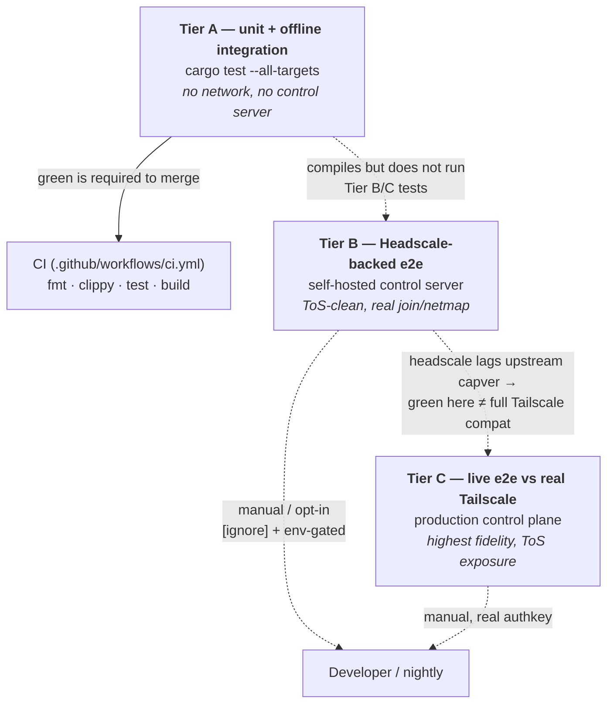

# Testing tiers

`tailscaled-rs` is a daemon that speaks a live, evolving control protocol, so "does it work" has
three different answers at three different costs. This document lays out the **three test tiers**,
what each proves, and how to run them. Only the first runs in CI; the other two are opt-in.



The arrow that matters is the dashed one between **Tier B** and **Tier C**: passing against Headscale
is necessary but **not sufficient** for real-Tailscale compatibility. See
[Why Headscale-green ≠ Tailscale-green](#why-headscale-green--tailscale-green).

---

## Tier A — unit + offline integration (what CI runs)

The default, always-on tier. **No network, no control server, no auth key, no root.** This is the
exact gate CI enforces ([`.github/workflows/ci.yml`](../.github/workflows/ci.yml)).

```bash
export TS_RS_EXPERIMENT=this_is_unstable_software   # the engine refuses to link/run without it

cargo fmt --all --check
cargo clippy --all-targets -- -D warnings
cargo test --all-targets
cargo build --release --bins
```

What it covers:

- **Unit tests** — the pure state machine ([`src/ipn.rs`](../src/ipn.rs) `derive_state_from`), prefs
  load/save, the LocalAPI wire format ([`src/localapi.rs`](../src/localapi.rs)), and the control-URL
  parse/scheme contract ([`tests/control_url.rs`](../tests/control_url.rs)).
- **Offline integration** — the real daemon⇄CLI Unix-socket IPC loop
  ([`tests/localapi_loop.rs`](../tests/localapi_loop.rs)), driven against a real `Backend` that is
  deliberately never brought `up`: the node sits in `NoState`/`Stopped`, so the IPC contract and the
  unauthenticated read path are exercised with zero connectivity.

What it deliberately does **not** cover: a real control handshake, registration, or a netmap. No
test in this tier ever opens a network socket to a control plane — that is what keeps `cargo test`
hermetic and CI ToS-clean. The two tiers below fill that gap.

> The Headscale-backed test file ([`tests/headscale_e2e.rs`](../tests/headscale_e2e.rs)) is **compiled**
> by `cargo test --all-targets` (so it can't bit-rot) but is marked `#[ignore]` **and** env-gated, so
> it never runs — and cannot make a network call — in this tier. See Tier B.

---

## Tier B — Headscale-backed e2e (self-hosted, ToS-clean)

The tier this scaffold ([bead `tsd-7ie`](#)) adds. It runs the **real** join → netmap → down flow
against a self-hosted [Headscale](https://github.com/juanfont/headscale) control server — a
protocol-compatible, independent reimplementation of Tailscale's control plane — so you exercise
registration and map-polling **without touching production Tailscale** (no ToS or rate-limit
exposure). The daemon already supports a custom control server; this tier points it at the local one.

Everything lives in [`test-support/headscale/`](../test-support/headscale/): a pinned
`docker-compose.yml` (image `headscale/headscale:0.28.0` — a real, recent **stable** tag, never
`:latest`) and the smallest `config.yaml` that boots a single tailnet (sqlite, auto-generated noise
key, `100.64.0.0/10` pool, DERP disabled, no update check).

### The full local loop

```bash
export TS_RS_EXPERIMENT=this_is_unstable_software

# 1. Bring up the control server.
docker compose -f test-support/headscale/docker-compose.yml up -d

# 2. Create a user and a reusable pre-auth key (the daemon's only login path is auth-key).
docker compose -f test-support/headscale/docker-compose.yml exec headscale \
    headscale users create test
docker compose -f test-support/headscale/docker-compose.yml exec -T headscale \
    headscale preauthkeys create --user test --reusable --expiration 24h
#   → prints a key like  <hs-preauth-key>

# 3a. Drive it by hand with the real binaries:
./target/release/tailnetd &                    # daemon (Tier A build)
TS_CONTROL_URL=http://localhost:8080 \
    ./target/release/tnet up --authkey <hs-preauth-key> --hostname hs-smoke
#   …or, equivalently, point a single `up` at it without the env var:
./target/release/tnet up --control-url http://localhost:8080 --authkey <hs-preauth-key>
./target/release/tnet status                   # expect: Running, with a 100.64.x.x address
./target/release/tnet down

# 3b. …or run the gated integration test, which does the same join → poll-to-Running → down:
export TAILNETD_HS_URL=http://localhost:8080
export TAILNETD_HS_AUTHKEY=<hs-preauth-key>
cargo test --test headscale_e2e -- --ignored --nocapture

# 4. Tear the server down when done.
docker compose -f test-support/headscale/docker-compose.yml down -v
```

See [`test-support/headscale/README.md`](../test-support/headscale/README.md) for the same loop kept
next to the compose file.

### How the gated test stays out of CI

[`tests/headscale_e2e.rs`](../tests/headscale_e2e.rs) is guarded **two** ways so it can never break
the offline Tier A run:

1. `#[ignore]` — excluded from `cargo test` (and CI's `cargo test --all-targets`); it only runs when
   explicitly un-ignored with `-- --ignored`.
2. **Env gate** — even when un-ignored, it early-returns (a clean *skip*, printing how to run it) if
   `TAILNETD_HS_URL` / `TAILNETD_HS_AUTHKEY` are absent. So it makes no network call and cannot fail
   unless an operator has deliberately stood up the server and set both vars.

The pre-auth key is passed **only via the environment** — it is never read from or written to any
committed file.

---

## Tier C — live e2e against real Tailscale (highest fidelity, manual)

The genuine article: join an actual Tailscale tailnet with a real pre-auth key. This is the only
tier that proves compatibility with the **real** control plane, and it is therefore the smoke test
gating an [engine bump](ENGINE.md#1-bumping-the-engine-rev). It is **manual** — it needs a real
`tskey-auth-…` key and incurs Tailscale ToS / rate-limit exposure, so it is never automated here.

```bash
export TS_RS_EXPERIMENT=this_is_unstable_software

./target/release/tailnetd &
./target/release/tnet up --authkey tskey-auth-XXXX --hostname live-smoke
./target/release/tnet status     # expect: Running, with a 100.x.y.z tailnet IP + peers
./target/release/tnet down
```

A future automated, gated campaign over this tier is tracked separately (bead `tsd-6hx`); it stays
opt-in and credential-gated for the same ToS reason.

---

## Why Headscale-green ≠ Tailscale-green

Tier B is ToS-clean, but it tests the daemon against a **reimplementation** of the control protocol,
not the genuine one — and the two can disagree.

The Tailscale control protocol is a moving target keyed by a single integer, the
**`CapabilityVersion`** (capver): every behavioral change to the client⇄control contract bumps it.
The daemon **inherits** whatever capver its pinned engine advertises — currently **130** (engine
`0.6.5`); the full mechanism and discipline are documented in
[`docs/ENGINE.md` §2](ENGINE.md#2-capability-version-tracking-discipline).

Two independent fidelity gaps stack here:

- **The engine advertises a capped capver.** It *defines* constants past the one it claims (up to
  V133) but deliberately sets `CURRENT = V130`, asserting only the semantics it actually implements
  (see [ENGINE.md §2 "The risk"](ENGINE.md#the-risk)). So the daemon is already behind live upstream.
- **Headscale itself lags upstream.** Headscale is an independent, best-effort reimplementation with
  a deliberately narrow scope (a single tailnet, for self-hosters); it does not advertise capability
  parity with Tailscale and trails upstream feature/capver-wise. So a `MapResponse` from Headscale
  may not match what production Tailscale would send for the same capver.

The consequence: **a green Tier B run proves the daemon registers and netmaps against
*Headscale's* understanding of the protocol — not that it is correct against the genuine Tailscale
control plane.** You are testing one reimplementation of a moving protocol against another; gaps
that only surface against the real server slip straight through Tier B. That is exactly why Tier C
(real Tailscale) remains the fidelity gate for an engine bump, and why the dashed B→C arrow above is
the load-bearing caveat of this whole document.
