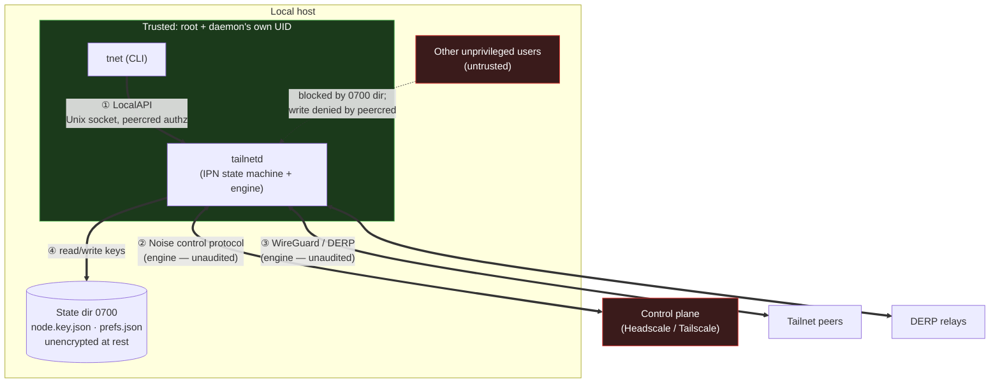

# Threat Model

This document states, honestly, what `tailscaled-rs` protects and what it does not. The house
style here is **honest gaps over fabricated guarantees**: every "mitigated" claim is tied to a
line of code, and every "not mitigated" item is named bluntly rather than hand-waved.

`tailscaled-rs` is the daemon layer (`tailnetd` + the `tnet` CLI) built on the **experimental,
unaudited** [`tailscale-rs`](https://github.com/GeiserX/tailscale-rs) engine. Where a risk lives in
the engine rather than this daemon, it is called out as such — the daemon cannot mitigate a flaw
below its own layer.

> [!WARNING]
> Experimental software on unaudited cryptography. Do not deploy this where a key compromise or
> traffic disclosure would matter. See [`../SECURITY.md`](../SECURITY.md).

---

## 1. Assets

What is worth protecting, roughly in descending order of damage if disclosed:

| Asset | Where it lives | Why it matters |
|---|---|---|
| **Node / machine / WireGuard private keys** | Held by the **engine**; persisted unencrypted under the state dir (`node.key.json`) | Disclosure lets an attacker impersonate this node on the tailnet and decrypt its traffic. |
| **Pre-auth keys** (`tskey-auth-…`) | Transit only — CLI → LocalAPI → engine registration call. Never stored by the daemon. | A leaked auth key lets an attacker enroll a rogue node into the tailnet. |
| **Tailnet membership / identity** | Defined by the keys above + the control plane's netmap | The node's place in the mesh: which peers it trusts, which routes it accepts. |
| **Traffic confidentiality** | The engine's WireGuard data plane (direct UDP or DERP relay) | The actual application data flowing over the overlay. |
| **The LocalAPI control surface** | `tailnetd`'s Unix domain socket (`tailnetd.sock`) | Anyone who can *write* to it can bring the node up/down and **repoint it at a control plane** of their choosing (see §5). |

The daemon's own job is the **last asset** — guarding the control surface — plus minimizing how
long the pre-auth key and engine-held keys are exposed in this process's memory. The first four
assets are ultimately the *engine's* to protect on the wire; the daemon's contribution is
on-disk and in-memory hygiene around them.

---

## 2. Trust boundaries

There are four boundaries. The daemon sits in the middle and treats each side differently.

| # | Boundary | Transport | Who is trusted on the far side |
|---|---|---|---|
| ① | **LocalAPI socket** | Local IPC (Unix domain socket, newline-delimited JSON) | **Reads:** anyone who can reach the socket. **Writes:** only root or the daemon's own UID. Enforced by `SO_PEERCRED` (`src/auth.rs`) behind a `0700` directory (`src/lib.rs`, `src/server.rs`). |
| ② | **Control-plane connection** | Noise control protocol (engine) | The control plane is **operator-trusted but not blindly trusted**: the engine talks Noise to it, but Tailnet Lock is **inert** (§5), so a compromised control plane *can* inject peer keys. The control URL is operator-chosen (`src/ipn.rs:188`). |
| ③ | **Data plane** | WireGuard over direct UDP or DERP relay (engine) | Peers are authenticated by WireGuard keys distributed via the netmap. Trust here is only as strong as the (unaudited) handshake and the (un-enforced) Tailnet Lock. |
| ④ | **On-disk state dir** | Filesystem | Trusted to the owning UID only — enforced by `0700` (`src/lib.rs:60`). **Not** trusted against root or anyone who can read the raw disk; keys are stored **without at-rest encryption**. |

The hard trust line is **boundary ①**: it is the only one this daemon fully owns and enforces in
its own code. Boundaries ② and ③ are the engine's; boundary ④ is a filesystem-permission gate, not
a cryptographic one.

---

## 3. Adversaries

| Adversary | Capability assumed | Covered in |
|---|---|---|
| **(a) Different unprivileged local user** | A separate UID on the same host, no root. | §4 — largely mitigated. |
| **(b) Root / privileged process on the same host** | UID 0, `ptrace`, `/proc/<pid>/mem`, raw disk read. | §5 — **not** mitigated. |
| **(c) Network attacker on the wire** | Can observe / modify packets between the node and the control plane / peers / DERP. | Engine's domain; relies on (unaudited) Noise + WireGuard. |
| **(d) Malicious / compromised control plane** | The control server the node registers with is hostile, or is taken over. | §5 — **not** mitigated (Tailnet Lock inert). |
| **(e) Memory capture: swap / hibernation / coredump / cold-boot** | Can read process memory after the fact, from disk or RAM. | §4.7 — **best-effort mitigated** (`mlockall` + coredump suppression when `harden_process()` succeeds); cold-boot still uncovered. |

The design point: this daemon meaningfully raises the bar against **(a)**, and applies
defense-in-depth against **(e)** — zeroize and minimal exposure *narrow the window*, and a
best-effort OS-level pass (`mlockall` + coredump suppression, §4.7) closes the swap/coredump
routes outright on hosts that grant the privileges. It offers **no defense** against **(b)** or
**(d)** — a root attacker who owns the kernel reads live memory regardless — and traffic-level
defense against **(c)** is entirely inherited from the unaudited engine.

---

## 4. What IS mitigated

Each item maps to code. These are the protections the daemon actually ships today.

### 4.1 Peer-credential authorization denies cross-user writes — adversary (a)

Every LocalAPI connection is authorized by its peer process credentials (`SO_PEERCRED` on Linux,
`LOCAL_PEERCRED`/`getpeereid` on macOS), read once at accept time:

- The policy is built once at startup from the daemon's effective UID (`src/server.rs:69`,
  `AuthPolicy::from_current_process` at `src/auth.rs:60`).
- A peer's access is decided purely from its UID: **root (uid 0) or the owner UID → `ReadWrite`;
  everyone else → `ReadOnly`** (`AuthPolicy::access_for_uid`, `src/auth.rs:75`).
- Mutating verbs (`up`/`down`) are gated; reads (`status`) are not. The classification is an
  exhaustive `match` over `Request`, so a new command **forces** an explicit authorization decision
  at compile time (`requires_write`, `src/auth.rs:122`).
- The deny decision is enforced *before* the backend lock is taken, so a denied caller never
  touches lifecycle state (`dispatch`, `src/server.rs:268`).

A different unprivileged user therefore cannot bring the node up/down or repoint its control plane,
even if they reach the socket.

### 4.2 The `0700` state/socket directory gates socket reach — adversary (a)

Peer-cred is the *second* layer; the directory is the *first*. A different user typically cannot
even traverse to the socket:

- The state dir (which also holds the unencrypted keys) is created and `chmod`ed to `0700` on
  startup; a pre-existing group/world-accessible dir is **tightened and logged**, not trusted
  (`ensure_state_dir_secure`, `src/lib.rs:60`, the `0o700` enforcement at `src/lib.rs:67`).
- The socket's parent dir is independently re-tightened to `0700` inside `serve` itself — the
  daemon does **not** trust the launcher to have done it, which matters when `TAILNETD_SOCKET`
  points outside the state dir (`ensure_dir_0700`, `src/server.rs:132`, called at
  `src/server.rs:59`).
- The socket **inode** is deliberately left broadly connectable (no `0600` chmod): the
  "anyone-who-can-reach-it may read" contract relies on the directory, and a `0600` socket would
  also lock out root, breaking read-for-all (rationale at `src/server.rs:55-58`).
- The daemon enforces `0700` only on the *directory*; the node **key file itself**
  (`node.key.json`, written by the engine) inherits the process umask, so the `0700` dir is the
  only at-rest gate on it. Deployments should therefore run with a restrictive umask
  (`UMask=0077`, now set in the systemd unit) so the key file is not group/world-readable even if
  the directory gate is ever loosened.
- Note this `UMask` plus the systemd unit's process sandboxing (`NoNewPrivileges`, `ProtectSystem`,
  the `SystemCallFilter`) is **Linux/systemd-only**: the macOS (launchd) deployment gets none of it
  and relies on running as root behind the `0700` directory alone.

### 4.3 `SecretString` reduces accidental key leakage — defense-in-depth for (e)

Pre-auth keys are carried as `secrecy::SecretString` (depends on `zeroize`; `Cargo.toml:46`),
which means **no `Debug`/`Display` rendering, no `serde` serialization, and zeroize-on-drop**:

- In the CLI, the key is resolved into a `SecretString` and exposed exactly once — at the moment
  the wire `Request` is serialized (`resolve_authkey`, `src/bin/tnet.rs:122`; expose at
  `src/bin/tnet.rs:77`). Neither `Cli` nor `Command` derives `Debug`, specifically to keep the key
  off any accidental `{:?}` path (note at `src/bin/tnet.rs:30`).
- In the daemon, the plaintext key from the wire is re-wrapped into a `SecretString` immediately at
  the dispatch boundary, confining it to the smallest scope (`src/server.rs:289`).
- The key is **never stored** on the `Backend`; it flows through `up()` and is exposed exactly once,
  for the single engine registration call that needs the plaintext (`src/ipn.rs:152-156`). The
  exposed `String` lives no longer than that `up` call.

This does not make secrets *safe* in RAM (see §5/§6) — it eliminates the **accidental-copy and
accidental-log** bug classes and shortens the in-memory lifetime.

### 4.4 Fail-closed authorization — adversary (a)

If the peer-credential lookup fails for any reason, the caller is treated as `ReadOnly` with no UID
— an **unidentifiable caller never gets write** (`AuthPolicy::for_peer`, `src/auth.rs:99-103`). The
deny path is unit-tested directly so it cannot be silently deleted or inverted
(`read_only_caller_is_denied_writes`, `src/auth.rs:193`).

### 4.5 Request line-length cap — adversary (a), DoS

A single newline-less connection cannot grow the read buffer without bound (OOM the daemon): lines
are capped at 64 KiB and a too-long line is refused and its connection closed (`MAX_LINE_BYTES`,
`src/server.rs:31`; the bounded reader `read_capped_line`, `src/server.rs:227`). A concurrent
connection flood is separately bounded by a 128-permit semaphore (`MAX_CONNECTIONS`,
`src/server.rs:36`, `src/server.rs:71`).

### 4.6 Bounded shutdown — availability

In-flight LocalAPI handlers are drained on a `JoinSet`, but only for a bounded 2 s; a wedged handler
is then aborted so it cannot keep the daemon from exiting (`DRAIN_TIMEOUT`, `src/server.rs:40`,
drain logic `src/server.rs:110`). The engine teardown is likewise bounded (5 s) so a wedged engine
can't hang the daemon (`stop_device`, `src/ipn.rs:303`).

### 4.7 Best-effort swap / coredump hardening — adversary (e)

A startup pass (`harden_process`, `src/hardening.rs:57`, called early in `main` before any key
material lands in memory) raises the cost of recovering secrets from a swap image or a coredump.
Each step is **best-effort and non-fatal** — a denial downgrades to a logged `warn` rather than
refusing to start, because losing a defense-in-depth layer is not a reason to take the node offline:

- **No swap.** `mlockall(MCL_CURRENT | MCL_FUTURE)` pins current and future pages resident so secret
  pages are never paged out to swap (`lock_all_memory`, `src/hardening.rs:145`). This is the step
  most likely to be denied: it needs `CAP_IPC_LOCK` (or root) or a sufficient `RLIMIT_MEMLOCK`, and
  a denial leaves secrets swappable — the warning says so plainly.
- **No coredump (Linux).** `prctl(PR_SET_DUMPABLE, 0)` clears the dumpable bit, which both suppresses
  coredumps and blocks `ptrace` attach by a **non-root** peer (`set_undumpable`, `src/hardening.rs:98`).
- **No coredump (portable).** `setrlimit(RLIMIT_CORE, 0)` caps the core size at zero as
  belt-and-suspenders, so no core file is written even if something re-enables the dumpable bit
  (`zero_core_limit`, `src/hardening.rs:122`). On macOS/BSD there is **no `prctl`**, so coredump
  suppression there is **rlimit-only** (`set_undumpable` returns `false`, `src/hardening.rs:115`).

Honest caveats, all reflected in the residual column of §7:

- The `mlockall` step is **only effective when granted** `CAP_IPC_LOCK`/root or enough
  `RLIMIT_MEMLOCK`; without it the swap route stays open (logged, non-fatal).
- macOS coredump suppression is **rlimit-only** (no dumpable-bit clear, no non-root-ptrace block).
- The whole pass can be **disabled** with `TAILNETD_NO_HARDEN=1` (debugging / noisy containers),
  in which case none of the above applies (`NO_HARDEN_VAR`, `src/hardening.rs:18`).
- This does **not** defend against adversary **(b)**: a **root** attacker can re-enable dumpable,
  `mlock` does not stop `/proc/<pid>/mem` reads, and `PR_SET_DUMPABLE=0` only blocks *non-root*
  ptrace. The root/live-memory gap remains exactly as stated in §5.1.

So the §3 row for **(e)** is now "best-effort mitigated when `harden_process()` succeeds" rather
than "not mitigated" — with the residual that a denied `mlockall`, a macOS host, an opt-out, or a
cold-boot capture all leave a window open (see §5.2).

---

## 5. What is NOT mitigated (blunt)

These are real, current gaps. They are listed because pretending otherwise would be the worst kind
of security documentation.

### 5.1 Root / `ptrace` / `/proc/<pid>/mem` reads live keys — adversary (b)

A privileged local attacker (root, or any process with `CAP_SYS_PTRACE` / debug rights over the
daemon) can read the engine's live private keys straight out of `tailnetd`'s address space. **Rust
cannot stop this** — memory safety is a property *within* the process, not a defense against an
attacker who owns the kernel or can attach a debugger. The `SecretString` zeroize in §4.3 reduces
*accidental* exposure; it is no obstacle to a deliberate privileged reader.

### 5.2 Swap / hibernation / coredumps — adversary (e), best-effort, residual gaps remain

The swap and coredump routes are now addressed **best-effort** by the §4.7 hardening pass
(`mlockall` + `prctl(PR_SET_DUMPABLE, 0)` + `setrlimit(RLIMIT_CORE, 0)`), so this is no longer an
unmitigated gap — but the mitigation is conditional, and the conditions are real:

- **`mlockall` can be denied.** Without `CAP_IPC_LOCK`/root (or a high enough `RLIMIT_MEMLOCK`) the
  lock fails and secret pages **can** still be paged to swap or captured in a hibernation image. The
  failure is logged at `warn`, non-fatal — so a node running unprivileged in a stock container is
  swap-exposed unless you grant the capability.
- **macOS coredump suppression is rlimit-only.** There is no `prctl` on macOS, so the dumpable bit
  is never cleared there; coredump suppression rests solely on `RLIMIT_CORE = 0`, and there is no
  non-root-`ptrace` block from this pass.
- **The pass can be opted out.** `TAILNETD_NO_HARDEN=1` disables all of it, restoring the original
  exposure (intended for debugging / noisy sandboxes).
- **Cold-boot is still uncovered.** `mlock` keeps pages out of *swap*; it does nothing about RAM
  remanence after power-off — a cold-boot attacker reading physical memory is unaffected.
- **A root attacker is unaffected** (see §5.1): root can re-enable dumpable and read
  `/proc/<pid>/mem` directly; the pass only raises the bar against non-root capture-after-the-fact.

Bottom line: on a Linux host that grants `CAP_IPC_LOCK`, swap and coredump capture by a non-root
party are closed; on a host that denies it, on macOS, or with the opt-out set, encrypting swap and
disabling coredumps yourself remains prudent defense-in-depth.

### 5.3 The engine's crypto is UNAUDITED — adversary (c)

The data-plane and control-plane confidentiality of every asset in §1 rests on the `tailscale-rs`
engine's **hand-rolled, unaudited** WireGuard `Noise_IKpsk2` and Tailscale control Noise handshakes.
The engine refuses to run without `TS_RS_EXPERIMENT=this_is_unstable_software` precisely as an
acknowledgement of this (see [`../SECURITY.md`](../SECURITY.md)). A flaw in those handshakes is
outside this daemon's reach to mitigate.

### 5.4 Tailnet Lock is INERT — adversary (d)

The engine does **not enforce Tailnet Lock**. A malicious or compromised control plane can therefore
**inject peer node-keys** into this node's netmap — i.e. add an attacker-controlled "peer" the node
will trust and route to — and the node has no key-pinning signature check to reject it. The control
URL is operator-chosen and validated only for scheme (`http`/`https`) before being handed to the
engine (`src/ipn.rs:188-199`); there is no cryptographic attestation that the control plane is the
expected one beyond the Noise handshake itself.

### 5.5 The engine's `String` API forces an un-zeroized last-mile authkey copy — tracked bead

The daemon holds the auth key in a `SecretString` and exposes it for the **single** engine call. But
`tailscale::Device::new` takes an `Option<String>`, so `up()` must materialize a plain `String` copy
of the plaintext to make that call (`expose_secret().to_string()`, `src/ipn.rs:153`); the same
`String`-typed wire field forces a copy on the CLI side (`src/bin/tnet.rs:77`) and at the dispatch
boundary before re-wrapping (`src/server.rs:289`). The daemon's own env path is the same shape: on
auto-start `auth_key_from_env()` hands back a plain `String` that lives transiently before it is
wrapped into a `SecretString` (`src/bin/tailnetd.rs`). Those last-mile `String`s are **not**
zeroized on drop — only the `SecretString` wrappers are. Closing this fully requires the engine to
accept a zeroizing secret type at its registration boundary; until then this is a **tracked bead**,
and a
narrow residual copy of the auth key exists transiently in process memory (which §5.1/§5.2 already
say is readable by a privileged attacker).

### 5.6 A write-authed caller can repoint the control plane — operator-trusted, authz-gated

A caller that *is* authorized to write (root or the daemon's UID) can pass `--control_url` to point
the node at an arbitrary control plane on the next `up` (`src/bin/tnet.rs:51`, applied at
`src/ipn.rs:188`). This is **by design** — it is how you target a self-hosted Headscale — and it is
gated behind the same write authorization as `up`/`down` (§4.1). It is listed here only to be
explicit: the control plane is **operator-trusted input**, so anyone you grant write to can move the
node's root of trust. The only validation is that the scheme is `http`/`https`; a malformed URL fails
loudly rather than silently falling back (`src/ipn.rs:189-198`).

> **Note on `SECURITY.md` drift.** [`../SECURITY.md`](../SECURITY.md) still describes the LocalAPI as
> authorizing "by filesystem permissions … richer `SO_PEERCRED`-based authorization is planned, not
> yet implemented", and suggests protecting the state dir at `0600` yourself. Both are now partially
> superseded by shipped code: peer-cred authz **is** implemented (§4.1), and the daemon enforces
> `0700` on the state and socket dirs itself (§4.2). The unaudited-crypto, at-rest-encryption, and
> Tailnet-Lock caveats in `SECURITY.md` remain accurate.

---

## 6. The Rust memory-safety thesis — honest version

It is tempting to claim "it's in Rust, so the secrets are safe." That claim is **false** as stated.
Here is the honest split.

**What Rust + `secrecy` actually buys:**

- **Deterministic zeroize.** `SecretString` wrappers are zeroed on drop (via `zeroize`), so secret
  bytes don't linger in freed heap for the lifetime of the process (§4.3) — unlike a GC'd language
  where the runtime decides if and when to reclaim, and copies freely during compaction.
- **No use-after-free / double-free key disclosure.** The borrow checker eliminates the bug class
  where a freed key buffer is read back through a dangling pointer, or a key is freed twice — a
  whole category of CVEs that simply cannot occur in safe Rust here.
- **Less accidental copying than a GC'd language.** Move semantics + the no-`Debug`/no-`serde`
  `SecretString` discipline mean the plaintext key isn't silently cloned into a log formatter, a
  string interner, or a heap-relocating collector. The one forced copy is named honestly in §5.5.

**What it does NOT buy:**

- **Nothing against a privileged local attacker.** Root / `ptrace` / `/proc/<pid>/mem` read live
  memory regardless of language (§5.1). Rust's guarantees end at the process boundary.
- **Nothing against swap / hibernation / coredumps** *by itself*. `zeroize` runs on *drop*; it does
  nothing for a page the kernel paged out to swap, or a coredump taken mid-run, before the drop.
  That needs OS-level help — `mlockall` + `PR_SET_DUMPABLE=0` + `RLIMIT_CORE=0`, which the daemon
  now applies best-effort at startup (§4.7). That OS pass, **not** the Rust/`secrecy` layer, is what
  closes these routes — and only when its privileges are granted (§5.2).
- **Nothing about the crypto being correct.** Memory safety is orthogonal to whether the
  (unaudited) handshake is sound (§5.3).

The right framing: Rust + `secrecy` here is **defense-in-depth and bug-class elimination**, not a
guarantee that secrets are safe in RAM. It removes the accidental and the use-after-free leaks; the
swap and coredump leaks are closed separately and best-effort by the OS-level pass (§4.7), not by
the language; and the privileged-attacker and cold-boot leaks remain unaddressed.

---

## 7. Residual risk summary

| Threat | Adversary | Mitigated? | Residual risk | Tracked where |
|---|---|---|---|---|
| Cross-user LocalAPI write (up/down, repoint control) | (a) | **Yes** — peercred + `0700` dir, fail-closed | Misconfigured (non-`0700`) parent dir created *outside* the daemon's path before startup; daemon re-tightens what it can reach | `src/auth.rs`, `src/server.rs`, `src/lib.rs` |
| Cross-user socket reach | (a) | **Yes** — `0700` dir gate | Reads (`status`) intentionally open to anyone who *does* reach the socket | `src/server.rs:132`, `src/lib.rs:60` |
| LocalAPI DoS (buffer OOM / conn flood) | (a) | **Yes** — line cap + conn semaphore | Bounded resource use only; not an availability *guarantee* | `src/server.rs:31`, `src/server.rs:36` |
| Accidental key leak (logs / `Debug` / serialize) | (e) | **Yes** — `SecretString`, no-`Debug`, expose-once | One forced un-zeroized `String` copy at the engine call | §5.5; `src/ipn.rs:153` |
| Live key read by root / ptrace / `/proc/mem` | (b) | **No** | Full key disclosure to a privileged local attacker | Out of scope — OS-level threat |
| Keys in swap / hibernation / coredump | (e) | **Best-effort** — `mlockall` + `PR_SET_DUMPABLE=0` + `RLIMIT_CORE=0` when `harden_process()` succeeds | Swap still exposed if `mlockall` denied (no `CAP_IPC_LOCK`); macOS coredump is rlimit-only; opt-out via `TAILNETD_NO_HARDEN=1`; cold-boot RAM remanence uncovered; root unaffected | §4.7, §5.2; `src/hardening.rs` |
| Broken handshake / traffic disclosure | (c) | **No** — engine is unaudited | Confidentiality unproven until audited | Engine; `SECURITY.md` |
| Rogue peer-key injection | (d) | **No** — Tailnet Lock inert | Compromised control plane can add trusted peers | Engine; §5.4, `SECURITY.md` |
| Operator repoints control plane | (b)/operator | **N/A** — by design | A write-authed caller can move the root of trust (authz-gated) | §5.6; `src/ipn.rs:188` |
| Auth-key in argv / shell history | (a)/(b) | **Partial** — `--authkey-file` / `$TS_AUTH_KEY` offered | `--authkey` flag still exposes the key in argv if used | `src/bin/tnet.rs:41-45` |

---

*This project is **experimental and unaudited** — see [`../SECURITY.md`](../SECURITY.md); do not
rely on it where a key compromise or traffic disclosure would matter.*
