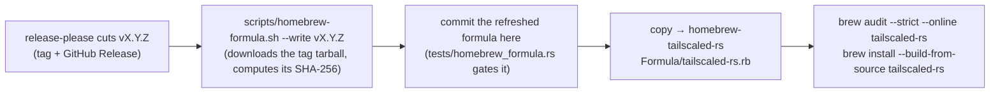

# Homebrew — installing `tailnetd` + `tnet` from a tap

[`tailscaled-rs.rb`](tailscaled-rs.rb) is this project's Homebrew formula: it builds the daemon
(`tailnetd`) and its CLI (`tnet`) from a released source tag and, optionally, runs the daemon as a
`brew services` background service.

The formula lives here, in the daemon's own repository, so it moves with the code it installs — the
binaries it puts on PATH, the cargo features a distributed build has to carry, and the engine opt-in
the daemon refuses to start without are all checked against their sources by
[`tests/homebrew_formula.rs`](../../tests/homebrew_formula.rs). Homebrew itself installs formulae
from a **tap** (a repository named `homebrew-<tap>`), so publishing means copying this one file into
`GeiserX/homebrew-tailscaled-rs` — see [Maintaining the tap](#maintaining-the-tap).

> [!WARNING]
> **Experimental, unaudited software — not for production.** Installing it, and above all starting
> the service, is you opting in on purpose. It is also **unofficial**: not affiliated with, endorsed
> by, or sponsored by Tailscale Inc. See the [repository README](../../README.md) and
> [`SECURITY.md`](../../SECURITY.md).

> [!NOTE]
> The tap repository is not published yet — the formula is ready ahead of it (a tap is worth having
> once releases are stable). Until then, install from this checkout:
> `brew install --build-from-source packaging/homebrew/tailscaled-rs.rb`.

## Install

```bash
brew tap GeiserX/tailscaled-rs          # → github.com/GeiserX/homebrew-tailscaled-rs
brew install tailscaled-rs              # builds from the released source tag (needs the Rust toolchain, pulled in as a build dep)
```

To build the current `main` instead of the last release:

```bash
brew install --HEAD tailscaled-rs
```

The formula builds with `--features tun,ssh,acme`, exactly like the released binaries: kernel-TUN
mode, the Tailscale SSH server, and ACME issuance for `tnet cert` / `serve --https` / `funnel` are
compiled **in**. Each still gates at runtime (TUN and SSH need root; cert and funnel need a SaaS
tailnet), so a full-featured build is not a privileged one — it is only one that can't fail closed
for a reason the operator never chose.

There is no bottle (prebuilt binary): the release workflow publishes Linux tarballs only, so a
formula that poured a bottle would have nothing to pour on macOS. `brew install` compiles.

## Run it

```bash
sudo brew services start tailscaled-rs   # root: see below
sudo tnet up --authkey-file /path/to/key
sudo tnet status
```

`brew services` sets `TS_RS_EXPERIMENT=this_is_unstable_software` for the daemon — the engine
refuses to start without it, and the daemon deliberately never sets it for itself.

The service runs as **root**, like the packaged
[systemd unit and launchd plist](../README.md): as root the daemon resolves the *system* state
directory (`/usr/local/var/tailnetd` on macOS, `/var/lib/tailnetd` on Linux), which is the same path
`sudo tnet` resolves, so the CLI finds the LocalAPI socket with no `--socket` flag. State therefore
lives outside the Homebrew prefix on purpose: relocating it under `$(brew --prefix)/var` would break
that agreement for every `sudo tnet …` command in these docs. Logs go to
`$(brew --prefix)/var/log/tailnetd.log` and `…/tailnetd.err.log`.

To run the daemon in the foreground instead, without the service:

```bash
TS_RS_EXPERIMENT=this_is_unstable_software tailnetd
```

## Upgrade and uninstall

```bash
brew update && brew upgrade tailscaled-rs
sudo brew services restart tailscaled-rs
```

`tnet update` **refuses** to touch a Homebrew-installed binary: an in-place swap would overwrite a
file Homebrew owns and leave `brew` reporting a version that is no longer installed. It says so and
names `brew upgrade` instead.

```bash
sudo brew services stop tailscaled-rs
brew uninstall tailscaled-rs
# Node state (keys + prefs) is NOT under the Homebrew prefix and is left behind on purpose:
#   sudo rm -rf /usr/local/var/tailnetd   # macOS   (Linux: /var/lib/tailnetd)
```

## Maintaining the tap



**First time — create the tap.** Homebrew resolves `brew tap GeiserX/tailscaled-rs` to the GitHub
repository `GeiserX/homebrew-tailscaled-rs`; the name prefix is the whole mechanism. Create it with
a `Formula/` directory and copy this formula in as `Formula/tailscaled-rs.rb`.

**Every release.** A formula pins its source by SHA-256, and that digest exists only once the tag
does — so this formula necessarily lags `Cargo.toml` until it is refreshed *after* the release is
cut. Refresh it with the script rather than by hand, so the digest is of the bytes GitHub really
serves:

```bash
scripts/homebrew-formula.sh --write v0.53.0   # omit the tag to use the version in Cargo.toml
git diff packaging/homebrew/tailscaled-rs.rb  # url + sha256, nothing else
```

`tests/homebrew_formula.rs` allows that lag and refuses the reverse — a formula claiming a version
this tree has not released — along with the drift that actually breaks an install: a binary the
formula installs that the crate no longer builds, a feature set that has diverged from the release
workflow's, or an engine opt-in value that no longer matches the one the daemon demands.
